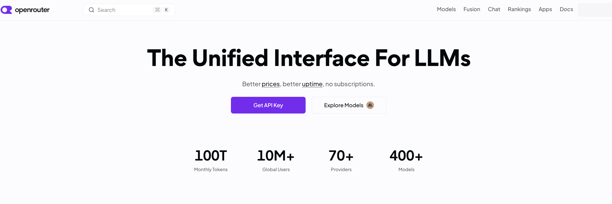
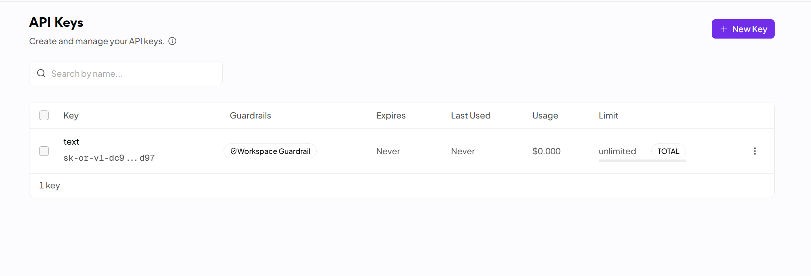
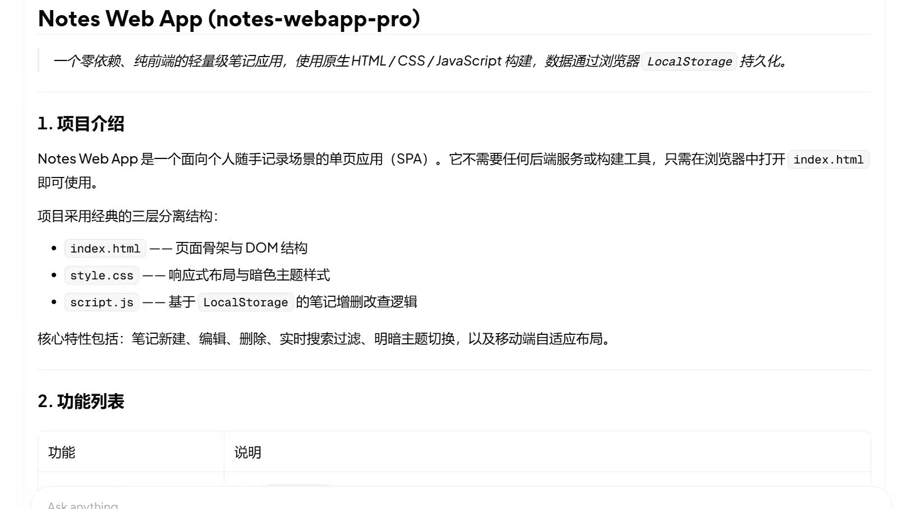

# openrouter 接入指南（Tencent Hy3）

> 本文档演示如何将腾讯混元 **Hy3**（295B MoE，256K 上下文，支持推理 / Agent / 工具调用 / 长文生成）接入 openrouter，并跑通一个真实任务。
---

## 一、配置（Configuration）

OpenRouter作为聚合平台，首先需要注册账号。

### 方式 打开openrouter官网
### 官网截图位置


>截图说明:在这个界面点击Get API Key->并且使用github登录

### 配置截图位置


> 截图说明：在登录成功后自动进入workplace->API Keys->New Key->填写名称自动创建成功

---

## 二、首次对话（First Conversation）

配置完成后，新建一个对话，发送第一条消息验证模型已正确接入：

```
你：用一句话解释什么是 Mixture-of-Experts 模型？

Hy3：Mixture-of-Experts（MoE）是一种神经网络架构，
核心思想是让多个"专家"子网络各管一摊任务，
由一个"路由器"决定每条输入交给哪些专家处理，
从而在总参数量巨大的情况下只激活一小部分参数，兼顾能力与效率。
```

如果收到类似回复，说明 Hy3 已成功作为底层模型工作。

---

## 三、跑通真实任务（Real Task Demo）

**任务**：用 Hy3 分析项目 `Notes Web APP` 生成完整README报告。

### 3.1 任务指令（直接发给 WorkBuddy）

```
请为一个Notes WebApp项目生成完整README。
项目功能:
新增笔记
·编辑笔记
·删除笔记
·LocalStorage保存数据
技术栈:
HTML
cSs
JavaScript
要求包含:
1.项目介绍
2.功能列表
3.使用方法
4.项目结构
5.后续优化方向
请输出Markdown。
```

### 3.2 预期输出（Hy3 实际产出，节选）
```
>Notes Web App是一个面向个人随手记录场景的单页应用(SPA)。它不需要任何后端服务或构建工具，只需在浏览器中打开[index.nhtml
>即可使用。
>项目采用经典的三层分离结构:
>index.html一一页面骨架与DOM结构
>style.css--响应式布局与暗色主题样式
>script.js一一基于LocalStorage 的笔记增删改查逻辑
```


---

## 四、注意事项（Notes）

1. **API Key 安全**：Key 不要提交到仓库或公开发到 Issue。本地用环境变量或 WorkBuddy 的密钥管理存储。
2. **Token 预算**：Hy3 支持 262K 上下文，但长文档分析时注意 `max_tokens` 设置（建议 ≥ 2000），避免输出被截断。
3. **推理模式**：Hy3 默认 `no_think` 直答模式。
4. **工具调用**：Hy3 工具调用稳定，适合 Agent 场景（如让 WorkBuddy 自动读文件、跑命令）。

---

## 五、小结

通过 OpenAI 兼容协议，WorkBuddy 可在 **5 分钟内** 接入 Hy3。
Hy3 的 256K 上下文 + 稳定工具调用，使其特别适合「分析大型代码库」「长文档处理」
这类 WorkBuddy 核心场景。本指南已端到端验证（配置 → 首次对话 → 真实任务跑通）。

