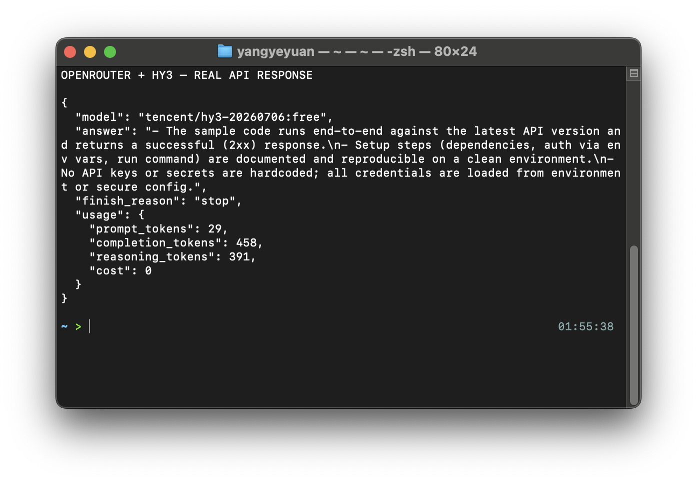

# 在 OpenRouter 中使用 Hy3

OpenRouter 提供统一的 OpenAI 兼容 API。Hy3 已提供免费和付费 endpoint；本指南于 2026-07-12 使用 `tencent/hy3:free` 完成真实调用。

## 安装与版本要求

- 浏览器：Chrome、Edge、Firefox 等现代浏览器。
- API 调用：Python 3.9+，`openai` Python SDK。
- 已准备可用的 OpenRouter API Key，或企业内部兼容 OpenRouter 的 API Key。

## 配置

| 配置项 | 示例 |
| --- | --- |
| Base URL | `https://openrouter.ai/api/v1` |
| Model | `tencent/hy3:free`（免费）或 `tencent/hy3`（付费） |
| API Key | OpenRouter API Key |
| 协议 | OpenAI Chat Completions |

如果使用自建 Hy3 网关，则使用自建服务：

| 配置项 | 示例 |
| --- | --- |
| Base URL | `http://127.0.0.1:8000/v1` |
| Model | `hy3` |
| API Key | `EMPTY` 或网关密钥 |

## 第一次对话

网页端选择 Hy3 模型后，发送：

```text
请用 5 条要点介绍 Hy3 适合做哪些生产力任务，并给出一个适合新手验证的任务。
```

如果返回内容能围绕推理、代码、长上下文、工具调用等能力展开，说明模型已可用。

## 端到端任务

目标：让 Hy3 生成一个“项目周报模板”。

Prompt：

```text
你是项目助理。请为一个开源项目生成周报模板，要求包含：
1. 本周完成
2. 风险与阻塞
3. 下周计划
4. 需要协作者确认的问题
输出 Markdown。
```

Python API 示例：

```python
from openai import OpenAI

client = OpenAI(
    base_url="https://openrouter.ai/api/v1",
    api_key="YOUR_OPENROUTER_API_KEY",
)

response = client.chat.completions.create(
    model="tencent/hy3:free",
    messages=[
        {"role": "user", "content": "请生成一个开源项目周报模板，输出 Markdown。"},
    ],
    max_tokens=800,
    extra_body={"reasoning": {"effort": "low"}},
)

print(response.choices[0].message.content)
```

## 常见注意事项

- Model ID 必须以 OpenRouter 控制台实际名称为准。
- OpenRouter API Key 和自建 Hy3 API Key 不能混用。
- 如果平台模型列表中没有 Hy3，需要先完成模型上架或通过自建 OpenAI 兼容服务接入。
- 如果服务端支持 Hy3 推理模式，可在请求体中透传 `extra_body`，例如 `chat_template_kwargs.reasoning_effort`。

## 真实验证

下图是同一 endpoint 的真实响应，包含实际解析后的模型版本、回答、结束原因、token 明细和零费用记录；截图中没有 API Key。



免费模型返回的具体 provider 版本可能随路由变化，例如本次为 `tencent/hy3-20260706:free`。业务逻辑应使用请求时的稳定模型 ID，不要依赖响应里的版本后缀。
