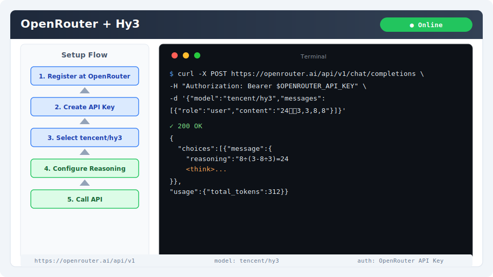

# OpenRouter 集成指南

[OpenRouter](https://openrouter.ai) 是一个统一的 LLM API 网关，提供多种模型的访问入口。通过 OpenRouter 可使用 Hy3 而无需本地部署。

## 安装与版本要求

- **无额外安装**：通过 HTTP API 调用，任何语言/工具均可
- **网络**：能访问 `https://openrouter.ai`
- **账号**：注册 OpenRouter 并创建 API Key

## 核心配置

| 配置项 | 值 |
|--------|-----|
| Base URL | `https://openrouter.ai/api/v1` |
| 模型 ID | `tencent/hy3` |
| 协议 | OpenAI Compatible |
| API Key | OpenRouter Key（格式 `sk-or-xxx`） |

环境变量推荐：

```bash
export OPENROUTER_API_KEY="sk-or-xxx"
export HY3_BASE_URL="https://openrouter.ai/api/v1"
export HY3_MODEL="tencent/hy3"
```

### 各部署模式对比

| 模式 | Base URL | 模型名 | API Key | 延迟 |
|------|----------|--------|---------|------|
| OpenRouter | `https://openrouter.ai/api/v1` | `tencent/hy3` | OpenRouter Key | 中等（经网关转发）|
| TokenHub（国内推荐） | `https://tokenhub.tencentmaas.com/v1` | `hy3` | TokenHub Key | 低（直连腾讯）|
| TokenHub（海外） | `https://tokenhub-intl.tencentmaas.com/v1` | `hy3` | TokenHub Key | 低（新加坡节点）|
| 本地 vLLM/SGLang | `http://127.0.0.1:8000/v1` | `hy3` | `EMPTY` | 最低（本地）|

## 第一次对话测试

使用 curl 测试连通性：

```bash
curl https://openrouter.ai/api/v1/chat/completions \
  -H "Authorization: Bearer $OPENROUTER_API_KEY" \
  -H "Content-Type: application/json" \
  -d '{
    "model": "tencent/hy3",
    "messages": [{"role":"user","content":"用一句话介绍 Hy3，并输出数字 1"}]
  }'
```

**预期结果**：返回 200 OK，包含 Hy3 的回复内容。



## 端到端实战 Demo：24 点游戏求解

### 场景

用户给出 4 个数字（如 3, 3, 8, 8），Hy3 通过深度推理计算 24 点。

### Python 示例

```python
from openai import OpenAI

client = OpenAI(
    base_url="https://openrouter.ai/api/v1",
    api_key="sk-or-xxx",
)

response = client.chat.completions.create(
    model="tencent/hy3",
    messages=[{"role": "user", "content": "24点：3,3,8,8"}],
    extra_body={"chat_template_kwargs": {"reasoning_effort": "high"}},
)

print(response.choices[0].message.content)
```

### 预期输出

Hy3 会输出包含 `8 ÷ (3 - 8 ÷ 3) = 24` 的推理过程和最终答案。

### 验证步骤

1. 保存上述代码为 `test_hy3.py`
2. 替换 `api_key` 为你的 Key
3. 运行 `python test_hy3.py`
4. 看到包含 `24` 的结果即成功

## 推理模式配置

通过 `chat_template_kwargs.reasoning_effort` 控制：

| 模式 | 值 | 适用场景 |
|------|-----|---------|
| 直接回复 | `no_think` | 简单问答、翻译 |
| 轻度推理 | `low` | 代码生成、分析 |
| 深度推理 | `high` | 数学、复杂逻辑 |

## 常见注意事项

1. **费用**：OpenRouter 收取约 10-20% 服务费，直接使用 TokenHub 更省
2. **速率限制**：免费用户 20 RPM，付费用户更高
3. **流式输出**：默认启用 `stream: true`，建议保持
4. **Base URL**：不要重复写 `/v1`（OpenRouter 已包含）
5. **模型名**：必须用 `tencent/hy3`（含提供商前缀）
