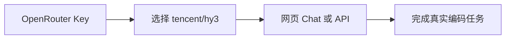

# OpenRouter × Hy3

在 [OpenRouter](https://openrouter.ai) 上选用腾讯 Hy3，一套 Key 可给 Cursor、Continue、Codex CLI 等多款工具复用。

## 安装与版本

| 项 | 要求 |
|----|------|
| 账号 | [openrouter.ai](https://openrouter.ai) 注册 |
| 浏览器 | 现代浏览器即可（网页聊天） |
| API | OpenAI 兼容；SDK 建议 `openai >= 1.40` |
| 模型页 | [tencent/hy3](https://openrouter.ai/tencent/hy3) |

## 配置项

1. 打开 [API Keys](https://openrouter.ai/keys) 创建 Key（形如 `sk-or-v1-...`）。
2. 模型 ID：
   - `tencent/hy3` — 标准路由
   - `tencent/hy3:free` — 免费档（若列表中仍提供；额度与下线时间以官网为准）
3. API 根路径：`https://openrouter.ai/api/v1`

| 配置 | 值 |
|------|-----|
| Base URL | `https://openrouter.ai/api/v1` |
| Model | `tencent/hy3` |
| Auth | `Authorization: Bearer sk-or-...` |
| 协议 | OpenAI Chat Completions |

### 最小调用

```bash
export OPENROUTER_API_KEY='sk-or-...'

curl https://openrouter.ai/api/v1/chat/completions \
  -H "Authorization: Bearer $OPENROUTER_API_KEY" \
  -H 'Content-Type: application/json' \
  -d '{
    "model": "tencent/hy3",
    "messages": [{"role": "user", "content": "用一句话介绍 Hy3。"}]
  }'
```

```python
import os
from openai import OpenAI

client = OpenAI(
    api_key=os.environ["OPENROUTER_API_KEY"],
    base_url="https://openrouter.ai/api/v1",
)
print(
    client.chat.completions.create(
        model="tencent/hy3",
        messages=[{"role": "user", "content": "用一句话介绍 Hy3。"}],
    )
    .choices[0]
    .message.content
)
```

也可在 OpenRouter 网页 Chat 中直接选择 **Tencent: Hy3** 对话。

## 端到端任务 Demo

**任务：** 让 Hy3 写一个带类型注解的 Python 函数，并用三行说明复杂度。

1. 网页或 API 发送：

```text
请实现 def top_k_frequent(nums: list[int], k: int) -> list[int]，
要求 O(n log k)，并附 3 行复杂度说明。只输出代码和说明。
```

2. 预期：得到可运行代码 + 简短复杂度说明。  
3. **截图：** 保存为 `assets/openrouter-chat-demo.png`（网页结果或终端输出均可）。



## 注意事项

- Key 前缀是 `sk-or-`，不要填成 OpenAI / TokenHub Key。
- 模型名必须带厂商前缀：`tencent/hy3`，不是裸的 `hy3`。
- 免费档（`:free`）可能有速率限制或下线日期，生产请用付费路由或 TokenHub。
- 部分 Coding Agent 需要工具调用：若失败，确认模型路由支持 tools，或改用 TokenHub 直连对比。
- 不要把 Key 写进截图；打码后再提交到本仓库。

## 截图清单

| 文件 | 内容 |
|------|------|
| `assets/openrouter-models.png` | 模型页选中 Hy3 |
| `assets/openrouter-chat-demo.png` | 上述编码任务完整对话 |
