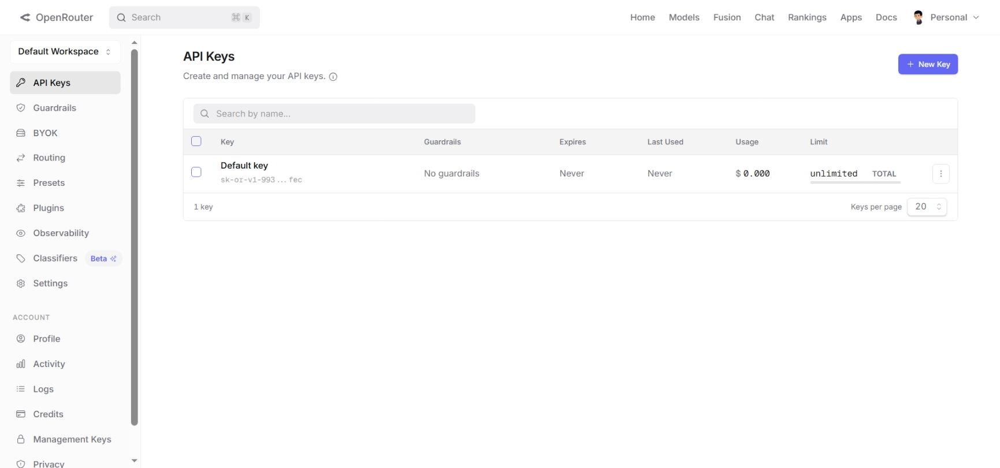
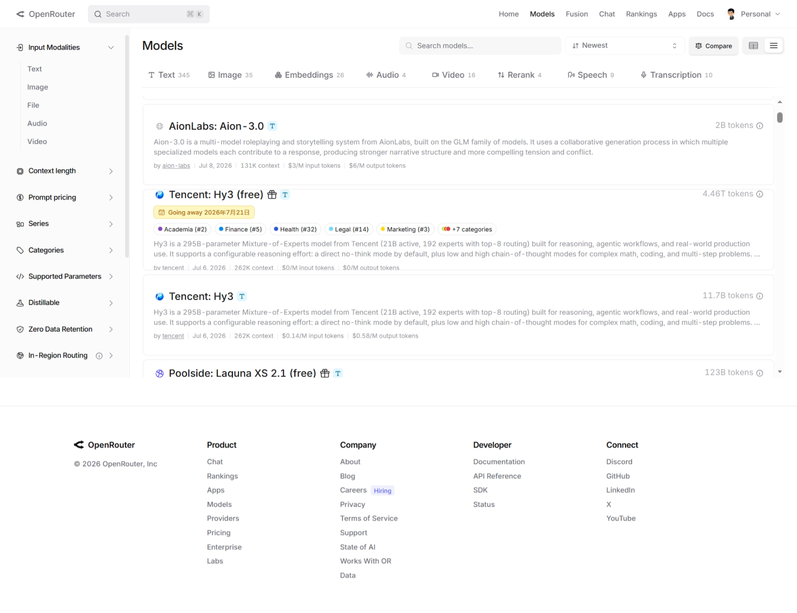
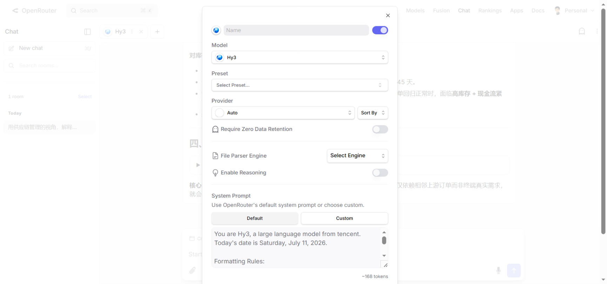
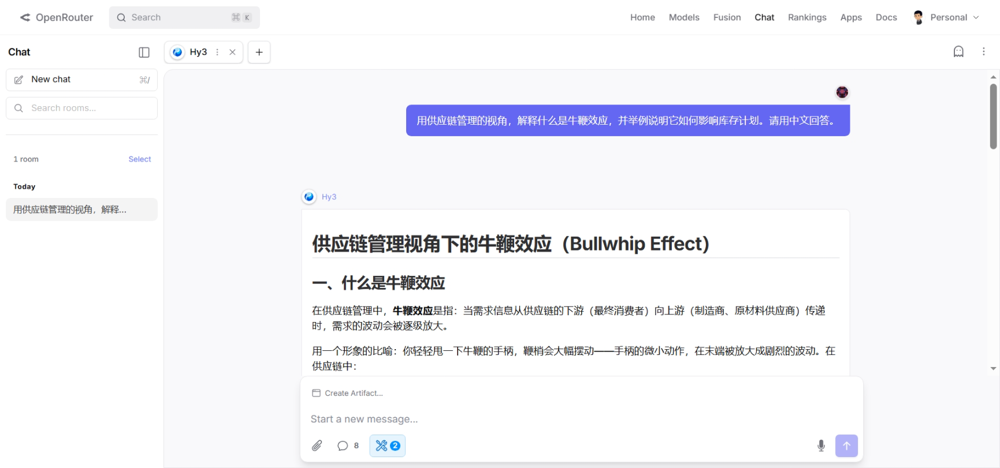
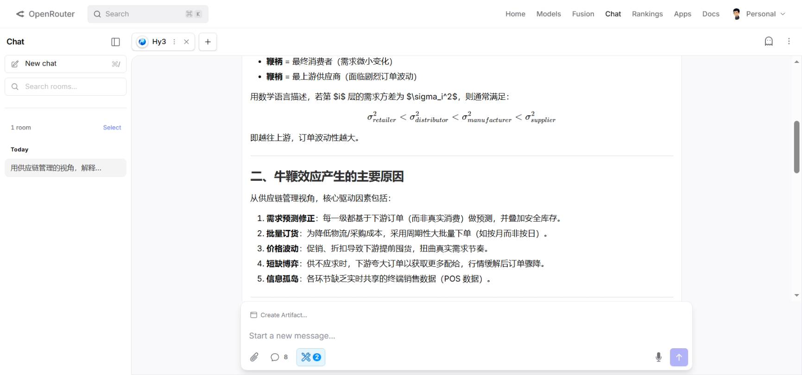
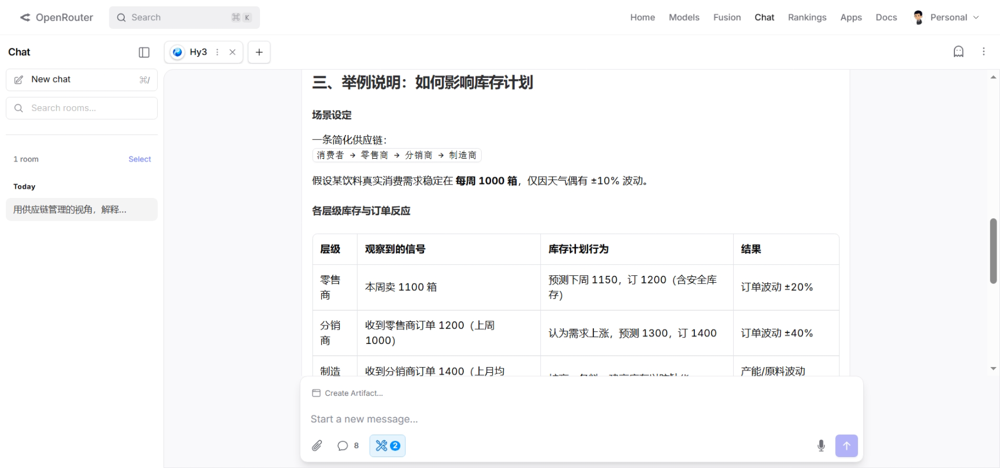
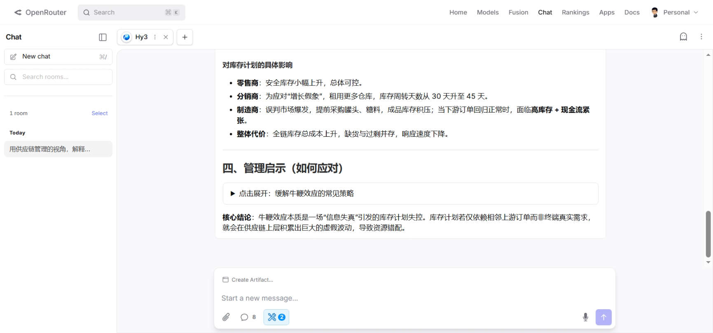

# OpenRouter 接入 Hy3 指南

> OpenRouter 是统一的 LLM API 网关，聚合 300+ 模型。通过 OpenRouter，你可以零部署门槛调用腾讯混元 Hy3。

## 前置条件

- 一个 OpenRouter 账号（[openrouter.ai](https://openrouter.ai) 免费注册）
- 基本的命令行或编程能力

## 方式一：通过 OpenRouter 接入

### 1. 获取 OpenRouter API Key

1. 访问 [openrouter.ai/keys](https://openrouter.ai/keys)
2. 点击 **"Create Key"** 创建 API Key
3. 复制 API Key（格式为 `sk-or-v1-...`）

> **免费窗口**：Hy3 在 OpenRouter 上提供免费试用至 **2026 年 7 月 21 日**。免费期间使用模型名 `tencent/hy3:free`，无需绑定信用卡。


*OpenRouter 控制台 API Keys 页面，点击 "+ New Key" 可创建新 Key*

### 2. Hy3 模型页面

访问 [openrouter.ai/tencent/hy3](https://openrouter.ai/tencent/hy3) 可查看：

- **Provider**：GMICloud（推荐，延迟低）和 AtlasCloud
- **定价**：$0.14 / 1M tokens（输入）、$0.58 / 1M tokens（输出）
- **上下文**：262K tokens
- **支持能力**：Chat Completions、Reasoning、Tool Calling


*OpenRouter Models 页面中 `Tencent: Hy3` 和 `Tencent: Hy3 (free)` 模型卡片，包含上下文、定价和排名信息*

### 3. 首次 API 调用

Hy3 通过 OpenRouter 完全兼容 OpenAI Chat Completions API，可直接使用 OpenAI 官方 SDK。

#### cURL

```bash
curl https://openrouter.ai/api/v1/chat/completions \
  -H "Authorization: Bearer $OPENROUTER_API_KEY" \
  -H "Content-Type: application/json" \
  -H "HTTP-Referer: https://your-site.com" \
  -H "X-Title: Hy3 Demo" \
  -d '{
    "model": "tencent/hy3",
    "messages": [
      {"role": "user", "content": "请用一句话介绍你自己。"}
    ]
  }'
```

#### Python

```python
from openai import OpenAI

client = OpenAI(
    base_url="https://openrouter.ai/api/v1",
    api_key="sk-or-v1-YOUR_KEY",
    default_headers={
        "HTTP-Referer": "https://your-site.com",
        "X-Title": "Hy3 Demo",
    }
)

response = client.chat.completions.create(
    model="tencent/hy3",
    messages=[
        {"role": "user", "content": "请用一句话介绍你自己。"}
    ],
)

print(response.choices[0].message.content)
```

#### JavaScript (Node.js)

```javascript
import OpenAI from "openai";

const client = new OpenAI({
  baseURL: "https://openrouter.ai/api/v1",
  apiKey: "sk-or-v1-YOUR_KEY",
  defaultHeaders: {
    "HTTP-Referer": "https://your-site.com",
    "X-Title": "Hy3 Demo",
  },
});

const response = await client.chat.completions.create({
  model: "tencent/hy3",
  messages: [{ role: "user", content: "请用一句话介绍你自己。" }],
});

console.log(response.choices[0].message.content);
```


*（截图占位：终端中首次 Hy3 API 调用成功截图）*

### 4. Playground Chat 演示

OpenRouter 提供 Web Chat 界面，无需写代码即可体验 Hy3。在 Chat 页面点击模型选择器，选择 **Hy3** 即可开始对话：


*图：在 OpenRouter Chat 中选择 Hy3 模型，可看到 Provider、Reasoning 等选项*

下面是用 Hy3 分析**牛鞭效应**的真实对话示例：


*图：在 OpenRouter Chat 中选择 Hy3 并提问*

提问内容：
> 用供应链管理的视角，解释什么是牛鞭效应，并举例说明它如何影响库存计划。请用中文回答。


*图：Hy3 给出牛鞭效应的定义与数学表达*


*图：Hy3 用饮料供应链案例说明各层级库存计划如何逐级放大*


*图：Hy3 总结管理启示与应对策略*

### 5. 推理模式（Reasoning）

Hy3 支持三种推理强度。通过 OpenRouter 调用时，使用 `reasoning` 参数：

```python
# 不思考模式（默认，最快）
response = client.chat.completions.create(
    model="tencent/hy3",
    messages=[{"role": "user", "content": "1+1等于几？"}],
)

# 轻度推理（适合代码审查、概念解释）
response = client.chat.completions.create(
    model="tencent/hy3",
    messages=[{"role": "user", "content": "请分析这段代码的时间复杂度"}],
    reasoning={"effort": "low"},
)

# 深度推理（适合复杂数学、架构设计）
response = client.chat.completions.create(
    model="tencent/hy3",
    messages=[{"role": "user", "content": "设计一个高并发的电商秒杀系统架构"}],
    reasoning={"effort": "high"},
)
```

> **注意**：推理模式下，响应中会包含 `reasoning_content` 字段（思维链），这部分 Token 按正常价格计费。


*（GIF 占位：同一问题在三种推理模式下的输出对比）*

### 6. 流式输出

```python
stream = client.chat.completions.create(
    model="tencent/hy3",
    messages=[{"role": "user", "content": "写一首关于AI的诗"}],
    stream=True,
)

for chunk in stream:
    if chunk.choices[0].delta.content:
        print(chunk.choices[0].delta.content, end="", flush=True)
```

### 7. 工具调用（Function Calling）

```python
tools = [{
    "type": "function",
    "function": {
        "name": "search_web",
        "description": "搜索网络信息",
        "parameters": {
            "type": "object",
            "properties": {
                "query": {"type": "string", "description": "搜索关键词"}
            },
            "required": ["query"]
        }
    }
}]

response = client.chat.completions.create(
    model="tencent/hy3",
    messages=[{"role": "user", "content": "2026年世界杯冠军是谁？"}],
    tools=tools,
    tool_choice="auto",
)
```

## 方式二：通过腾讯云 TokenHub 接入

如果你习惯在腾讯云生态工作，也可以直接使用 TokenHub：

```python
from openai import OpenAI

client = OpenAI(
    base_url="https://tokenhub.tencentmaas.com/v1",
    api_key="YOUR_TOKENHUB_KEY",
)

response = client.chat.completions.create(
    model="hy3",
    messages=[{"role": "user", "content": "你好，Hy3！"}],
    extra_body={"chat_template_kwargs": {"reasoning_effort": "low"}},
)
```

> TokenHub 的价格为 ¥1/M tokens（输入）、¥4/M tokens（输出），比 OpenRouter 的海外定价更具优势。获取 API Key：[TokenHub 控制台](https://console.cloud.tencent.com/tokenhub)。

## 端到端实战 Demo

### 场景：用 Hy3 分析供应链中的牛鞭效应

这是一个贴近物流与供应链管理教学的真实场景。我们将用 Hy3 解释**牛鞭效应（Bullwhip Effect）**，并展示它如何逐级放大库存计划波动。

### 操作步骤

1. 设置环境变量：
   ```bash
   export OPENROUTER_API_KEY="sk-or-v1-YOUR_KEY"
   ```

2. 创建 Python 脚本 `bullwhip_demo.py`：

   ```python
   from openai import OpenAI

   client = OpenAI(
       base_url="https://openrouter.ai/api/v1",
       api_key="YOUR_OPENROUTER_KEY",
       default_headers={
           "HTTP-Referer": "https://your-site.com",
           "X-Title": "Hy3 Supply Chain Demo",
       },
   )

   prompt = """用供应链管理的视角，解释什么是牛鞭效应，并举例说明它如何影响库存计划。
   要求：
   1. 先定义牛鞭效应
   2. 说明它产生的核心原因
   3. 举一个从零售商到制造商的逐级放大案例
   4. 最后给出 2-3 条管理启示
   请用中文回答。"""

   response = client.chat.completions.create(
       model="tencent/hy3",
       messages=[
           {"role": "system", "content": "你是一位资深的供应链管理专家。"},
           {"role": "user", "content": prompt}
       ],
       reasoning={"effort": "high"},
   )

   print(response.choices[0].message.content)
   ```

3. 运行：
   ```bash
   pip install openai
   python bullwhip_demo.py
   ```

### 预期结果

Hy3 会输出类似以下结构的分析（与 Playground 截图中的回答一致）：

- **定义**：牛鞭效应是需求信息从供应链下游向上游传递时，波动被逐级放大的现象
- **原因**：需求预测修正、批量订货、价格波动、短缺博弈、信息孤岛
- **案例**：消费者需求仅 ±10% 波动，零售商订单 ±20%，分销商 ±40%，制造商面临产能/原料剧烈波动
- **启示**：共享 POS 数据、缩短订货周期、采用 VMI/CPFR 协同计划

> 实际教学中，可以把这个回答作为课堂讨论材料，让学生对比不同层级的库存策略差异。

## 常见问题与排错

| 错误现象 | 原因 | 解决方案 |
|---------|------|---------|
| `401 Unauthorized` | API Key 无效或过期 | 在 openrouter.ai/keys 检查 Key 状态 |
| `404 Not Found` | 模型名错误 | 确认使用 `tencent/hy3`（非 `tencent/hy3-295b-a21b`） |
| `429 Too Many Requests` | 超出速率限制 | 免费窗口限速约 20 req/min，降低请求频率 |
| `Connection Error` | 网络问题 | 国内用户考虑使用 TokenHub 或检查代理 |
| 响应中包含大量 reasoning tokens | 推理模式开销 | 简单任务关闭推理模式（`reasoning={"effort": "no_think"}`） |
| 免费窗口结束后调用失败 | 模型变为付费 | 将 `tencent/hy3:free` 改为 `tencent/hy3`，确保账户有余额 |

## 小贴士

1. **国内用户**：OpenRouter 国内访问偶尔较慢，可搭配 TokenHub 作为备用
2. **费用监控**：[openrouter.ai/activity](https://openrouter.ai/activity) 可实时查看 Token 消耗
3. **Headers 建议**：设置 `HTTP-Referer` 和 `X-Title` 有助于 OpenRouter 提供更好的服务
4. **免费窗口到期前**：建议在 2026 年 7 月 21 日前完成所有测试和截图
