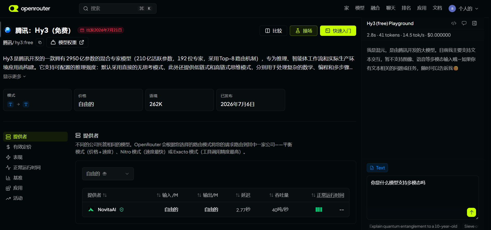

# OpenRouter 上用 Hy3

[OpenRouter](https://openrouter.ai/) 聚合了多家模型，有网页对话，也提供 OpenAI 兼容 API。列表里有 Hy3 的话，可以直接在浏览器里试。

正式业务或校内额度优先用 **TokenHub**；OpenRouter 适合随手试和接已经支持它的工具。

## 需要什么

- 浏览器 + OpenRouter 账号  
- 走 API 时再创建一个 Key  

## 网页用法

1. 打开 https://openrouter.ai/ 并登录  
2. Models 里搜 `Hy3` 或 `tencent`  
3. 进模型页，点 Chat / Playground  
4. API：Base URL 一般是 `https://openrouter.ai/api/v1`，model id 以页面为准（例如 `tencent/hy3:free`）

| 渠道 | Base URL | Model |
|------|----------|-------|
| OpenRouter | `https://openrouter.ai/api/v1` | 页面上的 ID |
| TokenHub | `https://tokenhub.tencentmaas.com/v1` | `hy3` |

## 试一次

选好 Hy3，问一个普通中文问题（比如开源有什么好处），能完整回答即可。

如果当时列表里没有 Hy3，改用 TokenHub + 任意兼容客户端验证，并在说明里写清楚。

## 截图

## 注意

- 第三方平台上的模型名、是否免费会变动，以当天页面为准  
- 截图别带完整 Key  
