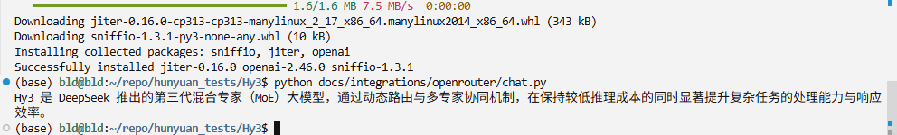

# OpenRouter × Hy3

**以下命令均以仓库根目录 `Hy3/` 为当前目录执行。**

## 本目录文件

| 文件 | 用途 |
|------|------|
| [`docs/integrations/openrouter/curl_chat.sh`](./curl_chat.sh) | curl 最小对话 |
| [`docs/integrations/openrouter/chat.py`](./chat.py) | Python SDK 示例 |
| [`docs/integrations/openrouter/requirements.txt`](./requirements.txt) | 依赖 |

```bash
bash docs/integrations/sync_env.sh
bash docs/integrations/openrouter/curl_chat.sh
# 或
pip install -r docs/integrations/openrouter/requirements.txt
python docs/integrations/openrouter/chat.py
```

## 配置项

| 配置 | 值 |
|------|-----|
| Base URL | `https://openrouter.ai/api/v1` |
| Model | `tencent/hy3` |

## Demo / 截图



## 提交前

```bash
bash docs/integrations/sanitize_secrets.sh
```
