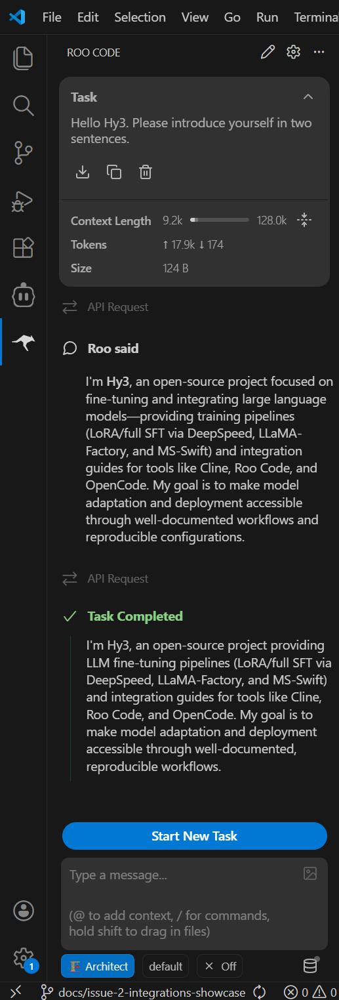
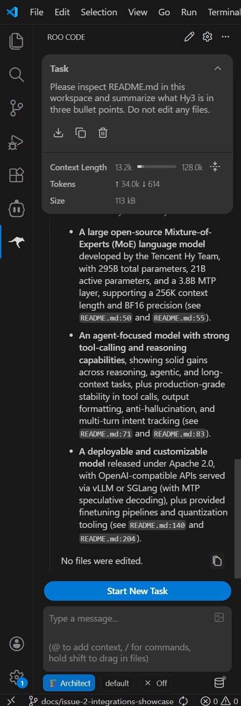

# Use Hy3 with Roo Code

## Overview

This guide shows how to configure Roo Code to use Hy3 through an OpenAI-compatible provider.

Verification status: Roo Code with Hy3 through Tencent Cloud TokenHub mode was manually verified with screenshots.

## Prerequisites

- Roo Code version: `3.54.0`.
- VS Code extension identifier: `rooveterinaryinc.cline`.
- Choose one Hy3 setup mode:
  - TokenHub cloud API mode: manually verified.
  - Local self-hosted mode: TODO: verify manually.

## Option A: TokenHub Cloud API Mode

Use TokenHub when you want to call Hy3 through Tencent Cloud TokenHub without self-hosting.

See [tokenhub.md](tokenhub.md) for shared setup and safety notes.

The basic TokenHub Hy3 Chat Completions API smoke test is verified in [tokenhub.md](tokenhub.md). Roo Code-specific setup through TokenHub was also manually verified.

| Setting | Value |
|:---|:---|
| Base URL | `https://tokenhub.tencentmaas.com/v1` |
| Model | `hy3` |
| API provider | OpenAI Compatible |
| API key | User-created TokenHub API key, not committed and not documented |
| Protocol | OpenAI-compatible |

If the TokenHub API key access scope is limited, Hy3 must be included in that scope.

## Option B: Local Self-hosted Mode

Use local self-hosted mode when Hy3 is running as a local OpenAI-compatible chat completions server.

See [local-server.md](local-server.md) for the repository-documented vLLM and SGLang serving examples.

| Setting | Value |
|:---|:---|
| Base URL | `http://127.0.0.1:8000/v1` |
| Model | `hy3` |
| API key for local testing | `EMPTY` |
| API protocol | OpenAI-compatible chat completions |

## Start Hy3 as an OpenAI-compatible Server

For TokenHub cloud API mode, no local Hy3 server is required.

For local self-hosted mode, follow [local-server.md](local-server.md).

Roo Code-specific connectivity with TokenHub mode was manually verified. Local self-hosted connectivity remains TODO: verify manually.

## Configure the Tool

Roo Code setup path: **Roo Code sidebar -> Configure provider -> OpenAI Compatible provider settings**.

For the verified TokenHub configuration:

| Field | Verified value |
|:---|:---|
| API provider | OpenAI Compatible |
| Base URL | `https://tokenhub.tencentmaas.com/v1` |
| Model | `hy3` |
| API key | User-created TokenHub API key, not committed and not documented |

Exact Roo Code UI path, secret storage behavior, and advanced options: TODO: verify manually.

## First Chat

Prompt:

```text
Hello Hy3. Please introduce yourself in two sentences.
```

Result: completed successfully.

## Real Task Demo

Task:

```text
Please inspect README.md in this workspace and summarize what Hy3 is in three bullet points. Do not edit any files.
```

Result: Roo Code completed the task and did not edit files.

Observed README demo summary:

1. Hy3 is a large open-source Mixture-of-Experts language model developed by the Tencent Hy Team, with 295B total parameters, 21B active parameters, 3.8B MTP layer parameters, 256K context length, and BF16 precision.
2. Hy3 is agent-focused, with strong tool-calling and reasoning capabilities.
3. Hy3 is deployable and customizable, released under Apache 2.0, with OpenAI-compatible APIs served via vLLM or SGLang, plus finetuning pipelines and quantization tooling.

The demo screenshot shows README references such as `README.md:50`, `README.md:55`, `README.md:71`, `README.md:83`, `README.md:140`, and `README.md:204`.

## Screenshots / GIF

- First chat screenshot:



- Real task demo screenshot:



Screenshots are included under `docs/integrations/assets/roo-code/`. GIFs are optional and were not added.

Screenshots and GIFs must not reveal API keys.

## Troubleshooting

- TokenHub API key handling: verified by using a user-created TokenHub API key without committing or documenting it.
- TokenHub API key access scope for Hy3: TODO: verify manually.
- Local endpoint connection issue: TODO: verify manually.
- Local self-hosted authentication or API key handling: TODO: verify manually.
- Model selection issue: TokenHub mode verified with `hy3`.
- Streaming or tool-use behavior: TODO: verify manually.

## Verified Environment

| Item | Value |
|:---|:---|
| OS | Windows 10.0.26200 |
| Editor | VS Code |
| Extension | Roo Code (`rooveterinaryinc.cline`) |
| Roo Code version | `3.54.0` |
| Setup mode | Tencent Cloud TokenHub cloud API mode |
| Hy3 server backend | TokenHub cloud API |
| API provider | OpenAI Compatible |
| Base URL | `https://tokenhub.tencentmaas.com/v1` |
| Model | `hy3` |
| Verification date | 2026-07-08 |
