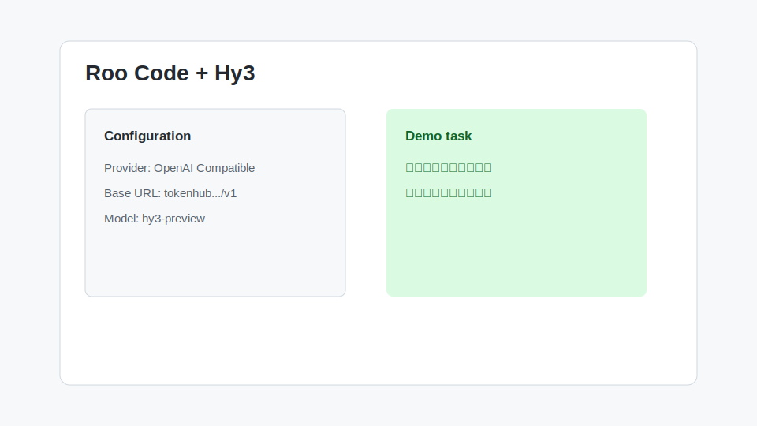

# Roo Code 接入 Hy3

Roo Code 是 VS Code 中常见的 AI 编程 Agent。它支持配置自定义模型服务时，可以接入 Hy3 进行代码理解、修复和生成。



## 安装与版本要求

- VS Code
- Roo Code 插件
- 支持 OpenAI Compatible / Custom Base URL 的 Roo Code 版本
- TokenHub API Key

## 配置项

| 配置项 | 值 |
| --- | --- |
| Provider | OpenAI Compatible |
| Base URL | `https://tokenhub.tencentmaas.com/v1` |
| Model | `hy3-preview` |
| API Key | TokenHub API Key |
| Mode | Ask / Code / Architect 均可，首次建议 Ask |

## 第一次对话

```text
请只读分析当前仓库，说明它的技术栈、目录结构和最适合从哪里开始阅读。
```

## 真实任务 Demo

任务：修复一个表单校验 bug。

输入：

```text
请检查登录表单的校验逻辑。目标：邮箱为空、格式错误、密码少于 8 位时给出不同错误提示。先列计划，再等我确认后修改。
```

示例输出：

```text
我会先定位表单组件和校验函数，再补充 3 个分支和对应测试。需要修改的文件预计是 LoginForm 和 validation utils。
```

## 常见注意事项

- 首次配置后先运行只读任务，确认模型能正常回复。
- 如果 Roo Code 提示模型不可用，检查模型名是否精确为 `hy3-preview`。
- 如果插件要求 “OpenAI Base URL”，不要填完整 `/chat/completions`。
- 对涉及写文件的任务，建议启用确认机制。
