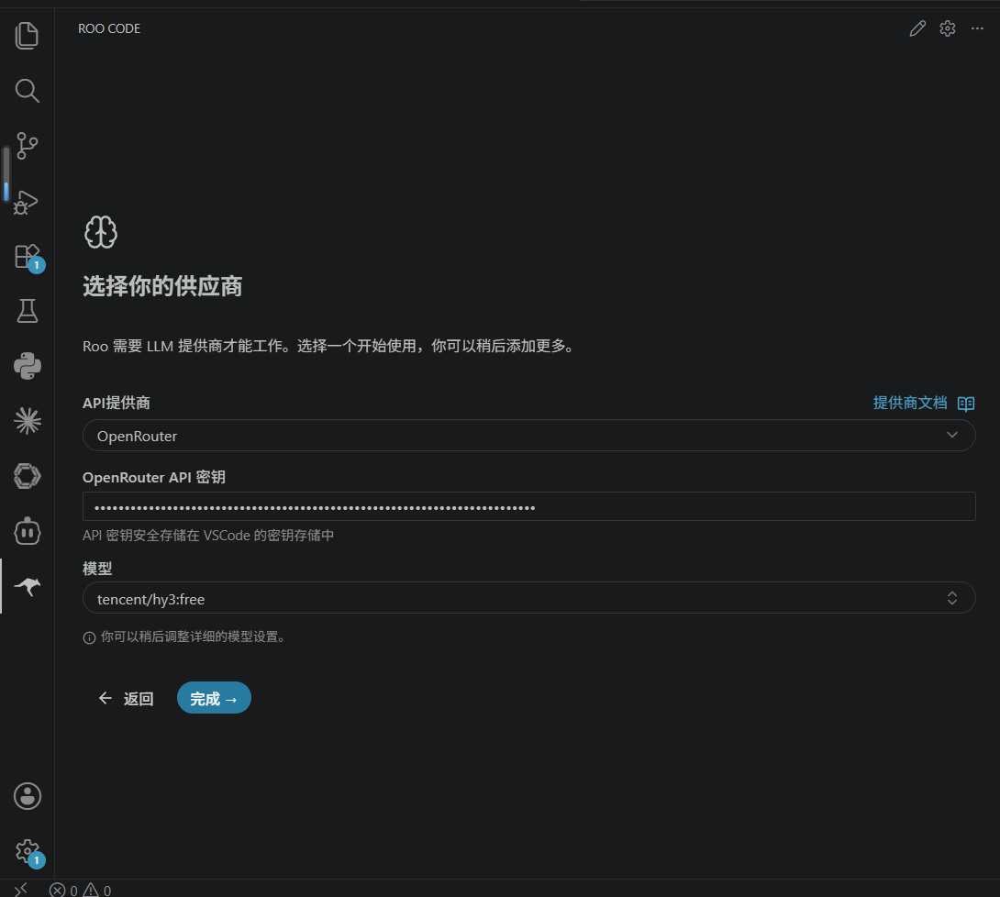
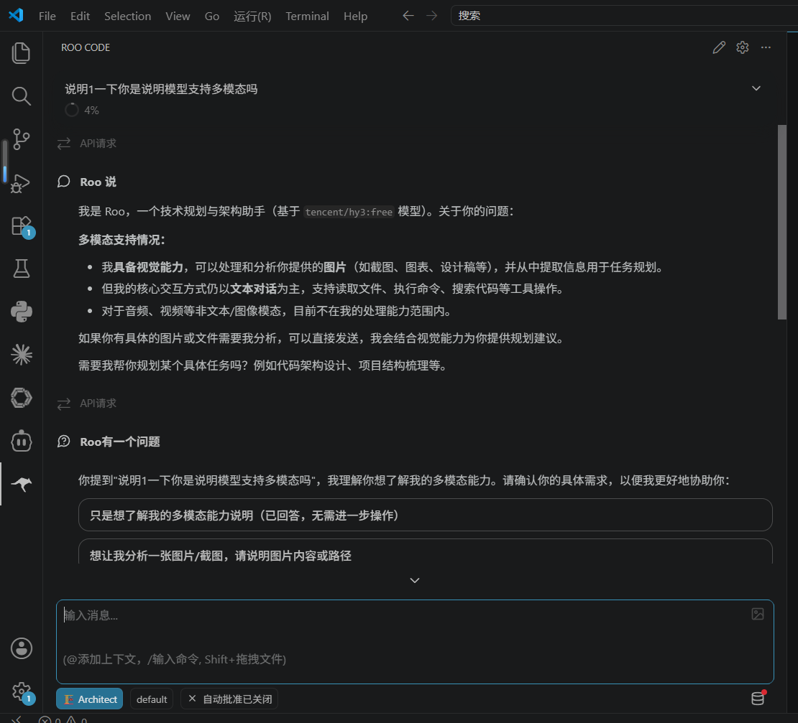

# Roo Code + Hy3

[Roo Code](https://github.com/RooCodeInc/Roo-Code)（扩展市场名一般是 **Roo Code**）支持 OpenRouter 和 OpenAI 兼容接口，可以接到 Hy3。

## 安装

VS Code 扩展市场安装 **Roo Code**，从活动栏打开面板。

## 配置

设置里选 OpenRouter，或 OpenAI Compatible：

| 项 | 值 |
|----|-----|
| Provider | OpenRouter / OpenAI Compatible |
| Base URL | `https://openrouter.ai/api/v1`（兼容模式时填） |
| API Key | 对应平台的 Key |
| Model | 例如 `tencent/hy3:free` |
| Max Tokens | 4096 |

TokenHub：`https://tokenhub.tencentmaas.com/v1`，模型 `hy3`。

## 试一次

打开面板，发一句简单的中文问题，或选中代码让它解释。能回就算通了。

## 截图

## 注意

Max tokens 不要填特别大，否则有时会 400。菜单文案随版本会变，对着 Base URL / Key / Model 三个字段填就行。
