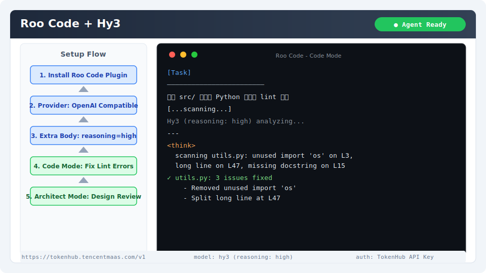

# Roo Code 集成指南

[Roo Code](https://github.com/RooVetGit/Roo-Code) 是 VS Code 上的 AI 编程助手插件，从 Cline 分支而来，专注于提供更灵活的自定义模型支持和扩展能力。通过配置 OpenAI 兼容提供商即可接入 Hy3。

## 安装与版本要求

- **VS Code**：1.85+
- **Roo Code 插件**：最新版本

安装方式：
- VS Code 扩展市场搜索 "Roo Code" 安装
- 或通过 [Open VSX](https://open-vsx.org/) 安装

验证安装：侧边栏出现 Roo Code 图标（袋鼠图标）。

## 核心配置

### 1. 打开设置

点击侧边栏 Roo Code 图标 → 点击右上角齿轮图标进入 Provider 设置。

### 2. Provider 配置

| 字段 | 值 |
|------|-----|
| API Provider | **OpenAI Compatible** |
| Base URL | `https://tokenhub.tencentmaas.com/v1` |
| API Key | `sk-xxx`（从 TokenHub 获取） |
| Model | `hy3` |

### 3. 推理模式配置（Advanced Settings）

Roo Code 支持在 Advanced Settings 中配置额外参数。在 `Extra Body` 字段中填入：

```json
{
  "chat_template_kwargs": {
    "reasoning_effort": "high"
  }
}
```

如需轻度推理，将 `high` 改为 `low`；直接回复模式改为 `no_think`。

### 各部署模式配置

| 模式 | Base URL | Model | 推荐场景 |
|------|----------|-------|----------|
| TokenHub（国内推荐） | `https://tokenhub.tencentmaas.com/v1` | `hy3` | 国内用户首选 |
| TokenHub（海外） | `https://tokenhub-intl.tencentmaas.com/v1` | `hy3` | 海外用户 |
| OpenRouter | `https://openrouter.ai/api/v1` | `tencent/hy3` | 已有 OpenRouter 账号 |
| 本地 vLLM/SGLang | `http://127.0.0.1:8000/v1` | `hy3` | 本地开发测试 |

## 第一次对话测试

1. 打开 Roo Code 面板
2. 确认 Provider 已选为自定义 OpenAI Compatible
3. 输入：

```
写一个 Python 函数，将给定字符串中的每个单词首字母大写（类似 .title()），但保留已有的全大写单词不变
```

**预期结果**：Hy3 生成带完整文档和示例的 Python 函数。



## 端到端实战 Demo：自动修复 Python 项目中的 Lint 错误

### 场景

使用 Roo Code 扫描项目中的 Python 文件，发现并自动修复 pylint/flake8 报告的代码风格问题。

### 操作步骤

1. 准备一个包含一些代码风格问题的 Python 项目
2. 在 VS Code 中安装 Python 和 pylint 扩展
3. 打开 Roo Code 面板
4. 输入：

```
请检查 src/ 目录下所有 Python 文件，找出以下问题并逐一修复：
1. 未使用的 import 语句
2. 超过 100 字符的行
3. 函数/类缺少 docstring
4. 变量命名不符合 snake_case 规范

每个修复后请简要说明修改了什么。
```

5. 观察 Roo Code 逐个文件检查并应用修复
6. 用 git diff 查看所有变更

### 预期行为

- Roo Code 逐个读取 Python 文件内容
- 分析代码风格问题
- 使用 Edit 工具逐个修复
- 最终所有文件通过 pylint 基本检查

## 常见注意事项

1. **与 Cline 的关系**：Roo Code 是 Cline 的分支，配置方式相似但某些高级功能（如 Extra Body）更完善
2. **Extra Body 支持**：Roo Code 原生支持 `extra_body` 参数，可用于配置 `chat_template_kwargs`——这是相比 Cline 的优势
3. **MCP 集成**：Roo Code 拥有独立的 MCP Server 配置面板，可与 Hy3 的 Function Calling 配合使用
4. **自动批准**：在 Settings 中可配置自动批准特定操作（如只读文件搜索），减少交互打断
5. **Rate Limiting**：密集的代码扫描会话可能触发 TokenHub 的速率限制，遇到 429 时 Roo Code 会自动等待后重试
6. **切换自定义 Mode**：Roo Code 支持 Code、Architect、Ask 三种模式，建议代码生成用 Code，架构设计用 Architect
