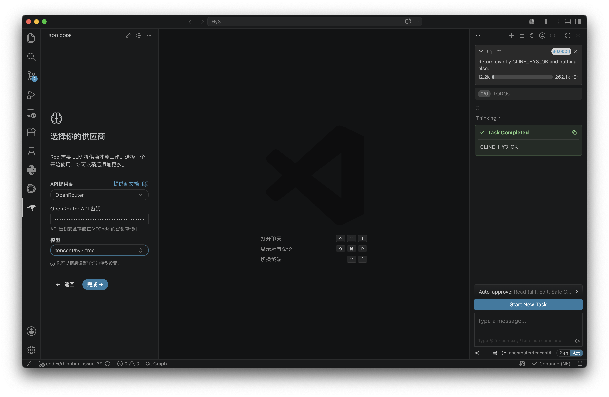
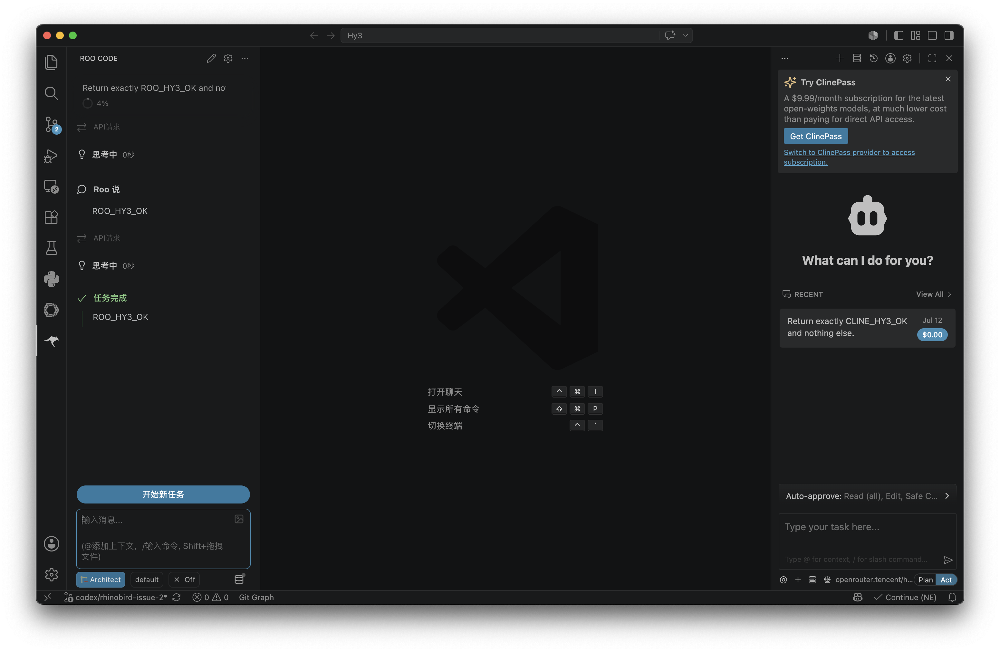

# 在 Roo Code 中使用 Hy3

Roo Code 是支持 Code、Architect、Ask、Debug 等模式的 VS Code Agent。本指南在 Roo Code `3.54.0` 上核对。

## 安装与版本

```bash
code --install-extension RooVeterinaryInc.roo-cline
code --list-extensions --show-versions | grep -i roo
```

也可在扩展市场搜索 `Roo Code`，确认发布者为 `roocode.com`。

## 配置

1. 打开 Roo Code，进入 Settings。
2. API Provider 选择 **OpenRouter**；若列表没有该项，选择 **OpenAI Compatible**。
3. 填入 OpenRouter API Key。
4. 模型选择 `tencent/hy3:free`，或手动输入该 ID。
5. OpenAI Compatible 模式下填写 `https://openrouter.ai/api/v1`。

| 配置项 | 值 |
| --- | --- |
| Provider | OpenRouter / OpenAI Compatible |
| Base URL | `https://openrouter.ai/api/v1` |
| Model ID | `tencent/hy3:free` |
| 鉴权 | Roo Code Secret Storage |
| 推荐模式 | Ask 验证，Architect 规划，Code 修改 |

## 真实调用验证

本机配置页确认 provider 为 OpenRouter、模型为 `tencent/hy3:free`，API Key 仅以密码点显示。



随后在 Architect 模式发送：

```text
Return exactly ROO_HY3_OK and nothing else.
```

Roo Code 完成任务并返回 `ROO_HY3_OK`。



## 第一次对话

先选择 **Ask** 模式并发送：

```text
阅读当前仓库的 README 和目录树，指出运行 API examples 所需的环境变量。只回答，不修改文件。
```

确认回答引用了真实文件和变量名后，再进入可写模式。

## 端到端任务

1. 使用 Architect 模式发送：

```text
为“新增第三方工具接入指南”制定实施计划。必须包含目标路径、文档结构、截图命名和验证命令。
```

2. 审阅计划后切换 Code 模式，要求只创建一个 Markdown 文件。
3. 查看 Roo Code 的 proposed changes，逐项批准。
4. 运行 `git diff --check` 并检查 Markdown 相对链接。

## 注意事项

- 不要在 Code 模式下自动批准所有终端命令。
- Roo Code 的模式提示会增加 token 消耗，免费 endpoint 可能更容易触发容量限制。
- 如果工具调用解析失败，先用 Ask 模式验证纯对话；自部署服务需启用 Hy3 tool parser。
- 切换 provider 后重新确认模型 ID，避免回落到其他模型。
- Roo Code `3.54.0` 在 VS Code `1.127` 中仍查找旧的 `@vscode/ripgrep` 路径；本机验证仅在扩展副本中把路径探测改为当前的 `@vscode/ripgrep-universal/bin/darwin-arm64/rg`。该兼容修改位于仓库外，未进入本 PR；其他环境应优先使用相互兼容的 Roo Code 与 VS Code 版本。
