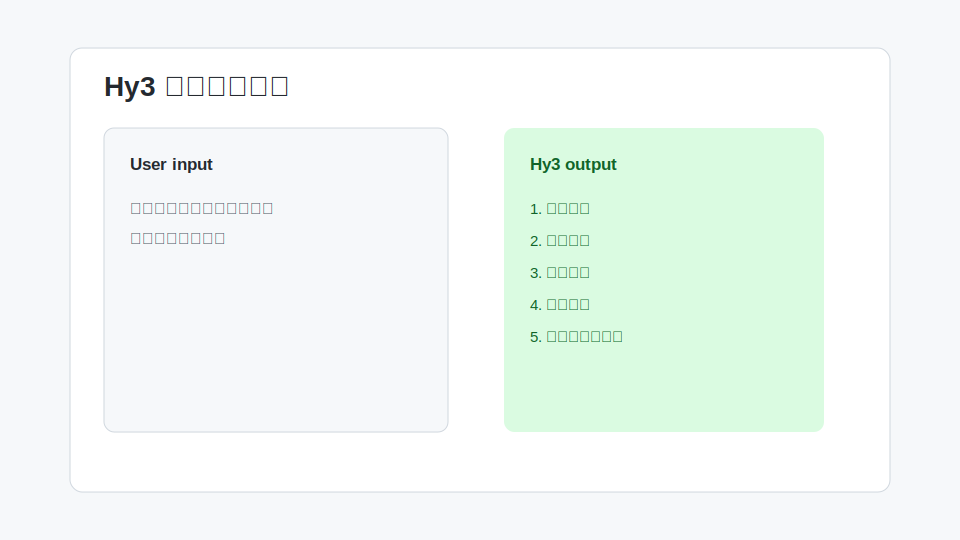

# 小作品 Demo：Hy3 需求澄清助手

本 demo 使用 Dify + Hy3 构建一个“需求澄清助手”。用户输入一句模糊需求后，Hy3 会生成澄清问题、用户故事、验收标准和初步实现建议。



## 作品目标

面向产品、研发和测试协作场景，把一句自然语言需求快速整理成可执行任务卡片。

核心能力：

- 长文理解
- 结构化生成
- 需求澄清
- 面向开发任务的推理拆解

## 搭建步骤

1. 在 Dify 中新增 Chat App。
2. 模型选择 Hy3：

| 配置项 | 值 |
| --- | --- |
| Provider | OpenAI-API-compatible |
| Base URL | `https://tokenhub.tencentmaas.com/v1` |
| Model name | `hy3-preview` |
| API Key | TokenHub API Key |

3. 配置系统提示词：

```text
你是一个严谨的需求澄清助手。用户会输入一句不完整的产品需求。
请输出：
1. 需求摘要
2. 需要追问的澄清问题
3. 用户故事
4. 验收标准
5. 可能涉及的页面、接口或数据字段
6. 风险与边界情况

要求：
- 使用中文
- 输出 Markdown
- 结论具体、可执行
```

4. 发布应用并复制公开访问链接。

## Demo 输入

```text
我想让用户可以收藏文章，以后能快速找到。
```

## 示例输出

```markdown
## 需求摘要

用户希望收藏文章，并在后续快速访问收藏内容。

## 需要追问的澄清问题

1. 收藏是否仅登录用户可用？
2. 是否需要取消收藏？
3. 收藏列表是否需要搜索、排序或分组？
4. 收藏状态是否需要在文章列表和详情页同步展示？

## 用户故事

作为登录用户，我希望在阅读文章时一键收藏，以便之后在收藏列表中快速找到。

## 验收标准

- 用户可以在文章详情页点击收藏。
- 已收藏文章再次点击可取消收藏。
- 收藏列表展示文章标题、摘要、收藏时间。
- 未登录用户点击收藏时提示登录。

## 可能涉及的接口

- `POST /articles/{id}/favorite`
- `DELETE /articles/{id}/favorite`
- `GET /users/me/favorites`

## 风险与边界情况

- 重复收藏需要幂等处理。
- 文章删除后收藏列表需要处理失效状态。
- 高并发点击收藏按钮需要避免状态错乱。
```

## Demo 视频 / GIF 建议

录制不超过 1 分钟：

1. 展示 Dify 中 Hy3 模型配置。
2. 输入 demo 需求。
3. 展示 Hy3 生成的结构化任务卡片。
4. 复制输出到 issue 或需求文档。

## 独立作品仓库建议

可以单独开源一个小仓库，例如 `hy3-requirement-assistant`，包含：

- `README.md`: 项目说明、模型配置、使用方式
- `prompts/system.md`: Dify 系统提示词
- `examples/demo-input.md`: 示例输入
- `examples/demo-output.md`: 示例输出
- `assets/demo.gif`: 不超过 1 分钟的演示 GIF

该独立仓库链接可在 PR 评论或活动平台中补充。
