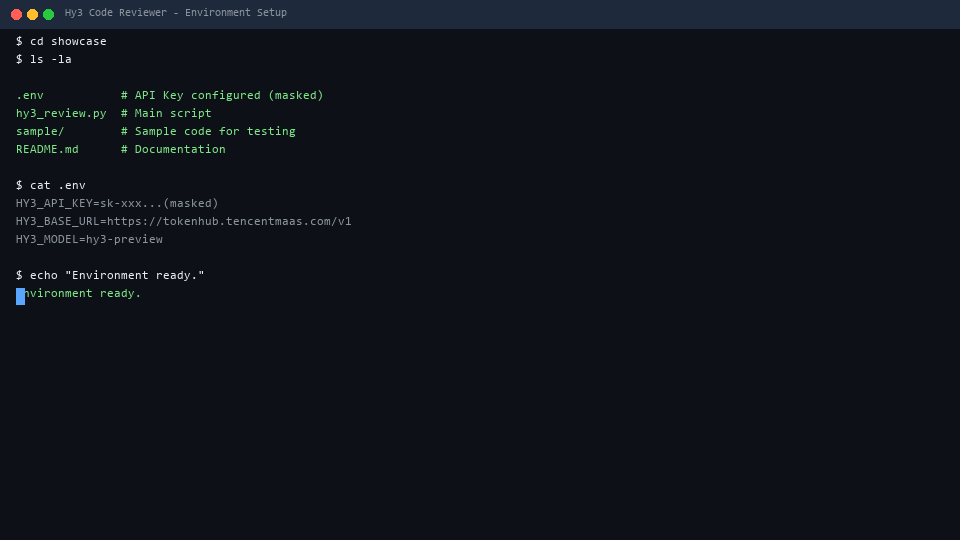

# Hy3 Code Reviewer

基于腾讯混元 Hy3 深度推理能力的 CLI 代码审查工具。将任意代码文件发送至 Hy3，获取结构化的代码审查报告，覆盖 Bug 风险、安全漏洞、性能问题、代码质量和最佳实践五个维度。

## 核心能力

- **深度推理**：利用 Hy3 的 `reasoning_effort: high` 模式，对代码进行逐步推理分析
- **多语言支持**：Python、JavaScript、TypeScript、Go、Rust、Java、C/C++ 等 20+ 语言
- **多输出格式**：终端文本、JSON、Markdown 报告
- **批量审查**：支持目录递归和 glob 通配符

## 快速开始

### 1. 配置 API Key

```bash
cd showcase
copy .env.example .env
# 编辑 .env，填入你的 TokenHub API Key
```

### 2. 安装依赖

```bash
pip install "openai>=1.0.0" python-dotenv
```

### 3. 运行审查

```bash
# 审查单个文件
python hy3_review.py app.py

# 审查多个文件
python hy3_review.py src/*.py

# 深度推理模式
python hy3_review.py app.py --effort high

# 生成 Markdown 报告
python hy3_review.py src/ --output report.md

# JSON 格式输出（便于程序处理）
python hy3_review.py main.py --output json
```

## 使用说明

### 命令行参数

| 参数         | 简写   | 说明                                       | 默认值          |
| ------------ | ------ | ------------------------------------------ | --------------- |
| `files`    | —     | 要审查的文件路径（支持通配符、目录）       | 必填            |
| `--effort` | `-e` | 推理强度:`no_think` / `low` / `high` | `high`        |
| `--output` | `-o` | 输出格式:`text` / `json` / `*.md`    | `text`        |
| `--model`  | `-m` | 覆盖默认模型                               | `.env` 中的值 |

### 推理强度选择

| 强度         | 适用场景           | Token 消耗 | 响应速度 |
| ------------ | ------------------ | ---------- | -------- |
| `no_think` | 简单代码检查       | 低         | 快       |
| `low`      | 日常代码审查       | 中         | 中等     |
| `high`     | 复杂逻辑、安全审计 | 高         | 慢       |

### 审查维度

每份报告覆盖五个维度：

1. **Bug 风险** — 逻辑错误、空值处理、边界条件、异常处理
2. **安全漏洞** — SQL 注入、XSS、不安全反序列化、硬编码密钥
3. **性能问题** — 不必要循环、内存泄漏、低效数据结构
4. **代码质量** — 命名规范、函数长度、复杂度、重复代码
5. **最佳实践** — 设计模式、SOLID 原则、错误处理、文档完整

## 示例

### 输入

```bash
python hy3_review.py calculator.py --effort high
```

### 输出

```
🔍 Hy3 Code Reviewer
   模型: hy3-preview | 推理强度: high
   待审查文件: 1 个

[1/1] 审查中: calculator.py ... ✓ (1856 tokens)

====================================================================
📄 文件 1/1: calculator.py
   语言: python | 行数: 42 | Tokens: 1856
====================================================================

🧠 推理过程:
----------------------------------------
逐一审查文件：函数逐个分析，关注边界条件和异常处理...

📋 审查报告:
----------------------------------------
🔴 严重 | calculator.py:15 — divide() 缺少除零检查，调用 divide(10, 0)
       将抛出 ZeroDivisionError — 建议添加 if b == 0: raise ValueError(...)

🟡 警告 | calculator.py:8 — subtract() 未对 None 参数做检查，传入 None
       将导致 TypeError — 建议添加类型检查和输入验证

🔵 建议 | calculator.py:30 — 魔法数字 3.14159 直接硬编码 —
       建议使用 math.pi 或定义为模块常量

总体评分: 7/10 — 核心逻辑正确，缺少输入验证和错误处理。

====================================================================
📊 总计: 1 个文件, 1856 tokens
====================================================================
```

## 文件结构

```
showcase/
├── README.md           # 本文件
├── .env.example        # 环境变量模板
├── .env                # 实际配置（需自行创建，不提交到 Git）
├── hy3_review.py       # 主程序
└── sample/             # 示例代码供测试
    └── calculator.py   # 用于测试审查功能的示例文件
```

## 设计思路

### 为什么选择 CLI 工具？

- **零部署成本**：Python 脚本即可运行，无需 Web 服务器
- **CI/CD 友好**：可集成到 GitHub Actions 等流水线中
- **开发者习惯**：命令行是开发者最熟悉的工作方式

### 为什么选择代码审查场景？

- **充分利用推理能力**：代码审查需要深度理解代码逻辑，是展示 Hy3 推理优势的典型场景
- **实用性强**：代码审查是开发者的高频刚需
- **结构化输出**：审查报告天然适合结构化展示，便于验证模型输出质量

## Demo GIF

项目已包含自动生成的演示 GIF，展示完整的 5 步操作流程。



**GIF 内容** (41 秒, 410 帧):

1. **环境展示** — 目录结构 + .env 配置确认
2. **单文件审查** — `python hy3_review.py sample/calculator.py --effort high` 的完整终端输出
3. **Markdown 报告** — `--output report.md` 批量审查 + 报告预览
4. **JSON 文件输出** — `--output json` 写入 JSON 文件，中文直接可读
5. **项目总结** — 文件结构总览

注：关于输出的gif动图与实际运行结果存在不一致，具体体现在该gif动图采用的是实时界面演示截取形成的gif动图，全程完全由AI运行并实现，存在因为无法识别中文字符导致的异常问题，实际运行时具体的输出的文件结构与gif动图是一致的。
