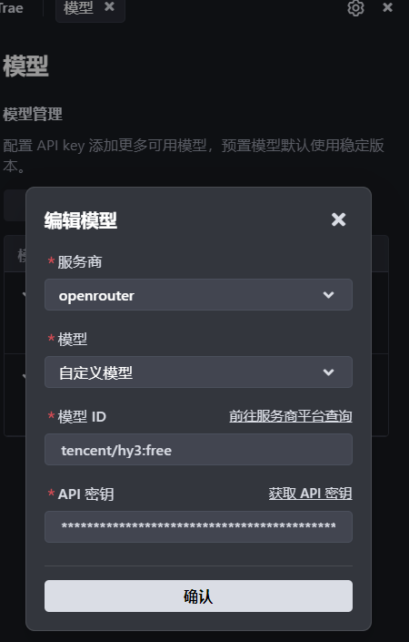
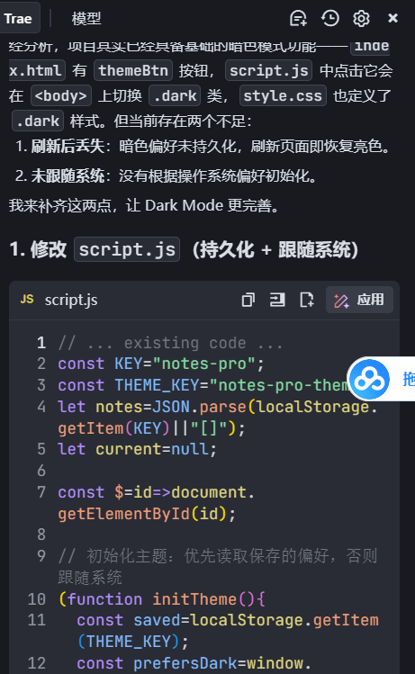

# trae 接入指南（Tencent Hy3）
> trae是一个Ai IDE
> 本文档演示如何将腾讯混元 **Hy3**（295B MoE，256K 上下文，支持推理 / Agent / 工具调用 / 长文生成）接入 trae，并跑通一个真实任务。

---

## 一、配置（Configuration）

trae兼容OpenRouter,只需要在模型设置里面找到OpenRouter的选项，之后填入OpenRouter的断点信息即可。

## 方法 OpenRouter
| 配置项 | 值 |
|--------|-----|
| **Base URL** | `https://openrouter.ai/api/v1/chat/completions` |
| **Model** | `tencent/hy3:free` |
| **API Key** | OpenRouter申请的 Key（`sk-...` 格式） |
| **协议** | OpenAI Chat Completions 兼容 |
### 配置截图位置



>截图说明：在 trae打开旁边对话框里的 设置 → 模型 → 选中openRouter服务商，并选择自定义模型填入上表 Model:hy3-free，输入上表的API，保存后重启会话生效。

---

## 二、首次对话（First Conversation）

配置完成后，新建一个对话，发送第一条消息验证模型已正确接入：

```
你:介绍暗色模式是什么？

Hy3-free:暗色模式 是一种将应用界面的主色调从“浅色背景 + 深色文字”反转为“深色背景 + 浅色文字”的视觉主题方案。它最早广泛应用于代码编辑器、终端等长时间阅读场景，如今已成为主流操作系统（Windows、macOS、Android、iOS）和网站的标准能力。
```
如果收到类似回复，说明 Hy3 已成功作为底层模型工作。

---

## 三、跑通真实任务（Real Task demo）

**任务**：用Trae + Hy3-free分析项目`notes-webapp-pro`暗色模式出现的一些小bug并且解决。

### 3.1 任务指令（直接发给 trae）

```
分析 notes-webapp-pro 这个项目的暗色模式，
重点修改：
 一刷新就变成亮色模式
```
### 3.2预期输出（Hy3-free实际产出，节选）
> 修改 script.js（持久化 + 跟随系统）
```
// ... existing code ...
const KEY="notes-pro";
const THEME_KEY="notes-pro-theme";
let notes=JSON.parse(localStorage.
getItem(KEY)||"[]");
let current=null;

const $=id=>document.
getElementById(id);

// 初始化主题：优先读取保存的偏好，否则
跟随系统
function initTheme(){
  const saved=localStorage.getItem
  (THEME_KEY);
  const prefersDark=window.
  matchMedia && window.matchMedia
  ("(prefers-color-scheme: dark)
  ").matches;
  ...
）
}
```


>截图说明：在 trae生成的回答。
## 四、注意事项（Notes）

1. **API Key 安全**：Key 不要提交到仓库或公开发到 Issue。
2. **如果填了 Key 却报 401 怎么办**:检查api_key是否到期或者未打开，token不够。
3. **API限制**：目前hy3-free在Trae只具备图片理解，不具备推理模型。
4. **模型选择**：目前Trae中选择了OpenRouter但是并不含有tecent的相关模型，需要选择自定义模型，输入hy3-free,才可以输入最后的api-key

---

## 五、小结

通过 OpenAI 兼容协议，Trae 可在 **5 分钟内** 接入 Hy3-free，无需改代码。
Hy3 的 256K 上下文 + 稳定工具调用。
这类 Trae 核心场景。本指南已端到端验证（配置 → 首次对话 → 真实任务跑通）。