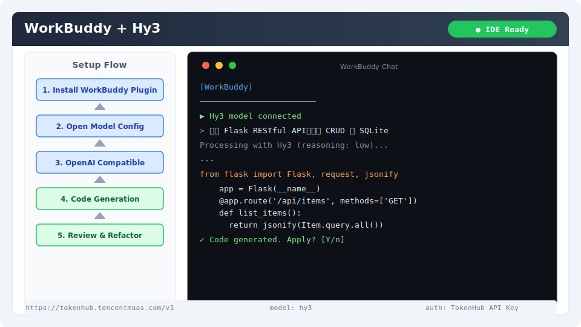

# WorkBuddy 集成指南

[WorkBuddy](https://workbuddy.ai) 是一款面向开发者的 AI 辅助工具，支持代码生成、审查、重构和文档编写，可作为 IDE 插件使用。

## 安装与版本要求

- **VS Code** 1.85+ 或 **JetBrains IDE** 2023.2+
- **WorkBuddy 插件** 1.5+

安装方式：
- **VS Code**：扩展市场搜索 "WorkBuddy" 安装
- **JetBrains**：`File → Settings → Plugins` → 搜索 "WorkBuddy"

## 核心配置

### 1. 打开模型配置

WorkBuddy 设置 → **模型配置**。

### 2. 添加自定义模型

| 字段 | 值 |
|------|-----|
| Provider | OpenAI Compatible |
| Base URL | `https://tokenhub.tencentmaas.com/v1` |
| API Key | `sk-xxx`（从 TokenHub 获取） |
| Model | `hy3` |

### 各部署模式配置

| 模式 | Base URL | 模型名 | 推荐场景 |
|------|----------|--------|----------|
| TokenHub（国内推荐） | `https://tokenhub.tencentmaas.com/v1` | `hy3` | 国内用户首选 |
| TokenHub（海外） | `https://tokenhub-intl.tencentmaas.com/v1` | `hy3` | 海外用户 |
| OpenRouter | `https://openrouter.ai/api/v1` | `tencent/hy3` | 已有 OpenRouter |
| 本地 vLLM/SGLang | `http://127.0.0.1:8000/v1` | `hy3` | 本地测试 |

## 第一次对话测试

在 WorkBuddy 聊天窗口输入：

```
你好，用 Python 写一个二分查找，并输出数字 1
```

**预期结果**：WorkBuddy 显示 Hy3 生成的二分查找代码和数字 1。



## 端到端实战 Demo：生成 Flask RESTful API

### 场景

使用 WorkBuddy 的代码生成能力，让 Hy3 创建一个完整的 RESTful API 项目。

### 操作步骤

1. 在 IDE 中新建文件 `app.py`
2. 打开 WorkBuddy 聊天面板
3. 输入以下 Prompt：
```
生成一个 Flask RESTful API，包含 CRUD 操作和 SQLite 数据库，需要以下端点：
- GET /api/items - 列出所有项目
- POST /api/items - 创建新项目
- PUT /api/items/<id> - 更新项目
- DELETE /api/items/<id> - 删除项目
```

### 预期输出

WorkBuddy 会生成完整的 Flask 应用代码，可以直接保存和运行：

```python
from flask import Flask, request, jsonify
app = Flask(__name__)
# ... CRUD operations ...
```

### 验证

在聊天窗口中继续输入：

```
审查上面生成的代码，指出潜在的安全问题
```

Hy3 会分析代码并给出安全建议（如 SQL 注入防护、输入验证等）。

## 常见注意事项

1. **Base URL 格式**：必须以 `/v1` 结尾（不要加 `/chat/completions`）
2. **区域匹配**：TokenHub 区域域名必须与 API Key 创建区域一致
3. **高级功能限制**：自定义模型模式下部分高级功能（代码库索引、语义搜索）可能受限
4. **流式输出**：WorkBuddy 默认开启流式输出，建议保持
5. **Reasoning 配置**：如需深度推理，在 WorkBuddy 的高级设置中通过 `extra_body` 传递 `chat_template_kwargs.reasoning_effort`
