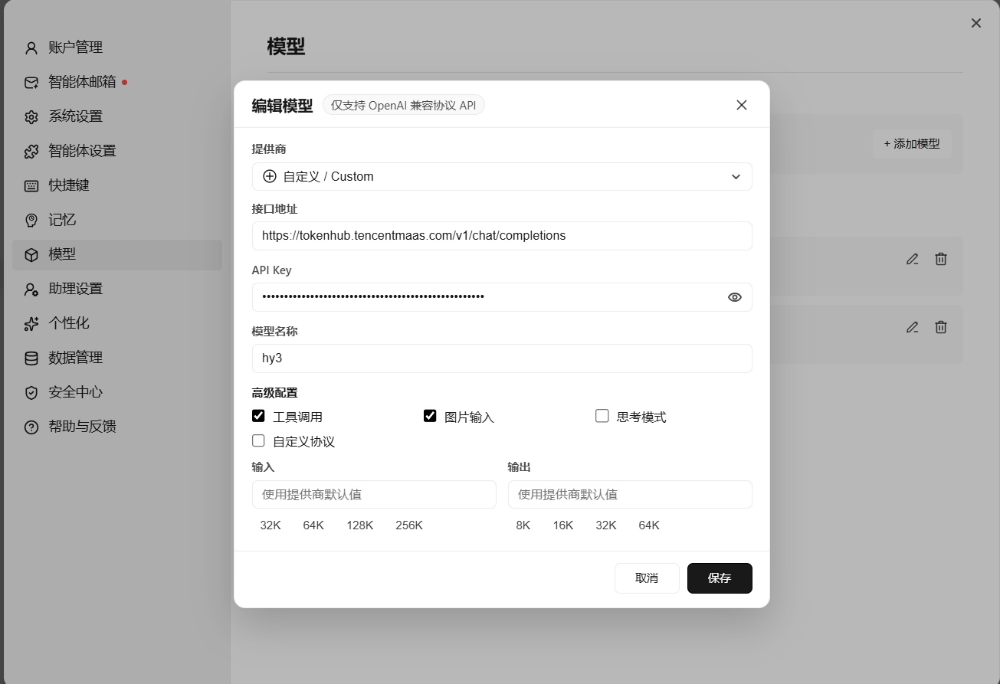
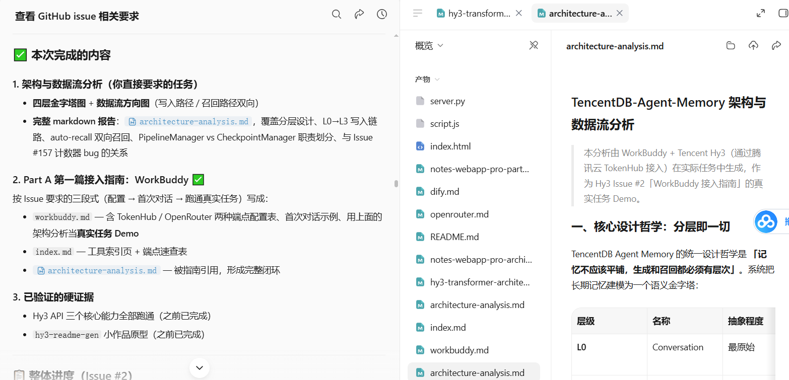

# WorkBuddy / CodeBuddy 接入指南（Tencent Hy3）

> 本文档演示如何将腾讯混元 **Hy3**（295B MoE，256K 上下文，支持推理 / Agent / 工具调用 / 长文生成）接入 WorkBuddy（或 CodeBuddy），并跑通一个真实任务。

---

## 一、配置（Configuration）

WorkBuddy / CodeBuddy 兼容 OpenAI 协议，只需在模型设置里填入 Hy3 的端点信息即可。

### 方式 腾讯云 TokenHub（推荐，国内低延迟）

| 配置项 | 值 |
|--------|-----|
| **Base URL** | `https://tokenhub.tencentmaas.com/v1` |
| **Model** | `hy3` |
| **API Key** | 腾讯云 TokenHub 申请的 Key（`sk-...` 格式） |
| **协议** | OpenAI Chat Completions 兼容 |


### 配置截图位置




> 截图说明：在 WorkBuddy 设置 → 模型 → 自定义 OpenAI 兼容端点，填入上表 Base URL / Model / API Key，保存后重启会话生效。

---

## 二、首次对话（First Conversation）

配置完成后，新建一个对话，发送第一条消息验证模型已正确接入：

```
你：用一句话解释什么是 Mixture-of-Experts 模型？

Hy3：Mixture-of-Experts（MoE）是一种神经网络架构，
核心思想是让多个"专家"子网络各管一摊任务，
由一个"路由器"决定每条输入交给哪些专家处理，
从而在总参数量巨大的情况下只激活一小部分参数，兼顾能力与效率。
```

如果收到类似回复，说明 Hy3 已成功作为底层模型工作。

---

## 三、跑通真实任务（Real Task Demo）

**任务**：用 WorkBuddy + Hy3 分析开源项目 `TencentCloud/TencentDB-Agent-Memory` 的架构与数据流方向，并产出结构化的分析报告。

### 3.1 任务指令（直接发给 WorkBuddy）

```
分析 TencentDB-Agent-Memory 这个项目的架构和数据流方向，
重点说明：
1. L0→L3 四层记忆的分层设计
2. 写入路径（从对话到 Persona 的沉淀过程）
3. 召回路径（auto-recall 如何双向检索注入）
4. PipelineManager 和 CheckpointManager 的职责划分
```

### 3.2 预期输出（Hy3 实际产出，节选）

> **核心设计哲学：分层即一切。** 系统把长期记忆建模为语义金字塔：
> - **L0 Conversation**：最原始的对话记录，sanitize 后以 JSONL 每日文件落盘
> - **L1 Atom**：结构化事实，向量去重 + 冲突检测，可检索
> - **L2 Scenario**：把相关 Atom 聚合成 Markdown 场景块
> - **L3 Persona**：用户画像，平时靠它快速把握用户偏好
>
> **写入路径**：`agent_end` hook → L0Recorder 落 JSONL → PipelineManager 调度
> `notifyConversation` 决定何时触发 L1 → L1Runner 抽 Atom → advanceL2Timer
> 触发 L2 聚合 Scenario → PersonaGenerator 生成 persona.md。
>
> **召回路径**：每轮 `auto-recall` 触发，先读 L3 Persona 快速把握，
> 再语义检索 L2/L1 下钻取证，带字符预算注入上下文。
>
> **两个调度组件**：PipelineManager 是调度中枢（warm-up 阈值、L2 只减不增定时器、
> 优雅关闭三层防护）；CheckpointManager 用 split-state 设计把 runner_states 和
> pipeline_states 分到两个命名空间，消除并发写互相覆盖的 bug。

>截图说明：workbuddy实际产出节选部分

---

## 四、注意事项（Notes）

1. **API Key 安全**：Key 不要提交到仓库或公开发到 Issue。本地用环境变量或 WorkBuddy 的密钥管理存储。
2. **推理模式**：Hy3 默认 `no_think` 直答模式。
3. **工具调用**：Hy3 工具调用稳定，适合 Agent 场景（如让 WorkBuddy 自动读文件、跑命令）。
4. **如果填了 Key 却报 401 怎么办**:检查api_key是否到期或者未打开，token不够
---

## 五、小结

通过 OpenAI 兼容协议，WorkBuddy 可在 **5 分钟内** 接入 Hy3。
Hy3 的 256K 上下文 + 稳定工具调用，使其特别适合「分析大型代码库」「长文档处理」
这类 WorkBuddy 核心场景。本指南已端到端验证（配置 → 首次对话 → 真实任务跑通）。
