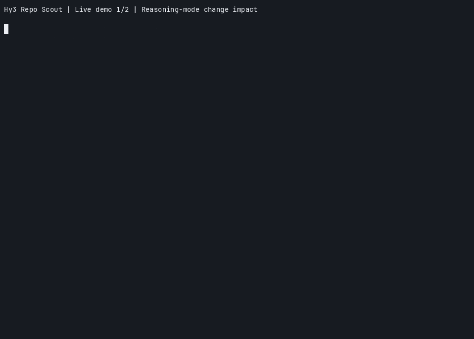

# Hy3 Repo Scout

[English](README.md)

Hy3 Repo Scout 是一个由 Hy3 API 驱动的只读仓库调查 CLI。Hy3 可以从四个有边界的
本地工具中选择调用，最终生成基于证据的 Markdown 报告；程序会在本地校验报告中的
仓库文件和行号引用。

模型可调用的工具不会修改目标仓库，也不提供通用 Shell。只有用户显式指定
`--output` 时，程序才会向指定路径写入报告。

## 运行要求

- Python 3.10 或更高版本。
- 可访问的、提供 Hy3 且支持工具调用的 OpenAI 兼容 Chat Completions 接口。
- 配置端点接受的 API 凭据。OpenRouter 必须使用真实 Key；其他兼容网关可按其文档
  使用占位凭据。
- 当 Hy3 需要调用可选的 `git_diff` 工具时，操作系统默认可执行路径中需安装 Git，
  且 `--repo` 必须恰好指向 Git 仓库根目录；linked worktree 的 Git 管理指针必须双向一致。

## 安装

在 Hy3 仓库中执行：

```bash
cd examples/hy3-repo-scout
python3 -m venv .venv
source .venv/bin/activate
python -m pip install --upgrade pip
python -m pip install -e .
```

安装后可使用 `hy3-repo-scout` 命令，也可在虚拟环境中执行
`python -m hy3_repo_scout`。

## 环境变量

程序直接读取进程环境，**不会自动加载 `.env` 文件**。OpenRouter 的最简配置为：

```bash
export HY3_API_KEY="your-openrouter-api-key"
export HY3_BASE_URL="https://openrouter.ai/api/v1"
export HY3_MODEL="tencent/hy3:free"
```

也可以填写 `.env.example`，再显式加载私有副本：

```bash
cp .env.example .env
# 仅在本地编辑 .env，切勿提交。
set -a
source .env
set +a
```

连接其他 OpenAI 兼容 Hy3 网关时，请使用实际的 served model name 和网关要求的凭据。
`EMPTY` 占位值只允许用于非 OpenRouter 端点：

```bash
export HY3_API_KEY="EMPTY"
export HY3_BASE_URL="https://approved-hy3-gateway.example.com/v1"
export HY3_MODEL="hy3"
```

| 变量 | 默认值 | 用途 |
|---|---|---|
| `HY3_API_KEY` | 必填 | API 凭据；未设置时可回退到 `OPENROUTER_API_KEY` |
| `HY3_BASE_URL` | `https://openrouter.ai/api/v1` | OpenAI 兼容 API 根地址 |
| `HY3_MODEL` | `tencent/hy3:free` | 服务商模型标识 |
| `HY3_REASONING_EFFORT` | `high` | 可选 `no_think`、`low` 或 `high` |
| `HY3_TIMEOUT` | `90` | 单次请求超时秒数 |
| `HY3_MAX_ATTEMPTS` | `3` | 瞬时 API 故障的总尝试次数 |
| `HY3_RETRY_BASE_DELAY` | `0.5` | 初始重试等待秒数 |
| `HY3_RETRY_MAX_DELAY` | `8.0` | 重试等待上限秒数 |
| `HY3_MAX_ROUNDS` | `9` | 模型轮次预算；最后两轮用于总结与引用修正 |
| `HY3_MAX_TOOL_CALLS` | `32` | 本地工具调用硬上限 |
| `HY3_MAX_CONTEXT_CHARS` | `120000` | 仓库工具结果累计字符预算 |
| `HY3_MAX_TOOL_RESULT_CHARS` | `24000` | 单次工具结果字符预算 |
| `HY3_MAX_TOKENS` | `16384` | 每次模型请求的最大输出 token 数 |
| `HY3_TEMPERATURE` | `0.3` | Chat Completions temperature |
| `HY3_TOP_P` | `1.0` | Chat Completions top_p |

`--model`、`--base-url`、`--reasoning-effort`、`--max-rounds`、
`--max-tool-calls` 和 `--max-context-chars` 可覆盖单次运行的对应环境变量。
API Key 有意不提供命令行参数，避免出现在 Shell 历史或进程列表中。

当地址属于 OpenRouter 时，客户端发送服务商标准的 `reasoning.effort` 字段，并把本地
`no_think` 映射为 OpenRouter 的 `minimal`；对其他 OpenAI 兼容端点，则发送 Hy3
服务栈使用的 `chat_template_kwargs.reasoning_effort`。

## 单次命令

在 `examples/hy3-repo-scout` 目录中调查 Hy3 仓库根目录：

```bash
hy3-repo-scout --repo ../.. \
  "reasoning_effort 在哪里配置？修改默认值会影响哪些示例？"
```

将带运行元数据和引用校验状态的报告写入文件：

```bash
hy3-repo-scout --repo ../.. \
  --output /tmp/hy3-repo-scout-report.md \
  "审计仓库中的 reasoning_effort 默认值，不要修改文件。"
```

使用 `--json` 可获得机器可读的报告与摘要。单次运行只有在报告完整、结束原因是
`stop`、没有耗尽预算且引用校验通过时才返回状态码 `0`；报告不完整或存在缺失、
无效、未见于本轮证据的引用时返回 `3`，配置或仓库工具错误返回 `2`，其他错误
返回 `1`，用户中断返回 `130`。

## REPL

省略问题即可进入交互模式：

```bash
hy3-repo-scout --repo ../..
```

| 命令 | 作用 |
|---|---|
| `/demos` | 列出内置 Demo |
| `/demo impact` | 运行推理模式变更影响分析 |
| `/demo pipeline` | 运行 LoRA 流程一致性审计 |
| `/exit` 或 `/quit` | 退出会话 |

普通输入行会发起一次新的调查。REPL 只向终端打印结果；需要报告文件时请使用带
`--output` 的单次命令。

## 两个端到端 Demo

仓库提供两个会在运行时真实请求 Hy3 API 的 Demo 定义，结果不是预置文本：

1. [推理模式变更影响分析](demos/prompts/change-impact.md)

   ```bash
   hy3-repo-scout --repo ../.. --demo impact \
     --output demos/artifacts/change-impact.md
   ```

2. [LoRA 流程一致性审计](demos/prompts/lora-pipeline-audit.md)

   ```bash
   hy3-repo-scout --repo ../.. --demo pipeline \
     --output demos/artifacts/lora-pipeline-audit.md
   ```

可用录屏安全的辅助脚本依次运行两个验收流程。脚本会加载本地已忽略的 `.env`（若存在），
不会主动回显凭据，并在任一流程不完整时停止：

```bash
./demos/run-live-demos.sh
```

录制的 OpenRouter 运行中，两个流程都以状态 `0` 完成：[变更影响报告](demos/artifacts/change-impact.md)
包含 58 个已验证引用，[LoRA 流程审计](demos/artifacts/lora-pipeline-audit.md)包含 51 个。
[运行说明](demos/artifacts/RUN.md)记录了时间、非敏感配置、结果、产物哈希和凭据捕获检查。
合并终端录屏为 `37.98` 秒，低于活动要求的两分钟。

[](demos/media/hy3-repo-scout-live-demos.gif)

本应用面向 [Hy3 Issue #4](https://github.com/Tencent-Hunyuan/Hy3/issues/4)，目标分支为
`rhinobird2026`。

## 架构与 Hy3 的作用

```text
问题 / Demo
    |
    v
CLI -> 配置校验 -> OpenAI 兼容 Hy3 Chat Completions API
                     |                               ^
                     | 工具请求                      | 有边界的结果
                     v                               |
                 本地 RepoScoutAgent 编排循环
                     |
                     v
     RepoTools: list_files | search_text | read_file | git_diff
                     |
                     v
             引用校验 -> 终端 / JSON / Markdown
```

**Hy3 在运行时承担核心工作**：规划调查、选择与排序仓库工具、判断证据是否足够，并
综合生成最终引用报告。每一模型轮都是实际 API 请求。本地程序负责工具白名单和预算、
执行只读操作、对瞬时 API 故障进行有限重试，并校验引用语法、路径和行号边界。
程序还会确认每个引用范围确实由本轮工具返回给了 Hy3。

最后两轮不再提供工具：第一轮用于总结，第二轮仅在本地引用校验要求 Hy3 修正报告时
使用。每次工具结果及累计仓库上下文都有字符上限。提示词要求把事实、推断、风险和
建议分开，并按五个固定章节输出；本地引用校验器不会判断某行证据在语义上是否真的
证明了对应结论。

## CodeBuddy 开发记录

开发期间仅使用 CodeBuddy Code CLI `2.119.2` 执行过一次 `acceptEdits` 任务，且
编辑边界限定为 `prompts.py` 和 `test_prompts.py`。它修改了系统提示词及测试；
CodeBuddy 不是运行时依赖，也没有实现智能体循环、API 客户端、仓库工具、引用校验、
CLI、报告、打包或本文档。

接受的变更范围、脱敏任务摘要、四项人工修正和验证记录见
[demos/CODEBUDDY.md](demos/CODEBUDDY.md)。泛化工具名和错误的单行引用格式先由人工
修正；后续真实运行复核又补充了更严格的缺失文件证据规则与 Demo 验证约束。

## 隐私与安全

- Hy3 只能调用 `list_files`、字面量 `search_text`、有边界的 `read_file` 和
  `git_diff`，没有写工具或通用 Shell。
- 路径必须相对选定根目录；程序阻止父目录穿越、绝对路径、不安全软链接、Git 元数据、
  生成环境/缓存目录、二进制、超过 256 KiB 的文件，以及常见密钥文件名和后缀。
  默认单次最多读取 400 行。
- 敏感文件过滤是启发式规则，不是数据防泄漏保证。使用远程服务商前应先检查目标仓库。
- 用户问题以及 Hy3 选择的仓库文本或 diff 片段会发送给配置的 API 服务商。若组织策略
  不允许外发源码，请改用获批的自部署端点。
- 系统提示词要求把仓库内容视为不可信证据，并忽略其中的 prompt injection 指令。
  这是模型层缓解措施，不是形式化沙箱，也不能证明恶意仓库绝对无法影响输出。
- API Key 从环境变量读取，不会由程序放进模型消息、终端跟踪、报告或 JSON 摘要；
  服务商自身的认证处理与日志策略仍然适用。
- `--output` 是操作者显式要求的本地写入。除此之外，仓库调查工具保持只读。

## 测试

测试套件是离线的，使用临时仓库和伪造 API 响应，不消耗 API Key，也不能证明某个
远程服务商当前一定可用。

```bash
cd examples/hy3-repo-scout
python -m unittest discover -s tests -v
python -m pip install -e '.[dev]'
python -m ruff check src tests
```

本文档更新时，本地 80 项单元测试和 Ruff 检查均通过。真实服务商证据另见录制运行说明，
不属于离线单元测试套件。

## 限制

- 服务商模型 ID、免费额度、限流以及对工具调用或对应推理参数字段的支持可能独立变化。
- 搜索是字面量搜索，不是语义或正则搜索；只能处理本地大小、扫描、行数、工具、轮次和
  上下文预算范围内可读的 UTF-8 文本。
- 引用校验检查规范格式、路径安全、文件可读性、行号边界，以及本轮工具证据是否覆盖
  引用范围；它不能验证语义蕴含、结论完整性或建议质量。
- 敏感文件过滤依赖名称和类型，普通源码文件中的密钥仍可能被遗漏；生成报告必须人工复核。
- 模型与服务商文本在显示到终端或写入报告前会移除终端控制字符，避免本地重放控制序列。
- `git_diff` 会调用受限的本地 Git 子进程，仅在 `--repo` 恰好为 Git 根目录时工作，
  且不启用重命名识别或外部文本转换器。程序拒绝 Git filter driver 和对象 alternates；
  Git 目录、common store、对象库与 index 必须位于根目录内，除非 linked worktree 的
  `.git` 与管理目录回链完全一致。程序查找 Git 时会有意忽略调用者的 `PATH`，因此
  操作系统默认路径之外的包管理器自定义安装无法用于此工具。
- 这些检查会阻止已知的 Git 元数据越界路径，但不是针对攻击者可控本地 Git 内部数据的
  形式化沙箱。
- 这是仓库调查助手，不是安全扫描器、代码执行器或代码修改智能体。

## 许可证

Hy3 Repo Scout 随本仓库按 [Apache License 2.0](../../LICENSE) 发布。
