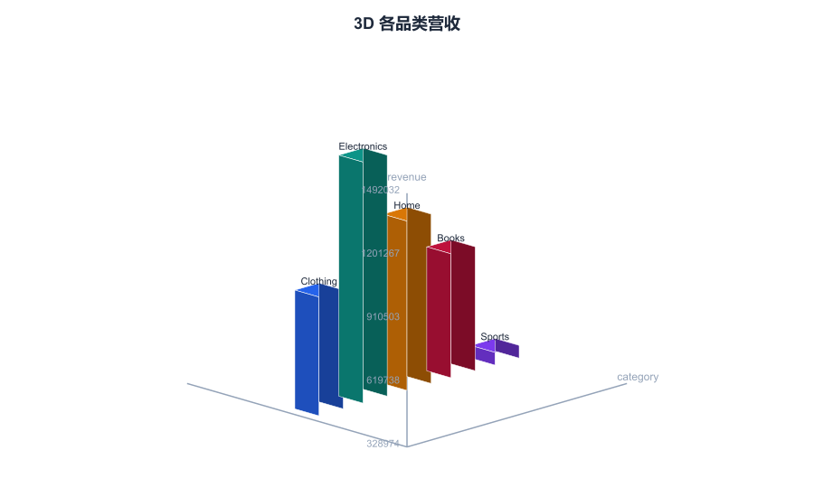
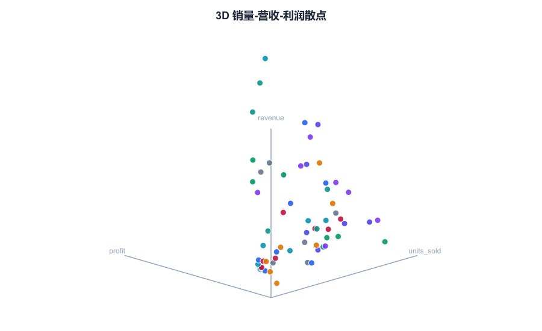
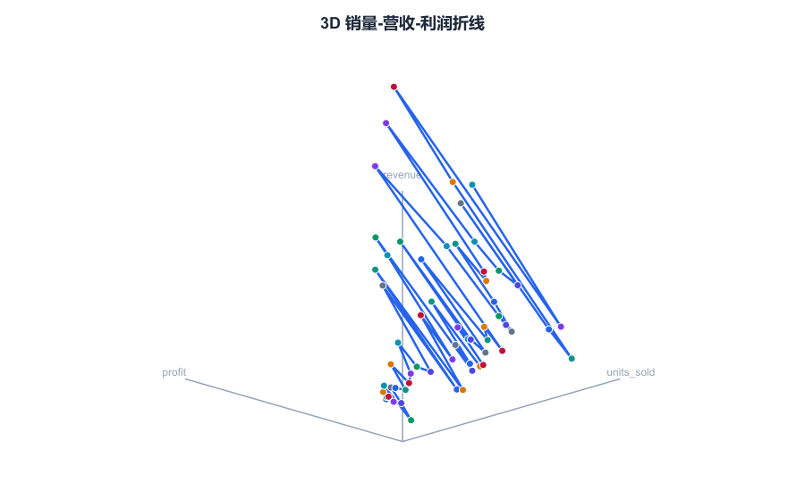
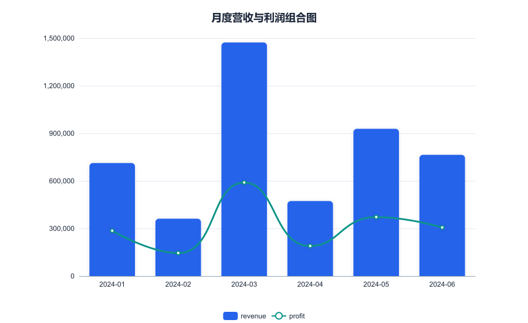
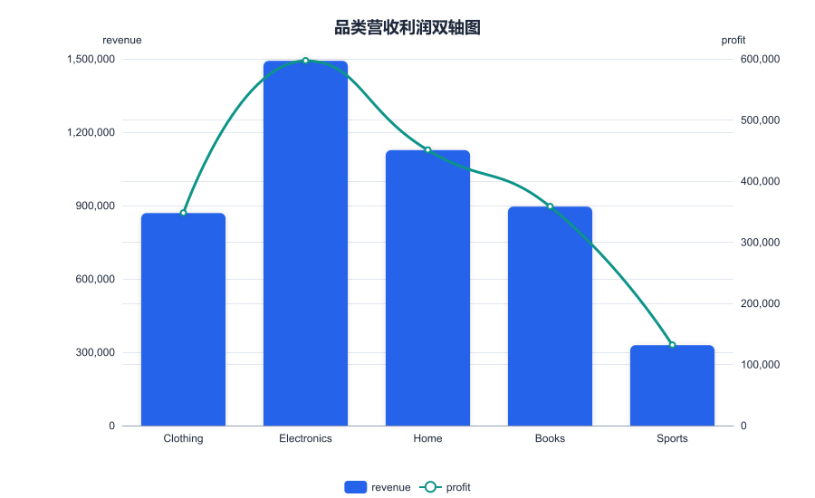
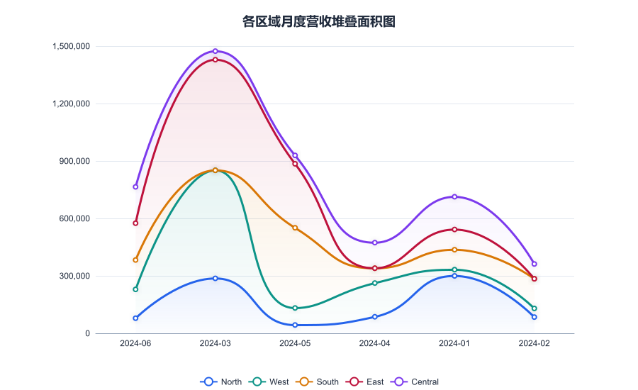
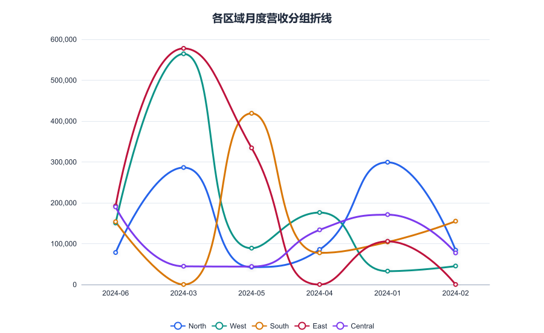
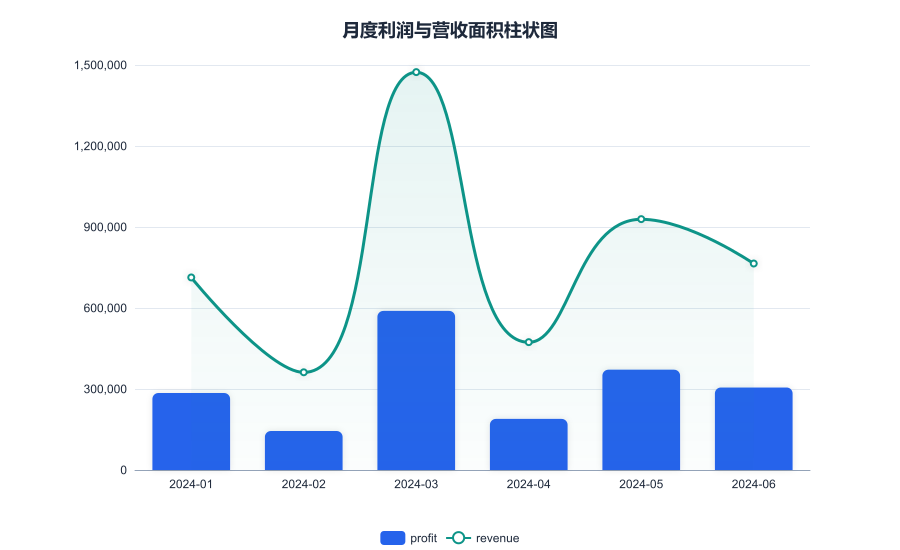

# PR: Add Hy3-powered Data Analysis MCP Server

**Target repository:** `Tencent-Hunyuan/Hy3`  
**Target branch:** `rhinobird2026`  
**New directory:** `hy3-data-mcp/`  
**Author:** `xy200303`  
**Related issue:** [Build an MCP Server powered by Hy3](https://github.com/Tencent-Hunyuan/Hy3/issues/3)

---

## Summary

This PR introduces `hy3-data-mcp`, a TypeScript ESM MCP server that uses the Tencent Hunyuan **Hy3** model for analytical reasoning and generates static/interactive data visualizations locally.

### What’s included

- **8 MCP tools** exposed via stdio:
  - `hy3_data_visualize` — bar, line, area, pie, donut, rose, scatter, bubble, scatter_trend, radar, heatmap, funnel, sankey, treemap, sunburst, gauge, histogram, boxplot, candlestick, stacked_bar, grouped_bar, 3D charts (bar3d, scatter3d, line3d), and composite charts (line_bar, area_bar, dual_axis, stacked_area, grouped_line), each with 9 themes (Professional is the default), custom font support, and optional custom color overrides
  - `hy3_wordcloud` — keyword extraction + word cloud
  - `hy3_knowledge_graph` — entity/relation extraction + force-directed graph
  - `hy3_data_dashboard` — multi-file HTML dashboard or composite PNG
  - `hy3_data_report` — generate HTML/Markdown analysis reports with embedded charts
  - `hy3_data_insight` — textual data analysis
  - `hy3_document_summary` — summarize PDF / DOCX / TXT / CSV / JSON / XLSX
  - `hy3_document_visualize` — extract data from documents and visualize it
- **Output formats:** `svg` (static), `html` (interactive / animated), `png` (rasterized via `sharp`)
- **Document parsing:** PDF (`pdf2json`), DOCX (`mammoth`), XLSX/CSV/JSON (`xlsx` / `papaparse`)
- **CLI installer:** `hdm init` detects CodeBuddy, Cursor, Cline, Roo Code, Continue, Codex CLI, OpenCode and writes the client config automatically
- **Published on npm:** `hy3-data-mcp@0.1.6` — install with `npm install -g hy3-data-mcp` or run with `npx -y hy3-data-mcp`
- **Configuration:** all secrets via `.env` (`HY3_API_KEY`, `HY3_BASE_URL`, `HY3_MODEL`, `HY3_OUTPUT_DIR`); no hard-coded keys
- **Demo:** `assets/demo.gif` generated from real API outputs

---

## Demo


## Screenshot gallery

All screenshots are rendered with the **Professional** theme from the bundled sample datasets.

| | |
|---|---|
|  |  |
|  |  |
|  |  |
|  |  |
|  |  |
|  |  |
|  |  |
|  |  |
|  |  |

---

## How to verify

```bash
cd hy3-data-mcp
cp .env.example .env
# fill in HY3_API_KEY
npm install
npm run build
npm test
npm run test:real   # requires a valid HY3_API_KEY
```

- `npm run build` compiles cleanly.
- `npm test` runs 120+ unit/integration/smoke tests.
- `npm run test:coverage` generates a coverage report: `src/` coverage is ~95% statements / ~85% branches / ~96% functions (entry-point files excluded).
- `npm run test:real` invokes every tool against the live Hy3 endpoint and writes files to `hy3-data-output/`.

---

## Files added

All files live under the new `hy3-data-mcp/` directory:

```
hy3-data-mcp/
├── assets/demo.gif
├── sample_data/
│   ├── complex/
│   │   ├── ecommerce_sales.csv
│   │   ├── customers.csv
│   │   ├── marketing_campaigns.csv
│   │   ├── clinical_trial.csv
│   │   ├── employee_performance.csv
│   │   ├── hierarchical_geo_sales.csv
│   │   └── reviews.csv
│   ├── sales.csv
│   ├── stock.csv
│   ├── article.txt
│   ├── report.docx
│   └── report.pdf
├── scripts/
│   ├── generate-demo-gif.mjs
│   ├── generate-sample-data.mjs
│   └── test-real.mjs
├── src/
│   ├── cli/
│   ├── tools/
│   ├── viz/
│   ├── client.ts
│   ├── documents.ts
│   ├── index.ts
│   ├── server.ts
│   └── utils.ts
├── tests/
├── .env.example
├── .gitignore
├── package.json
├── README.md
├── README_CN.md
└── tsconfig.json
```

---

## Pre-submission checklist

- [x] `npm run build` passes
- [x] `npm test` passes (122/122)
- [x] Real API smoke test passes for all 8 tools
- [x] PNG output verified for `hy3_data_visualize` (including area, sankey, treemap, sunburst, gauge, boxplot, candlestick, bubble, histogram, stacked_bar), `hy3_wordcloud`, `hy3_knowledge_graph`, `hy3_data_dashboard`, and `hy3_document_visualize`
- [x] Theme, custom font, and custom color overrides verified across visualization tools
- [x] README and README_CN updated with PNG examples
- [x] `assets/demo.gif` generated from actual outputs
- [x] `.env` is listed in `.gitignore` and is not committed
- [x] No API keys or secrets are hard-coded
- [x] Follows the existing project license (Apache-2.0)

---

## Notes

- The server uses the OpenAI-compatible Hy3 endpoint (`https://tokenhub.tencentmaas.com/v1`) with model `hy3-preview`.
- Generated files are written to `hy3-data-output/` by default; this directory is ignored by Git.
- Some npm audit warnings exist in transitive dependencies; they can be addressed in a follow-up.
