# Hy3 Data MCP

[](#license)
[](#)
[](#)
[](#)

> Turn any CSV, JSON, Excel, PDF, Word, or text file into charts, dashboards, word clouds, knowledge graphs, and AI-powered insights — all through an MCP server driven by **Tencent Hunyuan Hy3**.

**Hy3 Data MCP** is a [Model Context Protocol](https://modelcontextprotocol.io) server that brings analytical superpowers to your AI assistant. You ask questions in natural language; Hy3 reasons about the data, and the server renders publication-ready visuals in **SVG**, **HTML**, or **PNG**.

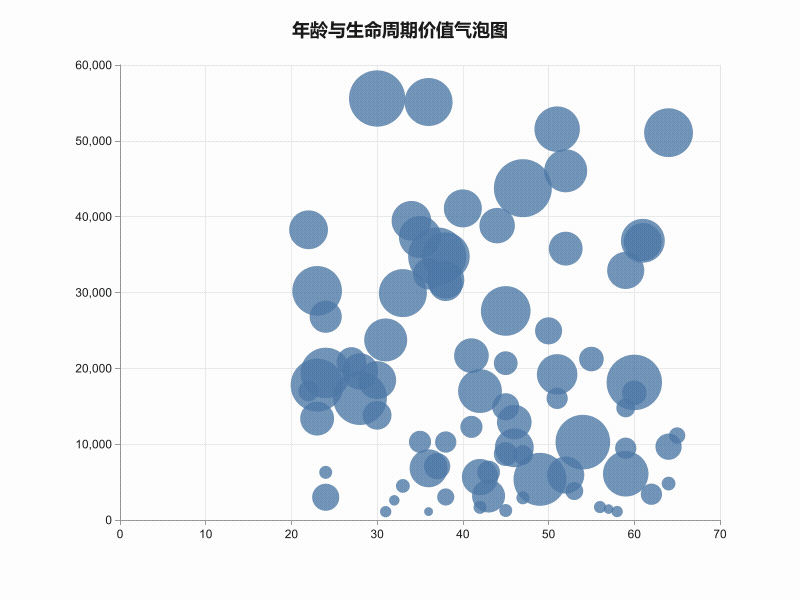

Built for the **2026 Tencent RhinoBird Open Source Talent Program** issue: [Build an MCP Server powered by Hy3](https://github.com/Tencent-Hunyuan/Hy3/issues/3).

---

## Why Hy3 Data MCP?

- **No-code visualization for AI chats** — Your MCP client can now generate charts and dashboards from a single prompt.
- **Hy3 does the thinking** — Column selection, titles, keywords, entities, and layout decisions are delegated to the Hy3 model.
- **Production-grade outputs** — Static SVGs for documents, animated HTML pages for browsers, and PNG images for slides or social sharing.
- **Privacy-first** — Your API key lives only in a local `.env` file. Nothing is hard-coded or sent anywhere except the Hy3 endpoint.
- **Works everywhere** — Compatible with CodeBuddy, WorkBuddy, Cline, Cursor, Roo Code, Continue, Codex CLI, OpenCode, and any stdio MCP client.

---

## Features

| Tool | What it does | Output formats |
| --- | --- | --- |
| `hy3_data_visualize` | Bar, line, area, pie, donut, rose, scatter, bubble, scatter_trend, radar, heatmap, funnel, sankey, treemap, sunburst, gauge, histogram, boxplot, candlestick, stacked_bar and grouped_bar charts from structured data. | `svg` / `html` / `png` |
| `hy3_wordcloud` | Extracts keywords with Hy3 and renders a word cloud. | `svg` / `html` / `png` |
| `hy3_knowledge_graph` | Extracts entities and relationships and renders a force-directed graph. | `svg` / `html` / `png` |
| `hy3_data_dashboard` | Combines multiple files into a multi-chart dashboard designed by Hy3. | `html` / `png` |
| `hy3_data_insight` | Analyzes data and returns textual insights, trends, and outliers. | `text` |
| `hy3_document_summary` | Summarizes or answers questions about PDF, DOCX, TXT, CSV, JSON, and XLSX files. | `text` / `html` |
| `hy3_document_visualize` | Extracts structured data from documents and turns it into charts or dashboards. | `svg` / `html` / `png` |

---

## Demo Gallery

All screenshots are rendered with the default **Nature** theme using the bundled sample datasets.

<table>
  <tr>
    <td align="center">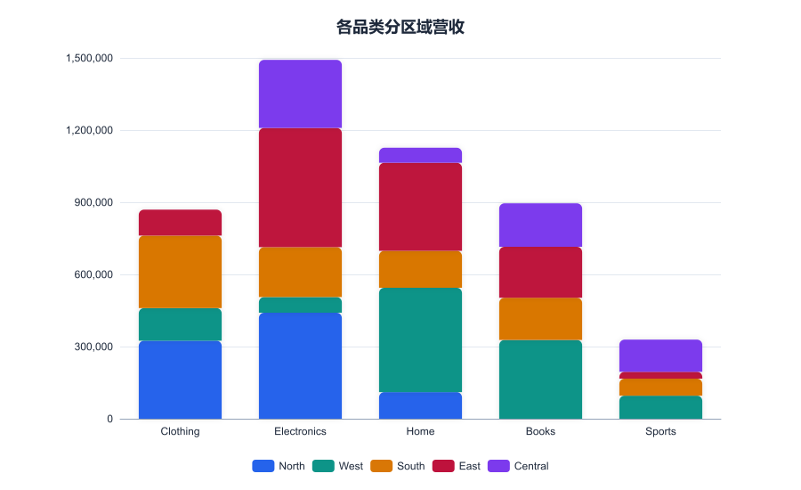<br/>Stacked bar by region</td>
    <td align="center">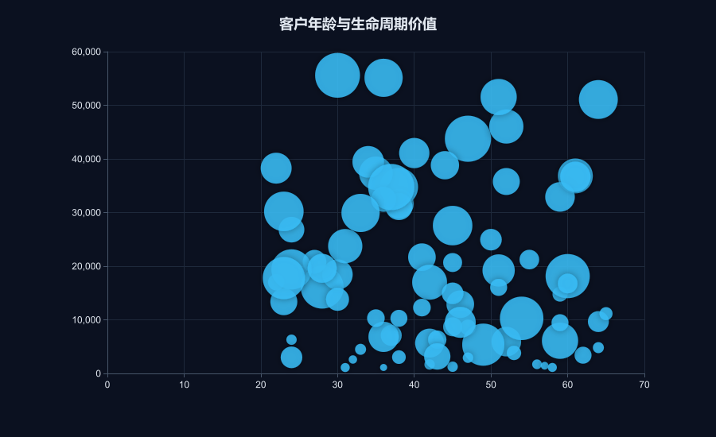<br/>Age vs lifetime value</td>
  </tr>
  <tr>
    <td align="center">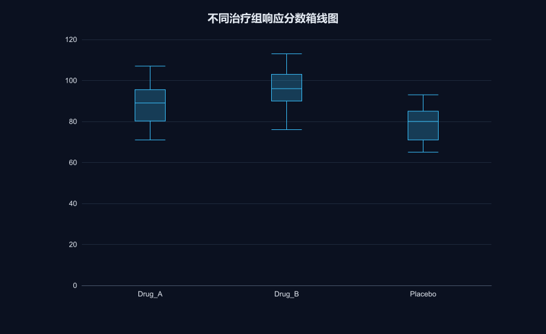<br/>Clinical response boxplot</td>
    <td align="center">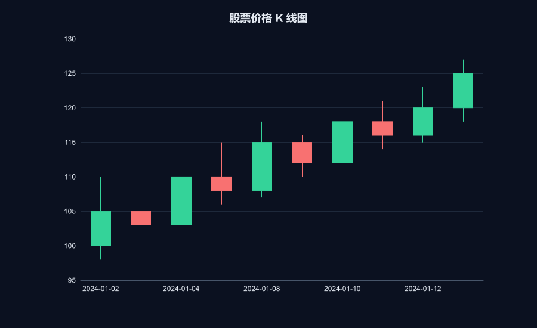<br/>Stock candlestick</td>
  </tr>
  <tr>
    <td align="center">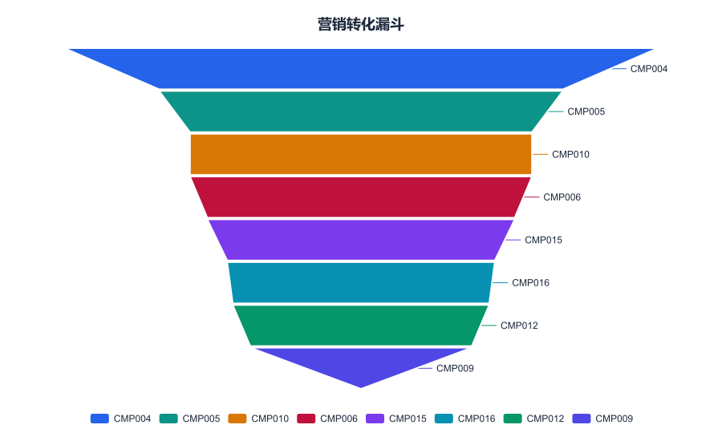<br/>Marketing funnel</td>
    <td align="center">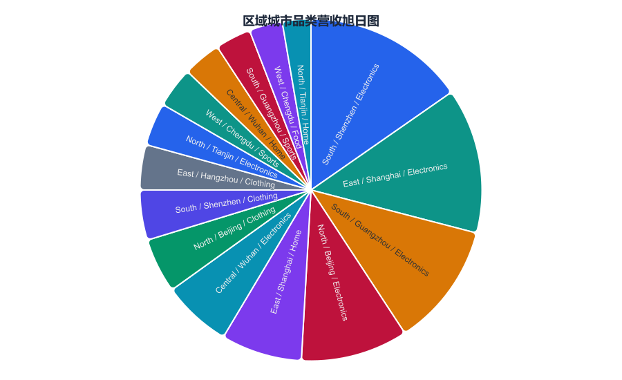<br/>Geo/category sunburst</td>
  </tr>
  <tr>
    <td align="center">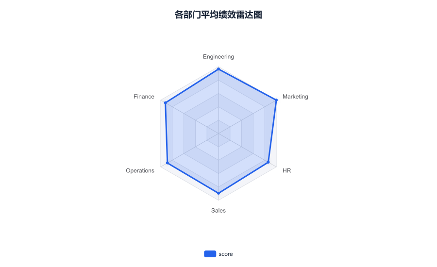<br/>Department performance radar</td>
    <td align="center">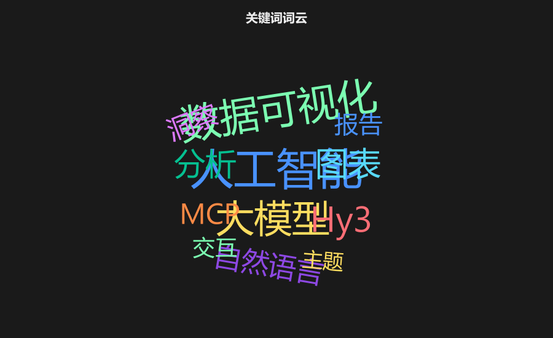<br/>Keyword word cloud</td>
  </tr>
  <tr>
    <td align="center">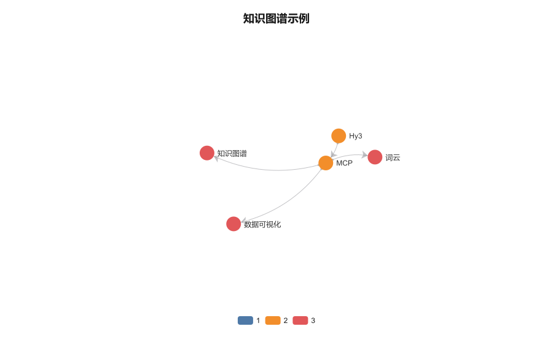<br/>Knowledge graph</td>
    <td align="center">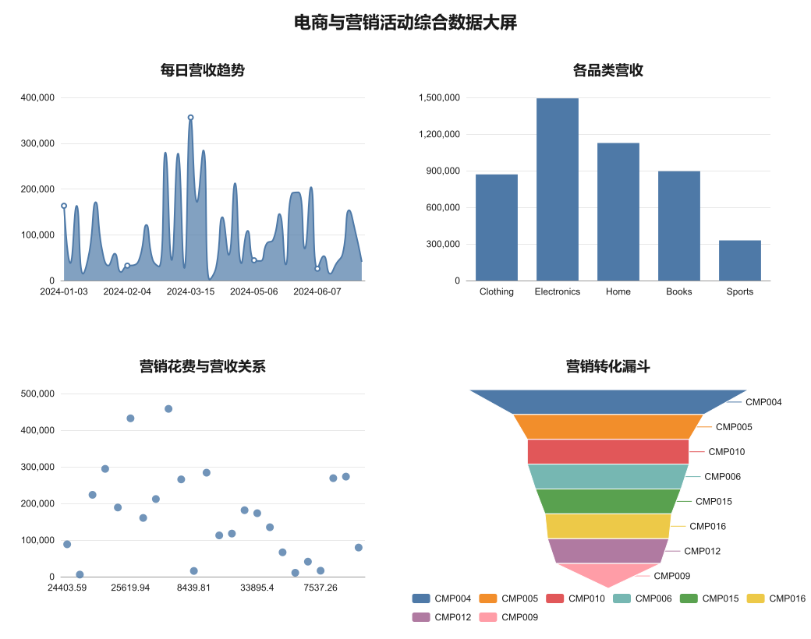<br/>Composite dashboard</td>
  </tr>
</table>

---

## Quick Start

### 1. Get an API key

Sign up at [TokenHub](https://tokenhub.tencentmaas.com) and create an API key for the Hy3 model.

### 2. Run with `npx` (no install)

```bash
cp .env.example .env
# Edit .env and set HY3_API_KEY
npx -y hy3-data-mcp
```

### 3. Or install from npm

```bash
npm install -g hy3-data-mcp
hy3-data-mcp
```

### 4. One-click client setup

The package ships with a dedicated `hdm` CLI for client configuration:

```bash
# Without installing
npx -y hdm init

# Or after global install
hdm init
```

`hdm init` scans your system for MCP clients (CodeBuddy, Cursor, Cline, Roo Code, Continue, Codex CLI, OpenCode, etc.), lets you pick one, and writes the MCP configuration and `.env` file automatically.

---

## Configuration

Create a `.env` file in the project root:

```dotenv
HY3_API_KEY=your-tokenhub-api-key
HY3_BASE_URL=https://tokenhub.tencentmaas.com/v1
HY3_MODEL=hy3-preview
HY3_OUTPUT_DIR=./hy3-mcp-output
```

| Variable | Required | Default | Description |
| --- | --- | --- | --- |
| `HY3_API_KEY` | Yes | — | Your TokenHub / Hy3 API key. |
| `HY3_BASE_URL` | No | `https://tokenhub.tencentmaas.com/v1` | OpenAI-compatible endpoint. |
| `HY3_MODEL` | No | `hy3-preview` | Model name. |
| `HY3_OUTPUT_DIR` | No | `./hy3-mcp-output` | Where generated files are saved. |

---

## Client Setup

### CodeBuddy / WorkBuddy

Add to `.codebuddy/mcp.json`:

```json
{
  "mcpServers": {
    "hy3-data-mcp": {
      "command": "npx",
      "args": ["-y", "hy3-data-mcp"],
      "env": {
        "HY3_API_KEY": "your-tokenhub-api-key",
        "HY3_BASE_URL": "https://tokenhub.tencentmaas.com/v1",
        "HY3_MODEL": "hy3-preview",
        "HY3_OUTPUT_DIR": "./hy3-mcp-output"
      }
    }
  }
}
```

### Cline / Cursor / Roo Code / Continue

Use `hdm init` to auto-configure, or copy the matching snippet from [`configs/`](./configs/).

---

## Usage Examples

### Analyze and visualize a CSV

```json
{
  "name": "hy3_data_visualize",
  "arguments": {
    "file_path": "./sales.csv",
    "chart_type": "bar",
    "output_format": "png",
    "language": "zh"
  }
}
```

### Sankey flow chart

```json
{
  "name": "hy3_data_visualize",
  "arguments": {
    "file_path": "./sales.csv",
    "chart_type": "sankey",
    "output_format": "png",
    "language": "zh"
  }
}
```

### Scientific boxplot

```json
{
  "name": "hy3_data_visualize",
  "arguments": {
    "file_path": "./sales.csv",
    "chart_type": "boxplot",
    "output_format": "png",
    "language": "zh"
  }
}
```

### Bubble chart with size dimension

```json
{
  "name": "hy3_data_visualize",
  "arguments": {
    "file_path": "./sales.csv",
    "chart_type": "bubble",
    "output_format": "png",
    "language": "zh"
  }
}
```

### Stacked bar chart

```json
{
  "name": "hy3_data_visualize",
  "arguments": {
    "file_path": "./sales.csv",
    "chart_type": "stacked_bar",
    "output_format": "png",
    "language": "zh"
  }
}
```

### Histogram

```json
{
  "name": "hy3_data_visualize",
  "arguments": {
    "file_path": "./sales.csv",
    "chart_type": "histogram",
    "output_format": "png",
    "language": "zh"
  }
}
```

### Candlestick / K-line chart

```json
{
  "name": "hy3_data_visualize",
  "arguments": {
    "file_path": "./stock.csv",
    "chart_type": "candlestick",
    "output_format": "png",
    "language": "zh"
  }
}
```

### Build a dashboard from multiple files

```json
{
  "name": "hy3_data_dashboard",
  "arguments": {
    "file_paths": ["./sales.csv", "./users.csv"],
    "title": "Monthly Operations Dashboard",
    "theme": "nature",
    "output_format": "html",
    "language": "en"
  }
}
```

### Extract insights from text data

```json
{
  "name": "hy3_wordcloud",
  "arguments": {
    "file_path": "./reviews.csv",
    "column": "comment",
    "max_words": 80,
    "output_format": "png",
    "language": "zh"
  }
}
```

### Summarize a document

```json
{
  "name": "hy3_document_summary",
  "arguments": {
    "file_path": "./report.pdf",
    "question": "Summarize the key findings and risks",
    "output_format": "html",
    "language": "en"
  }
}
```

---

## Output Formats

- **`svg`** — Lightweight, scalable, embeddable in reports or web pages.
- **`html`** — Interactive ECharts page with animations; open in any browser.
- **`png`** — Rasterized by `sharp`; perfect for slides, documents, and sharing.

---

## Themes & Fonts

Every visualization supports a `theme` parameter and an optional `font_family` override.

Built-in themes:

| Theme | Style |
| --- | --- |
| `light` | Clean white background with default ECharts palette. |
| `dark` | Dark background with high-contrast neon palette. |
| `colorful` | Vibrant palette for presentations. |
| `minimal` | Subdued, single-hue friendly palette. |
| `professional` | Slate/grey palette for business reports. |
| `retro` | Solarized-style warm palette with serif fonts. |
| `science` | Green sequential palette with monospace fonts. |
| `nature` | **Default.** Nature-journal style with a publication-ready Tableau palette and clean typography. |

Example with the default Nature theme and a custom font:

```json
{
  "name": "hy3_data_visualize",
  "arguments": {
    "file_path": "./sales.csv",
    "chart_type": "bar",
    "output_format": "png",
    "theme": "nature",
    "font_family": "Inter",
    "language": "zh"
  }
}
```

### Custom Colors

Every visualization tool also accepts optional color overrides so you can match a brand or user preference:

| Parameter | Description |
| --- | --- |
| `background_color` | Chart/page background hex color, e.g. `#ffffff`. |
| `text_color` | Title, label and legend text hex color, e.g. `#1a1a1a`. |
| `axis_color` | Axis line and tick hex color, e.g. `#999999`. |
| `split_line_color` | Grid split-line hex color, e.g. `#e8e8e8`. |
| `palette` | Full custom palette as an array of hex colors. |
| `primary_color` | Convenience shortcut: replaces the first color of the current theme palette. |

Example with a custom palette:

```json
{
  "name": "hy3_data_visualize",
  "arguments": {
    "file_path": "./sales.csv",
    "chart_type": "bar",
    "output_format": "png",
    "theme": "nature",
    "palette": ["#1f77b4", "#ff7f0e", "#2ca02c", "#d62728"],
    "background_color": "#fafbfc",
    "text_color": "#222222",
    "font_family": "Inter"
  }
}
```

---

## Sample Datasets

The `sample_data/` directory contains both simple and complex datasets for testing every chart type:

- `sample_data/complex/ecommerce_sales.csv` — 60 rows of multi-dimensional sales data (region, category, channel, revenue, profit, discount).
- `sample_data/complex/customers.csv` — 80 customer records with demographics, segment, LTV, and churn risk.
- `sample_data/complex/marketing_campaigns.csv` — 24 marketing campaigns with budget, impressions, clicks, conversions, and revenue.
- `sample_data/complex/clinical_trial.csv` — 90 patient records across three treatment groups for scientific analysis.
- `sample_data/complex/employee_performance.csv` — 60 employee records with department, level, salary, performance, and satisfaction.
- `sample_data/complex/hierarchical_geo_sales.csv` — Region → city → category hierarchical data for treemaps and sunbursts.
- `sample_data/complex/reviews.csv` — 20 realistic Chinese product reviews for word clouds and sentiment analysis.
- `sample_data/stock.csv` — OHLC stock data for candlestick charts.

Run `node scripts/generate-sample-data.mjs` to regenerate these files deterministically.

---

## Development

```bash
git clone https://github.com/Tencent-Hunyuan/Hy3.git
cd Hy3/hy3-data-mcp
npm install
npm run build
npm test
npm run test:real   # requires HY3_API_KEY
```

Debug with the [MCP Inspector](https://github.com/modelcontextprotocol/inspector):

```bash
npx @modelcontextprotocol/inspector node dist/index.js
```

---

## Roadmap

- [x] 7 core data analysis tools
- [x] SVG / HTML / PNG output formats
- [x] CLI installer (`hdm init`)
- [x] PDF, DOCX, XLSX, CSV, JSON, TXT document support
- [x] Multiple chart themes and custom font support
- [ ] More dashboard layouts
- [ ] Streaming progress for long-running analysis
- [ ] Streaming progress for long-running analysis
- [ ] Multi-language UI labels auto-detection

---

## License

This project is licensed under the [Apache-2.0](../LICENSE) license.
