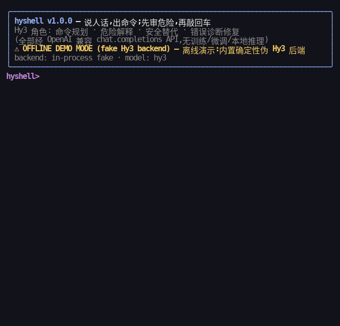

# hyshell — Hy3 驱动的终端命令行助手

> **说人话，出命令；先审危险，再敲回车。**
> `hyshell` = **Hy**3 + **shell**：把自然语言变成 shell 命令，双层安全引擎先审危险，失败了让 Hy3 自己诊断修复。

[English](README_EN.md) | 中文

2026 犀牛鸟开源人才培养活动 · [Hy3 issue #4「Build a vibe-coded application powered by Hy3」](https://github.com/Tencent-Hunyuan/Hy3/issues/4) 参赛作品。全程以 AI 结对编程（vibe coding）方式构建，Hy3 仅通过 OpenAI 兼容 API 调用——无训练、无微调、无本地推理部署。

---

## 端到端 Demo（两条流程，离线可复现）

**Demo 1 · 日常流程**：自然语言 → Hy3 规划命令（中文解释 + 风险分级）→ 确认门 → 真实执行



**Demo 2 · 安全拦截 + 错误自愈**：`rm -rf` 被模型评级 + 本地规则双重拦截 → 用户按 `a` 请 Hy3 给安全替代（先列旧日志、不删除）→ 随后 `head` 一个不存在的文件失败 → Hy3 读取 exit code / stderr / 目录列表，诊断出「你要的是 report.md」→ 重试成功


> 两张 GIF 录制自本仓库代码在离线演示模式（画面顶部有醒目的 **OFFLINE DEMO MODE (fake Hy3 backend)** 标注）下的**真实终端运行**，逐帧由 `demo/record_gifs.py` 生成，字节级可复现。接入真实 `HY3_API_KEY` 重录的方法见[重新录制](#重新录制-demo--接入真实-key)。

## 30 秒上手（零配置、零 API key）

```bash
cd hyshell
pip install -e .
hyshell demo daily        # 立刻观看端到端流程(离线伪后端)
hyshell                   # 进入交互 REPL(无 key 时自动离线模式)
hyshell doctor --ping     # 环境体检 + 后端连通性测试
```

不安装也可以：`PYTHONPATH=src python -m hyshell demo daily`。

## Hy3 在系统中的角色（题面硬性要求）

Hy3 是 hyshell 的**唯一大脑**，在 4 个节点出场，全部经由 OpenAI 兼容 `chat.completions` API（代码中唯一模型入口：`src/hyshell/llm.py :: Hy3Client`）：

| # | 调用点 | TASK 信封 | Hy3 输出（严格单 JSON 契约） |
|---|---|---|---|
| 1 | **命令规划** | `## TASK: plan` | `{command, explanation, risk, risk_reasons, notes}` |
| 2 | **危险解释** | （随 plan 返回） | `risk ∈ {safe, caution, dangerous}` + 中文理由数组 |
| 3 | **安全替代** | `## TASK: alt` | 用户拒绝高危命令后，给出「先只读列出、再人工决定」式替代 |
| 4 | **错误诊断修复** | `## TASK: fix` | 输入 exit code + stderr 尾部 + 目录列表 → `{diagnosis, command, confidence}` |

**为什么这个场景配 Hy3**（对应 Hy3 README 明文宣传的强项）：

- *输出格式稳定性*（"Stability of tool calls and output formats … output constraints"）→ hyshell 的全部交互建立在「只输出一个 JSON 对象」的严格契约上；
- *anti-hallucination*（幻觉率 12.5%→5.4%）→ 危险理由与错误诊断必须贴着证据说话，`fix` 信封只给真实的 stderr 与目录列表；
- *agentic 任务的错误恢复能力* → 失败 → 诊断 → 修复 → 重试循环就是这条能力的最小闭环展示；
- *256K 上下文* → 长 stderr、大目录列表可以整段塞进修复请求。

**明确声明**：本项目不训练、不微调、不做本地推理部署；模型只经 API 调用（题面要求 1）。

## 架构

```
用户自然语言 ─▶ ① 规划 plan ───── Hy3 API(严格 JSON 契约)──▶ CommandPlan
                                     │
              ② 双层安全评估: final = max(模型 risk, 本地规则引擎)
                 └ 21 条本地规则(rm -rf/find -delete/shred/dd/mkfs/fork 炸弹/curl|sh/…),
                   模型永远不能调低本地判级(测试锁死该不变量)
                                     │
              ③ 确认门(分级交互)
                 safe: 回车执行     caution: y/N 默认 N     dangerous: 必须原样输入 RUN
                 (--yes 非交互模式下 dangerous 仍然拒绝执行)
                                     │
              ④ executor 真实执行(bash -c, 超时杀整个进程组, 输出截断)
                                     │ exit ≠ 0
              ⑤ 修复循环 ── Hy3 API(命令+exit+stderr+目录列表)──▶ FixSuggestion
                 └ 修复命令同样过 ②③ 双层安全评估与确认门, ≤ 2 次重试
                                     │
              ⑥ JSONL 会话历史(~/.hyshell/history.jsonl) + 会话汇总表
```

模块一览：`config`(env 后端切换) · `llm`(Hy3 客户端+prompt) · `fake_backend`(离线确定性伪后端) · `safety`(本地规则引擎) · `executor` · `fixloop` · `app`(状态机) · `tui`(rich 渲染+输入抽象) · `history` · `demo_flows`(脚本化 demo) · `demo/`(GIF 生产线)。

## 安装与配置

依赖仅 4 个且都很常见：`openai` `rich` `httpx` `pydantic`（Python ≥ 3.10）。

```bash
pip install -e .          # 或: pip install -e '.[demo]'  (含录 GIF 用的 pillow)
```

后端选择**纯由环境变量决定**（代码零硬编码密钥）：

| 变量 | 默认 | 说明 |
|---|---|---|
| `HY3_API_KEY` | （空） | 空 = 离线演示模式；设置后自动切换真实后端 |
| `HY3_API_BASE` | `http://127.0.0.1:8000/v1` | 自托管 vLLM/SGLang 默认地址；腾讯云端点见下 |
| `HY3_MODEL` | `hy3` | 模型名（vLLM `--served-model-name hy3`） |
| `HY3_TEMPERATURE` / `HY3_TOP_P` | `0.9` / `1.0` | 跟随 Hy3 仓库 README 推荐值 |
| `HY3_REASONING_EFFORT` | （不传） | 仅显式设置时经 `extra_body.chat_template_kwargs` 传入（`no_think`/`low`/`high`） |
| `HY3_TIMEOUT` | `60` | 单次 API 请求超时（秒） |
| `HYSHELL_OFFLINE` | （空） | `1` = 强制离线（即使有 key） |
| `HYSHELL_MAX_FIX_RETRIES` | `2` | 修复循环最大重试次数 |
| `HYSHELL_HOME` | `~/.hyshell` | 历史记录目录 |

三种真实后端接法（模板见 [.env.example](.env.example)）：

```bash
# A. 腾讯云混元 OpenAI 兼容端点(以腾讯云控制台文档为准)
export HY3_API_BASE=https://api.hunyuan.cloud.tencent.com/v1
export HY3_API_KEY=<你的密钥>

# B. 自托管 vLLM(命令来自 Hy3 仓库 README)
vllm serve tencent/Hy3 --served-model-name hy3 &   # 详细参数见 Hy3 README
export HY3_API_BASE=http://127.0.0.1:8000/v1
export HY3_API_KEY=EMPTY

# C. 自托管 SGLang 同理,端口对齐后仅需改 HY3_API_BASE
```

配置后体检：`hyshell doctor --ping`（表格显示模式/端点/模型/打码后的 key，并发一条最小请求验证连通）。

## 使用指南

```
hyshell                          # 交互 REPL(默认): 输入自然语言;exit 退出;history 看最近 10 条
hyshell ask "把日志都删了" [--yes]  # 单发请求
hyshell demo daily|guard_fix     # 跑脚本化 demo(--backend real 可用真实后端重放)
hyshell history [--last N]       # 查看 JSONL 会话历史
hyshell doctor [--ping]          # 环境体检
公共 flags: --offline  --yes  --version
```

确认门分级（**核心安全设计**）：

| 最终风险 | 交互 | `--yes` 非交互 |
|---|---|---|
| safe | 回车执行 · `e` 编辑 · `s` 跳过 | 直接执行 |
| caution | `y/N`（默认 N）· `e` 编辑 · `s` 跳过 | 执行但打印警告 |
| dangerous | **必须原样输入 `RUN`** · `a` 让 Hy3 给安全替代 · `s` 跳过 | **拒绝执行** |

- 最终风险 = max(模型评级, 本地规则引擎)——模型说 safe 不算数，本地命中 `rm -rf` 就是 dangerous；
- 用户 `e` 编辑后的命令仅经本地规则重评，再次过门；
- 修复循环给出的命令**同样**过完整评估与确认门（危险的"修复"也要敲 `RUN`）。

## 离线演示模式(fake Hy3 backend)是什么

没有 `HY3_API_KEY` 时，hyshell 自动进入离线演示模式，界面醒目标注 **OFFLINE DEMO MODE (fake Hy3 backend)**。

- **它是**：注入真·openai SDK 的 `httpx.MockTransport` —— 真实的 prompt 构造、真实的 SDK 请求序列化、真实的响应解析全部照走，仅 HTTP 层被替换为进程内确定性规则表（`src/hyshell/fake_backend.py`）；
- **它保证**：无随机源、同输入同字节输出 → demo 转录、GIF、全部 132 个测试都可复现;
- **它测到了**：任务信封（`## TASK: plan|fix|alt`）、JSON 契约解析、双层安全合并、确认门、修复循环、历史落盘——即整条产品链路;
- **它不能**：回答规则库之外的请求（会诚实返回「离线演示规则库未覆盖此请求」的无副作用占位命令），也不能证明真实 Hy3 的输出质量——那部分请接真 key 验证（下节）。

## 重新录制 Demo / 接入真实 key

```bash
# 离线重录(与仓库中 GIF 字节级一致)
python demo/record_gifs.py --flow all

# 真实后端重放/重录(需要 key;真模型输出非确定,画面会与仓库版不同,
# 且脚本化输入可能与真实模型输出分叉导致提前结束——属预期)
export HY3_API_KEY=...; export HY3_API_BASE=...
hyshell demo daily --backend real
python demo/record_gifs.py --flow all --backend real
```

录制依赖：`pip install -e '.[demo]'`；首次录制会自动下载 CJK 等宽字体到 `~/.cache/hyshell-fonts/`（约 16MB，仅录制需要，不随仓库分发）。窄字符渲染需要系统等宽 TTF 字体——自动探测 Debian/Fedora/Arch/macOS 的常见路径（DejaVu/Menlo）；都找不到时退回 Pillow 内置点阵字体并打印警告（GIF 仍可生成，渲染效果下降）。GIF 由自研渲染器生成：rich 录制 ANSI → SGR 子集解析 → Pillow 逐格绘制（`demo/ansi2gif.py`）。

## 测试与质量

```bash
pip install -e '.[dev]'       # 开发/测试依赖: pytest + pillow
python -m pytest tests -q     # 132 passed, ~5s;全离线、零网络、确定性
```

（未装 pillow 时 GIF 管线测试自动跳过,核心套件不受影响。）

- 后端切换矩阵、伪后端确定性（同 prompt 同字节）、JSON 容错解析（围栏/散文/嵌套花括号）;
- 安全引擎表驱动 47 例（28 危险正例 + 7 谨慎正例 + 12 安全负例）+ 合并不变量（模型不能降级本地判定）;
- e2e：两条 demo 流进程内全跑 + **转录两次运行逐字节相等** + 「不输入 RUN 危险命令零执行」（executor 间谍断言）+ `--yes` 仍拒绝 dangerous;
- GIF 管线：SGR 解析、宽字符占两格、迷你 GIF 生成、已发布 GIF 的帧数/体积/时长校验（<2MB、≤2min）。

**诚实边界——哪些在本机验证过，哪些需要你本地做**：

| 项目 | 状态 |
|---|---|
| 全部 132 个测试、两条离线 demo、两张 GIF 录制 | ✅ 已在开发机(无 GPU、无外网 key)真实运行验证 |
| 真实 Hy3 后端连通与输出质量 | ⚠ 开发机无 `HY3_API_KEY`,未实测;请用 `hyshell doctor --ping` 冒烟,再跑 `hyshell demo daily --backend real` |
| 真实模型不守 JSON 契约的兜底 | 代码路径已测(容错抽取 + `ModelOutputError` 附原文片段);真实触发率未实测,见 FAQ |

## AI 结对编程记录(CodeBuddy 协作记录)

本项目按 issue 要求以 **vibe coding(AI 结对编程)**方式构建：人负责选题、架构取舍、验收把关，AI 结对负责代码生成与测试编写；所有代码经人工审阅后提交。逐模块协作记录如下（「CodeBuddy 会话」栏留给作者补充会话截图/链接归档）：

| 模块 | AI 协作内容 | 人工审校点 | CodeBuddy 会话 |
|---|---|---|---|
| 架构与场景选型 | 备选场景对比表、双层安全设计提案 | 拍板场景 (a)、确认「模型不能降级本地判定」原则 | (待补) |
| `llm.py` + prompt 契约 | JSON 信封设计、容错抽取器 | 审阅 prompt 用语与危险分级 rubric | (待补) |
| `fake_backend.py` | MockTransport 方案、确定性规则表 | 核对规则与 demo 剧本一致 | (待补) |
| `safety.py` 21 条规则 | 正则/匹配器初稿与中文理由 | 逐条人工核验正负例(47 个测试用例) | (待补) |
| `app.py`/`fixloop.py` 状态机 | 门禁交互与修复循环实现 | 走查危险路径:--yes 拒绝、RUN 精确匹配 | (待补) |
| 测试套件(132 例) | 用例生成、间谍夹具 | 审阅断言强度,补危险零执行不变量 | (待补) |
| GIF 生产线 `demo/` | SGR 解析器、逐格渲染器 | 逐帧目检中文对齐/配色/无豆腐块 | (待补) |
| README 双语文档 | 初稿与结构 | 事实核对(env 表、诚实边界) | (待补) |

## FAQ

- **为什么 dangerous 在 `--yes` 下也拒绝执行?** 非交互场景(脚本/CI)里没人看警告,「必须有人敲 RUN」是最后一道人闸,宁可中断不可误删。
- **为什么 temperature 默认 0.9?** 跟随 Hy3 仓库 README 的推荐推理参数(`temperature=0.9, top_p=1.0`);要更保守的 JSON 输出可自行调低。
- **真实模型输出不是合法 JSON 怎么办?** 抽取器容忍围栏/散文/嵌套;仍失败则抛出带原文片段的 `ModelOutputError`,该轮安全终止不执行任何命令。可尝试 `HY3_REASONING_EFFORT=low` 或调低 temperature。
- **Windows 能用吗?** 执行器依赖 `/bin/bash`,原生 Windows 不支持;WSL 内一切正常。
- **为什么历史里有耗时,屏幕上却不打印?** 屏幕转录必须逐字节确定(demo/GIF/测试三用),耗时只落 `history.jsonl`。

## License

与上游仓库一致:Apache-2.0。每个源文件带 SPDX 头;无任何硬编码密钥(有测试扫描把关)。
