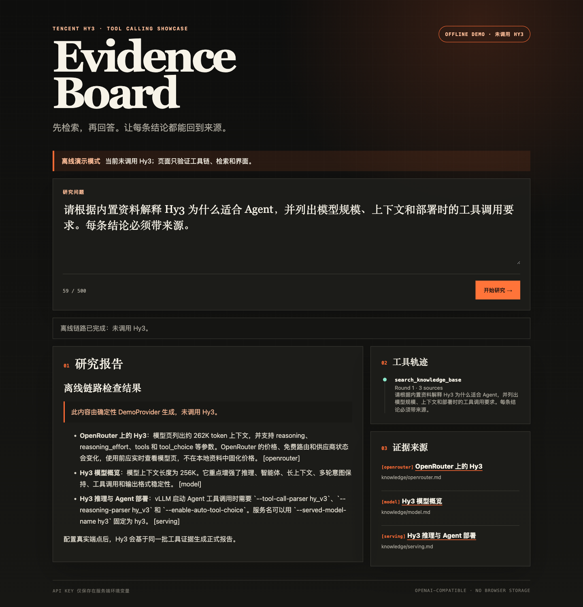

# Use Hy3 with Roo Code

> 中文：[roo-code.md](roo-code.md) · [Back to index](../README.en.md)

Roo Code is a VS Code coding agent with modes and provider profiles. Its official provider docs list **OpenAI Compatible**, which maps directly to Hy3.

## Install

Install **Roo Code** from the VS Code marketplace and verify the publisher against the current official listing. Record the actual extension version and prefer the current stable release. The fields below were checked against [Roo Code provider docs](https://roocodeinc.github.io/Roo-Code/providers/) on 2026-07-23.

## Provider profile

Create a `Hy3` profile:

```text
API Provider: OpenAI Compatible
Base URL: https://openrouter.ai/api/v1
API Key: <enter in the secret field>
Model ID: tencent/hy3
Temperature: 0.9
Context Window: 262144
```

For self-hosting use `http://127.0.0.1:8000/v1`, key `EMPTY`, and model `hy3`. Keep Native Tools enabled when shown, and enable Hy3's server-side tool parser. The actual context limit remains provider-dependent.

## First conversation

In **Ask** mode with write/command auto-approval disabled, request three verifiable Hy3 facts from `README_CN.md`, each with a path and section. Confirm only reads occurred and the worktree is unchanged.

## End-to-end task

In **Code** mode, ask Roo to modify only `issue2/demo/`, replace substring retrieval with testable token scoring, cover stable Chinese and English ordering with tests first, run the suite, and avoid network, dependencies, and commits. Approve only scoped reads, individual writes, and the exact test command.



## Troubleshooting

| Symptom | Fix |
|:---|:---|
| Profile switches back | Reselect `Hy3` in the task header and verify in a new task |
| Model not discovered | Enter it manually; OpenRouter requires `tencent/hy3` |
| Tool JSON errors | Enable Native Tools, verify server parser, and reduce parallel tools |
| Context overflow | Stay below provider limits and remove unrelated files/logs |
| Excessive auto-approval | Save least-privilege mode/profile settings and confirm sensitive commands |

Record a separate live Hy3 tool timeline before submission. The local screenshot documents only the runnable outcome.
