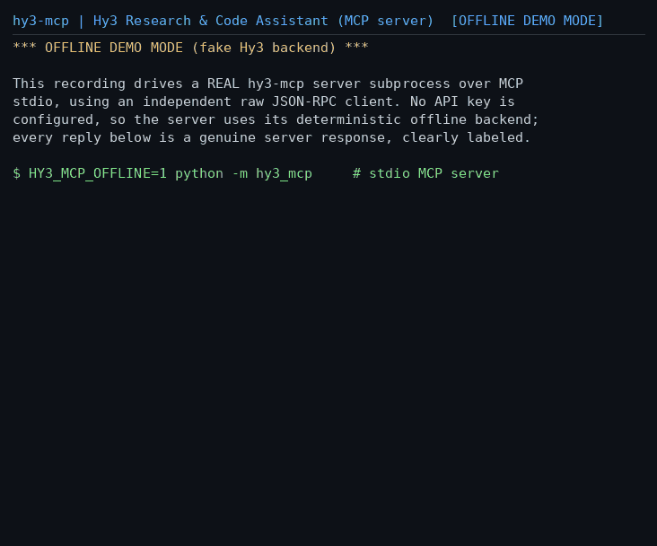

# hy3-mcp — Hy3 Research & Code Assistant MCP Server

<p align="left">
  中文: <a href="README.md">README.md</a> | English
</p>

**hy3-mcp** is an [MCP (Model Context Protocol)](https://modelcontextprotocol.io) stdio server that wraps Tencent's **Hy3** large language model behind 5 plug-and-play tools, so any MCP-capable client (CodeBuddy / WorkBuddy / Cursor / Cline / Claude Code, ...) can use Hy3 for code review, knowledge-base Q&A, data analysis and deep research with **zero extra development**.

| Tool | Scenario | Core reasoning done by Hy3 | Data source |
|---|---|---|---|
| `review_code` | Code review | Reviews a unified diff / source file, severity-ordered findings | Local files (sandboxed) |
| `ask_docs` | Knowledge-base Q&A | Answers strictly from retrieved chunks with `(file#chunk)` citations | Local docs + deterministic retrieval |
| `analyze_data` | Data analysis | Narrates insights over a deterministic data profile, suggests charts | Local CSV / JSON |
| `deep_research` | Deep research | Synthesizes multi-source evidence into cited conclusions | Pluggable search + local files |
| `hy3_status` | Diagnostics | No LLM call; reports mode/model/usage — ideal first demo call | — |

Exactly two external data sources (matching the issue's "1–2 extra data sources"): **(1) sandboxed local file reading** (everything outside `HY3_MCP_ROOT` is rejected — path/symlink escapes blocked, size caps, bad encodings never crash) and **(2) pluggable web search** (default `offline` stub runs with zero deps; `tavily` uses the `TAVILY_API_KEY` env var; new providers are a one-line registration).

## Demo GIF



> This GIF is a **real recording**: a script drives a genuine `python -m hy3_mcp` subprocess through the full MCP flow using an independent raw JSON-RPC client. The dev machine has no Hy3 API key, so the recording uses the built-in **deterministic offline fake backend**, clearly labeled `OFFLINE DEMO MODE (fake Hy3 backend)` in every frame — it is not real model output. With a real key, re-record with the same two scripts (see [Re-recording](#re-recording-the-demo)).

## Hy3's role & design principles

- **All core reasoning is Hy3's**: the four business tools call Hy3's OpenAI-compatible API through the openai SDK (`model=hy3`, recommended sampling `temperature=0.9, top_p=1.0`) and forward `reasoning_effort` per task (`high` for `deep_research`/`review_code`, `no_think` otherwise; `HY3_REASONING_EFFORT` overrides globally) — exactly the upstream README's `chat_template_kwargs` contract.
- **LLM output is never parsed, only presented**: every structured field (diff stats, heuristic risk flags, data profiles, citations) is computed deterministically in Python and returned as MCP `structuredContent`/`outputSchema`; Hy3 produces only the `markdown` narrative. No JSON-parsing fragility with the real backend; fully deterministic tests with the fake one.
- **Offline and real mode share 100% of the production code path**: offline merely swaps the HTTP transport for an in-process `httpx.MockTransport` (openai SDK request assembly, timeouts and usage accounting all run unchanged). One env var switches modes and a **missing key never crashes** the server.

## Installation (one command)

Requires Python ≥ 3.10. Pick either channel:

```bash
# Channel A: run without installing (recommended for a quick try)
uvx --from /ABS/PATH/TO/Hy3/mcp-server hy3-mcp --selfcheck

# Channel B: pip install as a console script
cd Hy3/mcp-server && pip install .
hy3-mcp --selfcheck
```

`--selfcheck` boots an offline server in-process, actually calls `hy3_status` and `review_code`, and prints `PASS/FAIL` — one command proves the install works. Publishing to PyPI is not required.

## Configuration (env vars only, zero hardcoding)

| Env var | Default | Meaning |
|---|---|---|
| `HY3_API_BASE` | `http://127.0.0.1:8000/v1` | Hy3's OpenAI-compatible endpoint |
| `HY3_API_KEY` | (empty) | API key; **read from the environment only**; optional for self-hosted endpoints (equivalent to `EMPTY`) |
| `HY3_MODEL` | `hy3` | Model name (matches vLLM `--served-model-name hy3`) |
| `HY3_MCP_OFFLINE` | (empty) | `1/true/yes` forces the offline demo mode |
| `HY3_MCP_ROOT` | CWD | File sandbox root: all file reads are confined to it |
| `HY3_MCP_DOCS_DIR` | sandbox root | Default docs directory for `ask_docs` (relative to root, or an absolute path — an absolute dir outside the root becomes an additional read-only sandbox root) |
| `HY3_SEARCH_PROVIDER` | `offline` | Search source: `offline` (built-in stub) / `tavily` (needs `TAVILY_API_KEY`) |
| `HY3_REASONING_EFFORT` | per tool | `no_think` / `low` / `high`; overrides per-tool defaults globally |
| `HY3_TEMPERATURE` / `HY3_TOP_P` | `0.9` / `1.0` | Upstream README's recommended sampling |
| `HY3_TIMEOUT_SECONDS` / `HY3_MAX_TOKENS` | `120` / `2048` | Request timeout / max completion tokens |

**Mode selection** (check anytime via `hy3_status`):

| Condition | Mode |
|---|---|
| `HY3_MCP_OFFLINE` truthy (or CLI `--offline`) | `offline` (forced) |
| else `HY3_API_BASE` or `HY3_API_KEY` set | `real` |
| else (nothing configured) | `offline` + stderr banner, **no crash** |

**Two ways to attach the real backend**:

```bash
# 1) self-hosted vLLM / SGLang (upstream README quickstart; no real key needed)
export HY3_API_BASE=http://127.0.0.1:8000/v1     # vLLM: --served-model-name hy3

# 2) Tencent cloud OpenAI-compatible endpoint (see cloud docs for specifics)
export HY3_API_BASE=https://api.hunyuan.cloud.tencent.com/v1
export HY3_API_KEY=<key from the console>
```

## Usage examples

```bash
# start in stdio mode (normally your MCP client spawns this for you)
HY3_MCP_OFFLINE=1 python -m hy3_mcp          # or hy3-mcp / uvx --from . hy3-mcp

# run the full MCP flow with the SDK-free raw JSON-RPC client (offline)
python scripts/raw_stdio_client.py
```

Runnable demo prompts once connected in a client:

> Use hy3's `review_code` tool on `examples/diffs/demo.diff` and summarize the main risks.
> Use `ask_docs` over `examples/docs`: what is the context length of Hy3?
> Use `analyze_data` on `examples/data/sales_sample.csv` and suggest charts.

## Client setup

Ready-made configs live in [`clients/`](clients/). Replace `/ABS/PATH/TO/Hy3/mcp-server` with your absolute path.

### CodeBuddy / WorkBuddy (project-level config + CLI command)

Project `mcp.json` (full file with a key-free offline variant in [`clients/codebuddy.mcp.json`](clients/codebuddy.mcp.json)):

```json
{
  "mcpServers": {
    "hy3": {
      "command": "uvx",
      "args": ["--from", "/ABS/PATH/TO/Hy3/mcp-server", "hy3-mcp"],
      "env": {
        "HY3_API_BASE": "http://127.0.0.1:8000/v1",
        "HY3_API_KEY": "${env:HY3_API_KEY}",
        "HY3_MODEL": "hy3",
        "HY3_MCP_ROOT": "${workspaceFolder}"
      }
    }
  }
}
```

CodeBuddy Code CLI one-liner:

```bash
codebuddy mcp add hy3 -e HY3_API_BASE=http://127.0.0.1:8000/v1 \
  -e HY3_API_KEY=$HY3_API_KEY -e HY3_MCP_ROOT=$PWD \
  -- uvx --from /ABS/PATH/TO/Hy3/mcp-server hy3-mcp
```

Launch command ✓ env vars ✓ runnable tool-call demo ✓ (prompts above; call `hy3_status` first to verify connectivity).

### Cursor / Cline / Claude Code

- Cursor: merge [`clients/cursor.mcp.json`](clients/cursor.mcp.json) into your project's `.cursor/mcp.json`.
- Cline: merge [`clients/cline.mcp.json`](clients/cline.mcp.json) into `cline_mcp_settings.json`.
- Claude Code: run [`clients/claude-code.sh`](clients/claude-code.sh) (includes the offline variant and a one-shot verification call).

### Client verification matrix (honesty statement)

| Client | Status | Evidence |
|---|---|---|
| Official MCP Python SDK stdio client | ✅ verified on the dev machine | `tests/test_stdio_e2e_sdk.py` (initialize / tools/list / all 5 tool calls / error path) |
| Independent raw JSON-RPC stdio client (zero mcp imports) | ✅ verified on the dev machine | `scripts/raw_stdio_client.py` + `tests/test_stdio_e2e_raw.py` |
| **Claude Code CLI 2.1.197 (real third-party client)** | ✅ verified on the dev machine | `claude mcp add` health check `✔ Connected`; `claude -p` actually called `hy3_status` and returned `mode=offline, model=hy3` |
| **Gemini CLI 0.51.0 (real third-party client)** | ✅ verified on the dev machine (connection level) | after `gemini mcp add hy3-mcp uvx --from <repo>/mcp-server hy3-mcp`, `gemini mcp list` ⇒ `✓ hy3-mcp … - Connected` (full MCP initialize handshake; tool-invocation evidence in the Claude Code CLI row above) |
| CodeBuddy / WorkBuddy (GUI) | 🔶 configs shipped, verify locally | dev machine has no GUI; follow the 3 steps above, call `hy3_status` first |
| Cursor / Cline (GUI) | 🔶 configs shipped, verify locally | same as above |

## Testing

```bash
cd mcp-server
python -m pytest tests -q        # 74 tests, fully offline & deterministic, ~16s
```

Coverage: mode-selection matrix, fake-backend wire format / determinism / `reasoning_effort` forwarding, sandbox escape + size/encoding defenses, deterministic retrieval (incl. Chinese bigrams), search factory and Tavily error paths (MockTransport, no real network), in-process plus dual-client stdio e2e for all five tools, packaging metadata, and a **no-hardcoded-secrets scan**.

## Architecture

```
mcp-server/
├── src/hy3_mcp/
│   ├── server.py          # FastMCP assembly + CLI (--version/--offline/--selfcheck)
│   ├── settings.py        # env-only config; the key never enters Settings (bool flag only)
│   ├── hy3_client.py      # openai AsyncOpenAI wrapper; usage stats; errors → ToolError
│   ├── fake_backend.py    # deterministic offline fake (httpx.MockTransport, OpenAI wire format)
│   ├── prompts.py / schemas.py
│   ├── tools/             # the 5 tools (review/ask/analyze/research/status)
│   └── sources/           # source #1 sandboxed files+retrieval; source #2 pluggable search
├── clients/               # CodeBuddy/WorkBuddy, Cursor, Cline, Claude Code configs
├── examples/              # demo diff/docs/CSV/JSON (numbers asserted 1:1 in tests)
├── scripts/               # raw JSON-RPC client, GIF recorder/renderer
└── tests/                 # 74 offline deterministic tests
```

Adding a search provider: implement the `SearchProvider` protocol in `sources/search.py` and register it in `_FACTORIES` (see `TavilySearch`; keys always come from env vars).

## Re-recording the demo

```bash
# rendering the GIF needs Pillow (optional extra, not a core dependency):
pip install '.[demo]'
# offline (same as the GIF in this repo)
python scripts/record_demo.py && python scripts/render_gif.py
# real model: export HY3_API_BASE/HY3_API_KEY, then run the same two commands
```

## FAQ

- **Why do I see OFFLINE DEMO MODE in my client?** Without `HY3_API_BASE`/`HY3_API_KEY` the server enters the offline demo mode by design (try every tool with no key). Configure them and it switches to real mode — confirm via `hy3_status`.
- **Can I print logs to stdout?** No. In stdio mode stdout is the MCP protocol channel; all banners/diagnostics here go to stderr — the most common self-built MCP server pitfall.
- **Is my key ever logged?** No. The key is read from the environment only when the HTTP client is built; it never enters `Settings`, logs, or `hy3_status` (which reports only the boolean `api_key_present`). A dedicated test asserts this.
- **`path escapes sandbox root` error?** All file arguments are confined to `HY3_MCP_ROOT` (after symlink resolution). Point the sandbox root at your project directory.

## License

Apache-2.0 (inherits the repository root [LICENSE](../LICENSE)).
