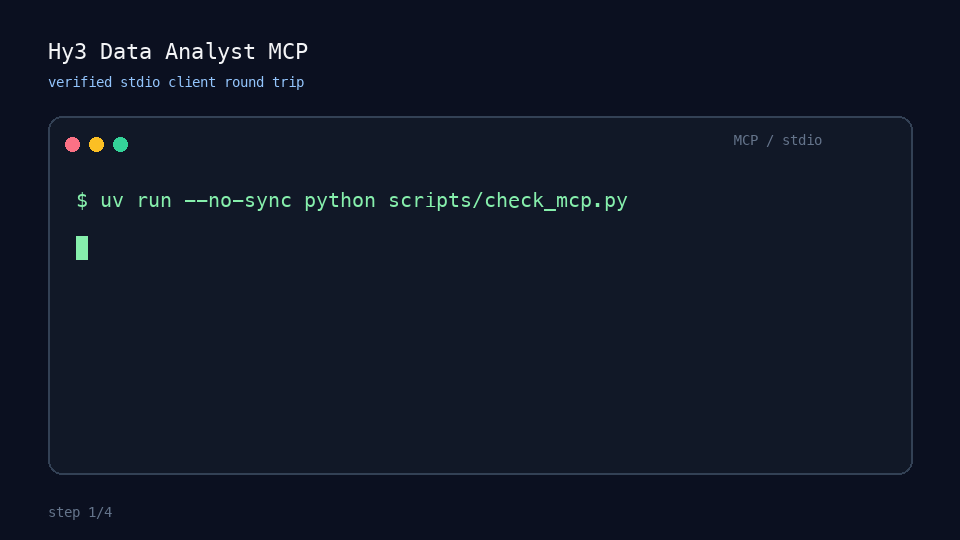

# Hy3 数据分析 MCP Server

这是一个本地 stdio 模式的 MCP Server，把 CSV/JSON 安全读取、基础统计与腾讯 Hy3 推理组合
为可复用的数据分析工作流，可接入 CodeBuddy、WorkBuddy、Cursor 等 MCP 客户端。



## 提供的工具

| 工具 | 是否调用 Hy3 | 功能 |
| --- | --- | --- |
| `profile_dataset` | 否 | 检查字段类型、缺失值、唯一值、数值统计和有限样例 |
| `analyze_dataset` | 是 | 基于数据画像和样例回答具体分析问题 |
| `generate_data_report` | 是 | 按给定目标生成有数据依据的 Markdown 报告 |

支持 `.csv`、`.json`、`.jsonl`、`.ndjson`，所有文件必须位于 `HY3_DATA_DIR` 内。

## 环境要求

- Python 3.10+
- 推荐使用 [`uv`](https://docs.astral.sh/uv/)，也可用 `pipx`
- 后两个工具需要 Hy3 的 OpenAI 兼容接口；本地部署方式见仓库的
  [部署文档](../../README_CN.md#部署)

## 一条命令安装

在当前目录运行：

```bash
uv tool install .
```

安装后，MCP 客户端可直接启动 `hy3-data-analyst`。开发模式无需全局安装；使用非 editable
安装可避开新版 Python 对隐藏 `.pth` 文件的兼容问题：

```bash
uv sync --dev --no-editable
uv run --no-sync hy3-data-analyst
```

该命令使用 stdio 通信，直接在终端启动后没有输出属于正常现象。

## 环境变量

代码中不保存 API Key，全部配置由 MCP 客户端传入：

| 变量 | 默认值 | 说明 |
| --- | --- | --- |
| `HY3_API_BASE` | `http://127.0.0.1:8000/v1` | Hy3 OpenAI 兼容接口地址 |
| `HY3_API_KEY` | `EMPTY` | 接口密钥；无鉴权的本地服务可用 `EMPTY` |
| `HY3_MODEL` | `hy3` | 服务端模型名 |
| `HY3_DATA_DIR` | Server 启动目录 | 工具唯一允许读取的根目录 |
| `HY3_MAX_FILE_BYTES` | `10485760` | 单文件大小上限（10 MiB） |
| `HY3_TIMEOUT_SECONDS` | `120` | Hy3 请求超时秒数 |

可参考 [`.env.example`](.env.example)，不要把真实密钥提交进 Git。

## 客户端配置

先把模板中的 `/ABSOLUTE/PATH/...` 全部替换为本机绝对路径；`command -v uvx` 可查看 `uvx`
的真实位置。桌面应用的 `PATH` 往往和终端不同，因此模板建议使用绝对路径。模板通过
`uvx --from <包路径>` 创建隔离的非 editable 安装，无需手动激活环境。

### CodeBuddy / WorkBuddy

CodeBuddy 当前推荐的项目级配置文件是 `<项目根目录>/.mcp.json`。将
[`client-configs/codebuddy.mcp.json`](client-configs/codebuddy.mcp.json) 复制到该位置，替换路径
及环境变量，然后刷新 MCP Server。

也可用 CLI 做一次性验证，而不修改用户级配置：

```bash
codebuddy \
  --mcp-config client-configs/codebuddy.mcp.json \
  --strict-mcp-config \
  --settings '{"enabledMcpjsonServers":["hy3-data-analyst"]}' \
  -p "调用 profile_dataset 检查 examples/sample_sales.csv，并告诉我行数。"
```

WorkBuddy 的自定义 MCP 界面接受相同的 stdio JSON，可直接导入
[`client-configs/workbuddy.mcp.json`](client-configs/workbuddy.mcp.json)。

### Cursor

将 [`client-configs/cursor.mcp.json`](client-configs/cursor.mcp.json) 复制到
`<项目根目录>/.cursor/mcp.json`，替换路径和环境变量，然后在 Cursor MCP 设置中启用。

## 调用示例

无需模型即可检查数据：

```json
{
  "file_path": "examples/sample_sales.csv",
  "max_rows": 10000,
  "sample_rows": 5
}
```

让 Hy3 回答数据问题：

```json
{
  "file_path": "examples/sample_sales.csv",
  "question": "哪个地区的已观察营收最强？这个结论有什么局限？",
  "reasoning_effort": "high",
  "sample_rows": 10
}
```

让 Hy3 生成报告：

```json
{
  "file_path": "examples/sample_sales.csv",
  "objective": "帮助销售经理确定地区优先级，同时指出数据质量风险",
  "reasoning_effort": "high"
}
```

## 验证

```bash
uv sync --dev --no-editable
uv run --no-sync ruff check .
uv run --no-sync pytest
uv run --no-sync python scripts/check_mcp.py
```

最后一条命令会真正启动 stdio Server、完成 MCP 初始化、核对 3 个工具并调用
`profile_dataset`。测试会 mock 当前不可用的远端模型，但会验证问题、数据上下文和推理模式确实
进入 Hy3 API 调用路径。若要验证真实推理，请设置可用的 `HY3_API_BASE`/`HY3_API_KEY` 后，
从 MCP 客户端调用后两个工具。

## 安全边界

- 解析后的路径不能越过 `HY3_DATA_DIR`，`..` 与符号链接也不能绕过。
- 不支持的格式和超大文件会在解析前拒绝。
- 最多扫描 100,000 行，最多向 Hy3 发送 20 行样例。
- API Key 只来自环境变量，SDK 错误信息中的 Key 会被脱敏。
- `profile_dataset` 完全本地执行；后两个工具会把画像和所选样例发送到配置的 Hy3 接口。
  敏感数据可设置 `sample_rows=0`。
- Server 不会修改原始数据文件。

## 已知限制

- 数值统计仅包含 `min`、`max`、`mean`，不能代替完整数据分析引擎。
- 嵌套 JSON 值会序列化为字符串，不做深层展开。
- 当 `truncated=true` 时，`rows_scanned` 是已扫描行数，不代表文件总行数。

## License

Apache License 2.0，与上级项目保持一致。
