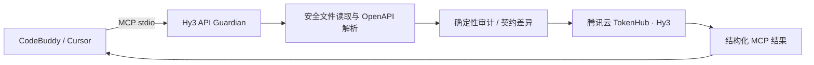

# Hy3 API Guardian MCP Server

[English](README_EN.md) | 中文

Hy3 API Guardian 是一个本地只读的 MCP Server，将腾讯混元 Hy3 的推理能力用于
OpenAPI 3.x 契约治理。它不仅让模型“看一眼文档”，还先执行确定性的结构检查和兼容性比较，
再让 Hy3 基于这些证据给出审计结论、迁移方案或可执行契约测试。

本项目为 2026 腾讯犀牛鸟开源人才培养计划
[Hy3 Issue #3](https://github.com/Tencent-Hunyuan/Hy3/issues/3) 的实现。

## 功能

| MCP Tool | 作用 | Hy3 的核心工作 |
| --- | --- | --- |
| `audit_openapi` | 审计一份 OpenAPI 文档 | 分析安全性、可靠性、可演进性和开发者体验 |
| `detect_breaking_changes` | 比较新旧两份契约 | 解释消费者影响并生成迁移与灰度方案 |
| `generate_contract_tests` | 生成 pytest 或 Jest 契约测试 | 根据真实接口约束生成成功、鉴权、校验和边界场景 |

所有 Tool 都会调用 Hy3 完成核心推理。OpenAPI 解析、静态检查和差异计算由本地代码完成，
以减少幻觉并为模型结论提供可核验的证据。



## 环境要求

- Python 3.11 或更高版本
- 一个腾讯云 TokenHub API Key
- 支持 MCP `stdio` 的客户端

Hy3 API 使用 OpenAI 兼容接口：

```text
Base URL: https://tokenhub.tencentmaas.com/v1
Model: hy3
```

TokenHub 开通和 Key 创建步骤请参考
[腾讯云快速入门](https://cloud.tencent.com/document/product/1823/130058)。

## 安装

在本目录执行：

```powershell
python -m venv .venv
.venv\Scripts\python -m pip install .
```

macOS/Linux：

```bash
python3 -m venv .venv
.venv/bin/python -m pip install .
```

也可以用 `uvx` 从本地源码直接启动，无需提前安装：

```bash
uvx --from . hy3-api-guardian
```

## 配置

| 环境变量 | 必需 | 默认值 | 说明 |
| --- | --- | --- | --- |
| `HY3_API_KEY` | 是 | 无 | TokenHub API Key；不得提交到 Git |
| `HY3_BASE_URL` | 否 | `https://tokenhub.tencentmaas.com/v1` | Hy3 OpenAI 兼容 Base URL |
| `HY3_MODEL` | 否 | `hy3` | 模型 ID |
| `HY3_ALLOWED_ROOT` | 否 | Server 启动目录 | 允许读取 OpenAPI 文件的根目录 |
| `HY3_TIMEOUT` | 否 | `60` | 请求超时秒数，范围 1～300 |
| `HY3_MAX_RETRIES` | 否 | `2` | Provider 重试次数，范围 0～5 |
| `HY3_MAX_FILE_BYTES` | 否 | `2000000` | 单个 OpenAPI 输入的字节上限 |
| `HY3_MAX_MODEL_CHARS` | 否 | `120000` | 发送给 Hy3 的契约投影字符上限 |
| `HY3_MAX_OUTPUT_TOKENS` | 否 | `8000` | 单次 Hy3 最大输出 Token |
| `HY3_REASONING_EFFORT` | 否 | `high` | `no_think`、`low` 或 `high` |

检查配置是否可用：

```powershell
$env:HY3_API_KEY = "你的 TokenHub Key"
$env:HY3_ALLOWED_ROOT = "D:\absolute\path\to\your\api-project"
.venv\Scripts\hy3-api-guardian.exe --check
```

输出只包含 `api_key_present: true/false`，不会输出 Key 内容。

## CodeBuddy 项目级配置

CodeBuddy 推荐在项目根目录使用 `.mcp.json`。复制
[`clients/codebuddy.project.example.json`](clients/codebuddy.project.example.json) 为项目根目录的
`.mcp.json`，再替换 Python 路径、允许目录和 Key 占位符。`.mcp.json` 已加入本仓库
`.gitignore`，避免误提交密钥。

也可用 CodeBuddy CLI 添加项目级 Server：

```powershell
codebuddy mcp add-json --scope project hy3-api-guardian `
  '{"type":"stdio","command":"D:\\path\\to\\.venv\\Scripts\\python.exe","args":["-m","hy3_api_guardian"],"env":{"HY3_API_KEY":"REPLACE_LOCALLY","HY3_MODEL":"hy3","HY3_BASE_URL":"https://tokenhub.tencentmaas.com/v1","HY3_ALLOWED_ROOT":"D:\\path\\to\\api-project"}}'
```

验证：

```powershell
codebuddy mcp list
codebuddy mcp get hy3-api-guardian
```

CodeBuddy 官方配置说明：<https://www.codebuddy.ai/docs/cli/mcp>

## Cursor 项目级配置

Cursor 使用项目目录下的 `.cursor/mcp.json`。复制
[`clients/cursor.project.example.json`](clients/cursor.project.example.json) 到该位置，替换本机路径
和 Key 后，重启 Cursor 或在 MCP 设置中刷新。

Cursor 官方配置说明：<https://docs.cursor.com/context/model-context-protocol>

> `clients/` 下的文件只有占位符，可以提交；实际含 Key 的 `.mcp.json` 和
> `.cursor/mcp.json` 不得提交。

## Tool 使用说明

### `audit_openapi`

参数：

- `spec_path`：`HY3_ALLOWED_ROOT` 内的 `.yaml`、`.yml` 或 `.json` 文件。
- `spec_text`：内联 OpenAPI 内容，与 `spec_path` 二选一。
- `focus`：`all`、`security`、`design`、`reliability` 或 `developer_experience`。

示例提示词：

```text
调用 audit_openapi 审计 examples/insecure-api.yaml，重点检查 security。
请按严重程度解释问题，并给出最小修改方案。
```

### `detect_breaking_changes`

新旧文档分别支持文件路径或内联内容。`include_compatible=false` 可只返回 Breaking 和 Warning。

示例提示词：

```text
调用 detect_breaking_changes，比较 examples/petstore-v1.yaml 和
examples/petstore-v2-breaking.yaml。列出破坏性变更，并给出兼容迁移顺序。
```

### `generate_contract_tests`

支持 `pytest` 和 `jest`。可用 `selected_paths` 限定路径或 `METHOD /path`；一次最多生成
20 个 operation 的测试，避免输出失控。

示例提示词：

```text
调用 generate_contract_tests，为 examples/petstore-v1.yaml 中的 GET /pets/{petId}
生成 pytest 契约测试。只返回可保存运行的代码和运行命令。
```

## Demo


演示展示了 Cursor 识别项目级 MCP 工具、直接调用 `detect_breaking_changes`，以及返回
`5` 个破坏性变更、`1` 个警告和 `1` 个兼容变更的完整流程。脱敏验证记录见
[`docs/verification/`](docs/verification/README.md)。

仓库提供三份无敏感信息的示例：

- [`examples/insecure-api.yaml`](examples/insecure-api.yaml)：用于安全和设计审计。
- [`examples/petstore-v1.yaml`](examples/petstore-v1.yaml)：兼容性比较的旧版本。
- [`examples/petstore-v2-breaking.yaml`](examples/petstore-v2-breaking.yaml)：包含破坏性变更的新版本。

推荐录屏流程：

1. 在客户端展示 Server 已连接和三个 Tool。
2. 审计 `insecure-api.yaml`。
3. 比较 Pet Store v1/v2。
4. 为一个接口生成 pytest 契约测试。
5. 展示结构化结果中的模型 ID 和 Token 使用量。

## 安全设计

- Server 只读，不写入源文件，也不执行 OpenAPI 中的命令。
- 只允许读取 `HY3_ALLOWED_ROOT` 内的 JSON/YAML 文件，解析后再次校验真实路径。
- 使用安全 YAML Loader，并拒绝 YAML alias，防止递归或膨胀对象图。
- 限制文件大小、对象数量、嵌套深度、模型输入和模型输出。
- 在发送给 Hy3 前脱敏 Bearer Token、常见 API Key、URL 凭据和私钥块。
- OpenAPI 描述、示例和扩展始终作为“不可信数据”包裹，降低提示词注入风险。
- API Key 仅通过环境变量读取，不进入日志或工具返回值。
- 非本机 HTTP Provider 地址会被拒绝，公网接口必须使用 HTTPS。

远程 `$ref` 不会被下载或执行。确定性差异引擎覆盖 operation、参数、请求体必需性、响应、
鉴权和组件 Schema 的常见兼容性变化；Hy3 再基于两份契约补充语义影响分析。

## 开发与验证

```powershell
python -m pip install -e ".[dev]"
python -m pytest
python -m ruff check .
python -m ruff format --check .
python -m build
```

测试包括解析、路径边界、YAML alias、脱敏、确定性差异、三个 Hy3 Tool、结构化返回和
真实 `stdio` MCP 的 `initialize`/`tools/list` 握手。

配置真实 `HY3_API_KEY` 后，可通过一个 MCP stdio 会话调用全部三个 Tool，并只输出脱敏后的
验证摘要：

```powershell
python scripts/live_smoke.py
```

## License

Apache License 2.0，与 Hy3 主仓库一致。
