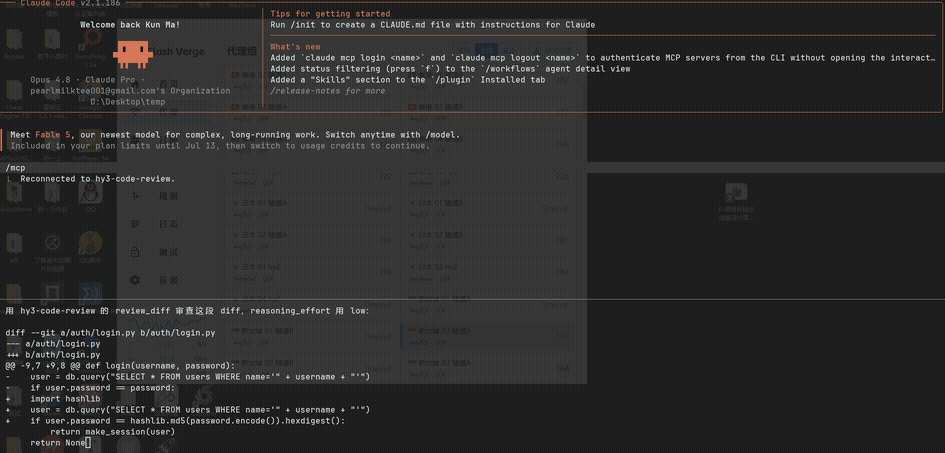

# Demos

Short screen recordings of `hy3-code-review` running inside real MCP clients.

| Client | Demo |
|---|---|
| Cline (VS Code) |  |
| Claude Code |  |

Each demo shows the same flow:

1. The MCP server connected (green status, three tools listed).
2. Pasting a diff and invoking `review_diff`.
3. Approving the tool call.
4. Hy3 returning a severity-tagged review (CRITICAL SQL injection + HIGH weak
   MD5 hash) with verdict **REQUEST CHANGES**.

## Recording tips

- **GIF**: [ScreenToGif](https://www.screentogif.com/) (Windows) — record the
  window, trim, export as GIF. Keep it under ~8 MB so it renders inline on GitHub.
- **Video**: `Win+G` (Xbox Game Bar) records MP4; attach it to the PR directly.
- Keep it 15–30 s. Blur or omit any real API key before publishing.
