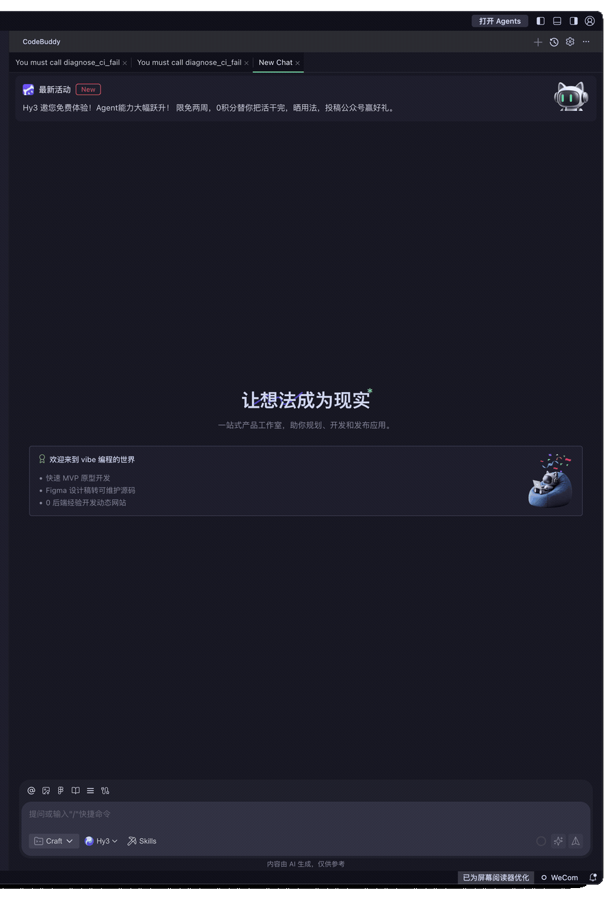

# Hy3 CI Copilot

[简体中文](README_CN.md) | English

Hy3 CI Copilot is a local stdio MCP server that turns CI logs and workflow files into
evidence-based failure diagnoses. It uses Hy3 for every analysis and adds bounded, read-only
repository context so MCP clients can move from a failing job to a concrete fix plan.

> **Data notice:** selected log, workflow, manifest, and Git metadata are sent to the endpoint
> configured by `HY3_BASE_URL`. Common credential patterns are redacted on a best-effort basis,
> but you should still remove sensitive data before analysis. The server never executes model
> suggestions and never modifies repository files.

## Tools

| Tool | Purpose | Required input |
| --- | --- | --- |
| `diagnose_ci_failure` | Rank root causes using a failed log and repository context | `log_path` |
| `compare_ci_runs` | Isolate regressions between a failed and a known-good run | `failed_log_path`, `successful_log_path` |
| `review_ci_workflow` | Find concrete correctness and reproducibility issues in workflow YAML | `workflow_path` |
| `build_ci_fix_plan` | Convert a diagnosis into file-level changes, verification, and rollback | `diagnosis` |

All tools also accept `repository_path`, `focus`, `output_language`, and/or
`reasoning_effort` where relevant. Tool schemas expose descriptions and defaults through MCP
`tools/list`.

## Demo and Client Validation



See the [live client validation record](docs/client-validation.md) for the exact CodeBuddy CN
1.106.1 and Claude Code 2.1.153 calls, resolved Hy3 model, parameters, and observed results.

## Requirements

- Python 3.10+
- [`uv`](https://docs.astral.sh/uv/getting-started/installation/) for one-command execution
- An OpenAI-compatible Hy3 endpoint, either self-hosted or through OpenRouter

## Quick Start

From this directory:

```bash
export HY3_API_KEY=EMPTY
export HY3_BASE_URL=http://127.0.0.1:8000/v1
export HY3_MODEL=hy3
export HY3_ALLOWED_ROOTS=/absolute/path/to/repository

uvx --from . hy3-ci-copilot
```

The command waits for MCP JSON-RPC messages on stdio. For OpenRouter:

```bash
export HY3_API_KEY='your-openrouter-key'
export HY3_BASE_URL=https://openrouter.ai/api/v1
export HY3_MODEL=tencent/hy3
```

No key is accepted as a tool argument or stored by the server. A self-hosted endpoint without
authentication should explicitly use `HY3_API_KEY=EMPTY`.

For MCP clients, create the private environment file used by the checked-in configurations:

```bash
umask 077
cp .env.example .env
# Set HY3_API_KEY, HY3_BASE_URL, HY3_MODEL, and HY3_ALLOWED_ROOTS in .env.
```

`.env` is ignored by Git. The project configuration loads it with `uv run --env-file`; portable
client examples use `uvx --env-file`. An already-running client daemon therefore does not need to
inherit the key from your shell.

### Persistent local install

```bash
uv tool install .
hy3-ci-copilot
```

### Protocol smoke test

```bash
uv run --extra dev python scripts/stdio_smoke.py
```

This starts the packaged server through the official MCP Python client, initializes a session,
and verifies that all four tools are discoverable. It does not call Hy3.

## Configuration

| Variable | Required | Default | Description |
| --- | --- | --- | --- |
| `HY3_API_KEY` | Yes | none | Endpoint key; use `EMPTY` for an unauthenticated local server |
| `HY3_BASE_URL` | No | `http://127.0.0.1:8000/v1` | OpenAI-compatible API base URL |
| `HY3_MODEL` | No | `hy3` | Hy3 model identifier |
| `HY3_API_STYLE` | No | `auto` | `native`, `openrouter`, or automatic URL detection |
| `HY3_ALLOWED_ROOTS` | No | server working directory | `:`-separated roots on Unix, `;` on Windows |
| `HY3_TIMEOUT_SECONDS` | No | `120` | Request timeout, 1-600 seconds |
| `HY3_MAX_INPUT_CHARS` | No | `120000` | Total prompt budget, 10,000-1,000,000 characters |
| `HY3_MAX_OUTPUT_TOKENS` | No | `4096` | Maximum response tokens |
| `HY3_MAX_RETRIES` | No | `2` | Retries for HTTP 429 and transient 5xx responses |

Native vLLM/SGLang requests use `chat_template_kwargs.reasoning_effort`; OpenRouter requests use
its `reasoning.effort` object. The official Hy3 values `no_think`, `low`, and `high` are exposed
through each MCP tool.

## CodeBuddy

CodeBuddy CN discovers project MCP servers from `.mcp.json`. This package includes a working
project configuration at [`.mcp.json`](.mcp.json); open this package directory as the workspace.
For another repository, copy
[`examples/clients/codebuddy.mcp.json`](examples/clients/codebuddy.mcp.json) to its root as
`.mcp.json`. Replace `/ABSOLUTE/PATH/TO/PACKAGE` with this package path and
`/ABSOLUTE/PATH/TO/TARGET_REPOSITORY` with the repository CodeBuddy may read.

CodeBuddy does not expand `${env:VAR}` in MCP configuration. The project configuration therefore
loads the ignored `.env` through `uv run --frozen`; the key never appears in MCP JSON. The portable
cross-repository configuration uses `uvx --env-file`. After preparing `.env`, start a fresh
CodeBuddy process so the project server is discovered. On macOS with CodeBuddy CN installed in its
default location:

```bash
cd /absolute/path/to/Hy3/mcp_servers/hy3_ci_copilot
'/Applications/CodeBuddy CN.app/Contents/Resources/app/bin/code' chat \
  -m agent --maximize \
  'You must call diagnose_ci_failure from hy3-ci-copilot. Use log_path logs/failed.log, repository_path examples/demo_repository, output_language en, and reasoning_effort low. Reply with the primary root cause and one verification command. Do not modify files.'
```

The plain `chat` command uses the current directory as its workspace. Do not use `-n`; `-r` may
reuse a window for a different workspace. CodeBuddy's editor-level `--add-mcp` writes a separate
configuration format, so project `.mcp.json` is the supported setup for this demo.
The checked-in `timeout` is `180000` milliseconds (three minutes). Keep `HY3_TIMEOUT_SECONDS` at or
below that client deadline; use `low` reasoning when the provider's high-reasoning latency is less
predictable.

## Claude Code

Claude Code can consume the same project [`.mcp.json`](.mcp.json) without modifying user MCP
settings. From this package directory, after preparing `.env`:

```bash
claude -p \
  --mcp-config .mcp.json \
  --strict-mcp-config \
  --allowedTools 'mcp__hy3-ci-copilot__diagnose_ci_failure' \
  --verbose \
  --output-format stream-json \
  'You must call diagnose_ci_failure from hy3-ci-copilot with log_path logs/failed.log, repository_path examples/demo_repository, output_language en, and reasoning_effort high. Report the primary root cause and one verification command. Do not modify files.'
```

[`examples/clients/claude-code.mcp.json`](examples/clients/claude-code.mcp.json) is the portable
cross-repository version. Replace its package and target-repository placeholders before use.

## Cline Configuration

Cline CLI stores MCP settings globally. The checked-in
[`examples/clients/cline_mcp_settings.json`](examples/clients/cline_mcp_settings.json) shows the
schema. The CLI command below resolves the package path before saving it:

```bash
PACKAGE_DIR="$(pwd)"
cline mcp add hy3-ci-copilot --yes -- \
  uvx --env-file "$PACKAGE_DIR/.env" --from "$PACKAGE_DIR" hy3-ci-copilot
```

Use `cline config mcp --json` to inspect the registered server. Cline CLI 3.0.39 stores MCP
settings globally. For an isolated validation, stop any existing Cline hub, then set
`CLINE_MCP_SETTINGS_PATH=/path/to/settings.json` for both registration and startup so the new hub
uses the isolated settings file. That release also has a fixed five-second per-request MCP
deadline, which is shorter than a typical Hy3 response; this is therefore a configuration example,
not one of the live client validations. The verified live clients are CodeBuddy and Claude Code.

## Example Calls

The deterministic fixture in [`examples/demo_repository`](examples/demo_repository) contains a
Python 3.11 success log, a Python 3.12 failure log, and the workflow that produced both.

```text
Call compare_ci_runs with:
- failed_log_path: logs/failed.log
- successful_log_path: logs/successful.log
- repository_path: /absolute/path/to/examples/demo_repository
- output_language: en
- reasoning_effort: high
```

Expected analysis should cite the Python version change and the missing `distutils` import. Model
wording may vary; a result that ignores the supplied evidence should not be accepted as verified.

## Safety Boundaries

- Repository roots come only from `HY3_ALLOWED_ROOTS`; tool paths cannot escape those roots.
- Symlink escapes, `.git` contents, empty files, and binary files are rejected; workflow YAML is
  bounded by alias-count, event-count, and nesting-depth limits.
- Logs are stripped of terminal control codes, truncated with an explicit marker, and redacted for
  common API keys, tokens, passwords, authorization headers, URL credentials, and private keys.
- Git context uses fixed argv commands with a five-second timeout; no shell, hooks, external diff,
  or model-generated command is executed.
- Tools are stateless and read-only. A diagnosis or fix plan is text, not an automated edit.

## Development

```bash
uv sync --extra dev
uv run --extra dev pytest
uv run --extra dev ruff check src tests scripts
uv build
```

The test suite includes a real stdio MCP session. A local fake Chat Completions HTTP server asserts
that each of the four tools reaches the configured Hy3-compatible endpoint.

## License

Apache-2.0, matching the parent Hy3 repository.
