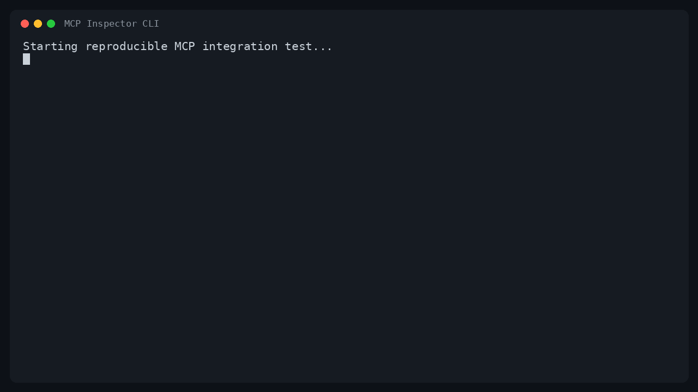

# Hy3 Deep Research MCP Server

一个由 Hy3 驱动的深度研究 MCP Server。它通过 stdio 接入 CodeBuddy、Cursor
等 MCP 客户端，执行网页搜索、正文提取、证据分析、研究报告生成和事实核验。

> English summary: a local stdio MCP server that combines key-free public web
> search and bounded page extraction with an OpenAI-compatible Hy3 endpoint.
> It exposes four typed tools and returns grounded reports with source IDs.

## 能力与数据流

~~~text
CodeBuddy / Cursor
        │ MCP stdio
        ▼
Hy3 Deep Research Server
        ├── DDGS 搜索 ──► 搜索结果
        ├── HTTP(S) 抽取 ──► 有界正文 / snippet 降级
        └── Hy3 OpenAI-compatible API ──► 带 [S1] 引用的结论
~~~

所有 Hy3 连接信息均从环境变量读取。服务端不会把 API Key 写入源码、日志或工具结果。

## Tools

| Tool | 主要参数 | 功能 |
|---|---|---|
| **search_web** | query, max_results, region, time_range | 搜索公开网页，返回标准化标题、URL、摘要和日期 |
| **analyze_evidence** | question, sources, focus, language | 读取内联文本或 URL，由 Hy3 基于指定证据回答 |
| **deep_research** | query, max_results, depth, language | 搜索、抓取多个来源并生成带引用的研究报告 |
| **verify_claim** | claim, max_results, language | 搜索正反证据，将断言分类为 Supported / Refuted / Mixed / Insufficient evidence |

每个 tool 都有 JSON Schema 参数约束和字段说明；一次最多处理 12 个来源。

## 前置条件

- Python 3.11+
- 推荐安装 [uv](https://docs.astral.sh/uv/getting-started/installation/)
- 一个 OpenAI-compatible Hy3 API。可使用本仓库 README 中的 vLLM / SGLang
  部署，也可使用兼容的托管服务。

## 一键运行

无需 clone：

~~~bash
export HY3_BASE_URL="http://127.0.0.1:8000/v1"
export HY3_MODEL="hy3"
export HY3_API_KEY="EMPTY"  # 本地 vLLM/SGLang；托管服务请使用真实环境变量

uvx --from "git+https://github.com/Tencent-Hunyuan/Hy3.git@rhinobird2026#subdirectory=mcp_servers/hy3_deep_research" hy3-deep-research
~~~

启动后没有普通终端输出是正常现象：stdio 已用于 MCP JSON-RPC 通信。

本地开发安装：

~~~bash
cd mcp_servers/hy3_deep_research
uv sync --extra test
uv run hy3-deep-research
~~~

也可用 pip：

~~~bash
python -m venv .venv
source .venv/bin/activate
pip install .
hy3-deep-research
~~~

## 配置

| 环境变量 | 默认值 | 说明 |
|---|---:|---|
| HY3_API_KEY | 无，调用 Hy3 时必填 | Hy3 provider Key；本地无鉴权服务显式设为 EMPTY |
| HY3_BASE_URL | http://127.0.0.1:8000/v1 | OpenAI-compatible API 根地址 |
| HY3_MODEL | hy3 | served model name |
| HY3_REASONING_EFFORT | high | no_think、low 或 high |
| HY3_TEMPERATURE | 0.9 | 采样温度 |
| HY3_TOP_P | 1.0 | top-p |
| HY3_MAX_TOKENS | 8192 | 最大生成 token |
| HY3_API_TIMEOUT | 300 | Hy3 请求超时秒数 |
| RESEARCH_SEARCH_TIMEOUT | 20 | 搜索超时秒数 |
| RESEARCH_FETCH_TIMEOUT | 20 | 单网页请求超时秒数 |
| RESEARCH_MAX_PAGE_CHARS | 20000 | 每个来源送入模型的最大字符数 |
| RESEARCH_ALLOW_PRIVATE_URLS | false | 是否允许工具抓取私网/回环 URL |

## CodeBuddy 项目级配置

CodeBuddy 官方推荐在项目根目录使用 .mcp.json。仓库提供
[examples/codebuddy.mcp.json](examples/codebuddy.mcp.json)，复制到目标项目：

~~~bash
cp examples/codebuddy.mcp.json /path/to/your-project/.mcp.json
export HY3_API_KEY="EMPTY"
export HY3_BASE_URL="http://127.0.0.1:8000/v1"
~~~

配置使用 CodeBuddy 支持的环境变量展开，Key 不进入版本控制。

也可以通过 CLI 添加项目级 Server：

~~~bash
codebuddy mcp add-json --scope project hy3-deep-research \
  '{"type":"stdio","command":"uvx","args":["--from","git+https://github.com/Tencent-Hunyuan/Hy3.git@rhinobird2026#subdirectory=mcp_servers/hy3_deep_research","hy3-deep-research"],"env":{"HY3_API_KEY":"${HY3_API_KEY}","HY3_BASE_URL":"${HY3_BASE_URL:-http://127.0.0.1:8000/v1}","HY3_MODEL":"${HY3_MODEL:-hy3}"}}'

codebuddy mcp list
codebuddy mcp get hy3-deep-research
~~~

可运行 demo：

~~~bash
codebuddy --mcp-config ./examples/codebuddy.mcp.json -p \
  "必须调用 hy3-deep-research 的 deep_research 工具，研究 Hy3 在长上下文任务中的特点；使用 4 个来源，中文输出，并保留来源引用。"
~~~

在 CodeBuddy IDE 中也可打开 Settings → MCP → Add MCP，粘贴同一配置，然后点击
“Try to Run”。首次连接项目级 MCP Server 时按提示确认信任。

## Cursor 项目级配置

Cursor 使用 project/.cursor/mcp.json。复制示例并在文件中把
YOUR_HY3_API_KEY 替换为本机 Key；不要提交替换后的文件：

~~~bash
mkdir -p /path/to/your-project/.cursor
cp examples/cursor.mcp.json /path/to/your-project/.cursor/mcp.json
~~~

验证 Server 和 tools：

~~~bash
cursor-agent mcp list
cursor-agent mcp list-tools hy3-deep-research
~~~

Cursor Agent demo prompt：

~~~text
Use the hy3-deep-research MCP server's verify_claim tool to verify:
"Hy3 has a 256K context length." Inspect at least four sources and answer in Chinese
with source IDs and uncertainty.
~~~

也可以在 Cursor Settings → MCP 中查看连接状态并启用四个 tools。

## MCP Inspector 与自动化验证

可先用官方 Inspector 手工验证 stdio：

~~~bash
cd mcp_servers/hy3_deep_research
npx -y @modelcontextprotocol/inspector uv run hy3-deep-research
~~~

运行所有自动化测试：

~~~bash
cd mcp_servers/hy3_deep_research
uv sync --extra test
uv run pytest -q
uv run pytest -q ../../test/test_hy3_mcp_integration.py
~~~

根目录集成测试会启动一个临时 OpenAI-compatible dummy backend，并通过官方
MCP Python Client 完成真实 stdio 握手、tools/list 和 tools/call。dummy backend
会检查发送给模型的消息流是否包含来源标签和抗提示注入约束，因此无需部署 295B 模型。

## Tool 调用示例

analyze_evidence：

~~~json
{
  "question": "两份材料对 Hy3 上下文长度的描述是否一致？",
  "sources": [
    {
      "title": "材料 A",
      "content": "Hy3 supports a context length of 256K."
    },
    {
      "title": "材料 B",
      "url": "https://github.com/Tencent-Hunyuan/Hy3"
    }
  ],
  "focus": "比较数值，并指出证据是否为第一手来源",
  "language": "zh-CN"
}
~~~

deep_research：

~~~json
{
  "query": "Hy3 的 Agent 能力、部署成本和适用场景",
  "max_results": 8,
  "depth": "deep",
  "language": "zh-CN",
  "region": "cn-zh",
  "time_range": "year"
}
~~~

## Demo 与轻量验证

该 GIF 由 [scripts/record_inspector_demo.py](scripts/record_inspector_demo.py)
实际执行官方 MCP Inspector CLI 后生成，包含 `tools/list` 和
`analyze_evidence` 的 `tools/call`。录制环境只有 OpenAI-compatible Qwen backend，
所以它证明的是 MCP stdio 与兼容 API 生产路径可用，不代表已验证 Hy3 模型效果。
完整边界和其他免 IDE 验证方式见 [docs/VALIDATION.md](docs/VALIDATION.md)。

使用真实 Hy3 endpoint 一键复录：

~~~bash
cd mcp_servers/hy3_deep_research
export HY3_API_KEY="EMPTY"
export HY3_BASE_URL="http://127.0.0.1:8000/v1"
export HY3_MODEL="hy3"
export HY3_REASONING_EFFORT="high"
uv run --with pillow scripts/record_inspector_demo.py
~~~

如需录制 CodeBuddy CLI，仍可使用 [docs/demo.tape](docs/demo.tape) 和
[scripts/record_codebuddy_demo.sh](scripts/record_codebuddy_demo.sh)。

## 安全边界

- 默认仅抓取公开 HTTP(S) URL，并阻止回环、私网、链路本地和保留地址。
- 每次重定向都会重新校验目标，避免常见 SSRF 跳转。
- 限制并发数、响应字节数、正文字符数和来源数，避免无界输入。
- 网页正文在 prompt 中被标记为“不可信证据”；Hy3 被明确要求忽略正文中的命令。
- 抓取失败时只使用搜索摘要并在 warnings 中显式标注。
- 公共搜索可能受网络、地区和上游限流影响；重要结论应复核原始来源。

## License

Apache-2.0，与 Hy3 仓库一致。

