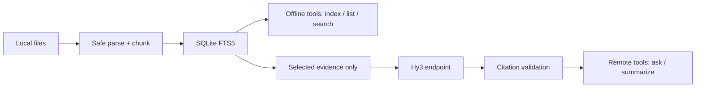

# Hy3 Knowledge Base MCP

[中文说明](README_CN.md)

Hy3 Knowledge Base MCP is a local-first, citation-grounded Model Context Protocol server for
Markdown, TXT, RST, and text-bearing PDF files. It lets an MCP client index an allowlisted folder,
search it offline, and ask Hy3 questions whose returned evidence identifiers are validated before
they reach the client.

## Purpose and privacy boundary

Indexing, source listing, FTS5 retrieval, chunking, and the SQLite index remain on this machine.
`hy3_kb_ask` and `hy3_kb_summarize_source` send only the selected evidence and instructions to the
configured Hy3-compatible endpoint. A local vLLM/SGLang endpoint keeps that traffic on loopback;
OpenRouter or another third-party endpoint receives the selected excerpts under its own privacy
policy. Source files are read-only, roots are explicit, and paths outside them are denied.



The remote branch starts only at `selected_evidence`; the full local files and SQLite index are not
sent to Hy3.

## Tools

The annotation columns use MCP `ToolAnnotations` field names. `remote` means the tool calls the
configured Hy3 endpoint; `offline` means it reads only the local index/files.

| Tool | Main arguments | Execution | readOnlyHint | destructiveHint | idempotentHint | openWorldHint |
| --- | --- | --- | --- | --- | --- | --- |
| `hy3_kb_index_documents` | `collection`, `path`, `recursive=true`, `replace=false`, `include_globs` | offline | false | false | true | false |
| `hy3_kb_search` | `collection`, `query`, `limit=8`, `offset=0`, `source_paths`, `response_format` | offline | true | false | true | false |
| `hy3_kb_ask` | `collection`, `question`, `top_k=8`, `source_paths`, `reasoning_effort`, `response_format` | remote | true | false | false | true |
| `hy3_kb_summarize_source` | `collection`, `source_path`, `focus`, `reasoning_effort`, `response_format` | remote | true | false | false | true |
| `hy3_kb_list_sources` | `collection`, `query`, `limit=20`, `offset=0`, `response_format` | offline | true | false | true | false |

`response_format` is `markdown` or `json`. Collections use a safe identifier; source filters use
root-relative POSIX paths returned by list/search results.

### Main structured result fields

- Index: `collection`, `discovered_sources`, `indexed_sources`, `updated_sources`,
  `unchanged_sources`, `skipped_sources`, `failed_sources`, `chunk_count`, and per-file `errors`
  containing `source_path` and safe `reason` text.
- Search: pagination fields `query`, `total`, `count`, `offset`, `has_more`, `next_offset`, plus
  `results` containing `evidence_id`, `source_path`, `page_number`, `line_start`, `line_end`, `score`,
  and `snippet`.
- Ask: `answer`, `grounded`, `insufficient_evidence`, `citations`, and `warnings`.
- Summary: `summary`, `coverage`, `used_evidence_ids`, `citations`, and `warnings`.
- List: pagination fields `total`, `count`, `offset`, `has_more`, `next_offset`, plus `sources` with
  `source_path`, `source_format`, `size_bytes`, `page_count`, `chunk_count`,
  `content_sha256_prefix`, and `indexed_at` metadata.

## Requirements and installation

- Python 3.10+ (Python 3.10 or newer).
- `uv` for isolated execution, or `pip` for a regular environment.
- An OpenAI-compatible Hy3 endpoint only for ask and summary operations.

From this directory:

```powershell
python -m venv .venv
.\.venv\Scripts\Activate.ps1
pip install .
hy3-knowledge-mcp
```

Or let `uvx` build and run the checkout without activating an environment:

```powershell
uvx --from . hy3-knowledge-mcp
```

The process uses stdio for MCP. Do not write application logs to stdout.

## Endpoint configuration

Set an allowlisted root before starting. The local profile is shown first because it provides the
strongest privacy boundary.

### Local vLLM or SGLang

Start an OpenAI-compatible Hy3 server on loopback, then run:

```powershell
$env:HY3_BASE_URL = "http://127.0.0.1:8000/v1"
$env:HY3_MODEL = "hy3"
$env:HY3_ENDPOINT_PROFILE = "local"
$env:HY3_REASONING_EFFORT = "none" # Maps to local no_think; low/high pass through
$env:HY3_KB_ROOTS = (Resolve-Path ".\examples\knowledge_base").Path
Remove-Item Env:HY3_API_KEY -ErrorAction SilentlyContinue # The client supplies EMPTY internally
uvx --from . hy3-knowledge-mcp
```

For the local profile, `none` maps to the Hy3 `no_think` payload. `low` and `high` remain supported
and are passed through. The client internally supplies the non-secret sentinel `EMPTY` when the key
is unset.

### OpenRouter

Use a newly rotated key stored only in the launching environment:

```powershell
$env:HY3_API_KEY = "<YOUR_ROTATED_HY3_KEY>"
$env:HY3_BASE_URL = "https://openrouter.ai/api/v1"
$env:HY3_MODEL = "tencent/hy3:free"
$env:HY3_ENDPOINT_PROFILE = "openrouter"
$env:HY3_REASONING_EFFORT = "none"
$env:HY3_KB_ROOTS = (Resolve-Path ".\examples\knowledge_base").Path
uvx --from . hy3-knowledge-mcp
```

The current tracked 10/10 evaluation report used `none`; that records the measured configuration,
not a general claim that it is better than `low` or `high`, which remain supported. The
`tencent/hy3:free` route was temporary and listed an OpenRouter expiration date of 2026-07-21. If it
is unavailable, select another Hy3 endpoint/model and record the actual route in evaluations.

## Environment variables and limits

See the safe template [.env.example](.env.example). A local `.env` may be used, but it must remain
untracked; process environment is preferred for secrets.

| Variable | Default / meaning |
| --- | --- |
| `HY3_API_KEY` | Required by remote profiles; omit for a local profile |
| `HY3_BASE_URL`, `HY3_MODEL`, `HY3_ENDPOINT_PROFILE` | Endpoint URL, route, and `local`/`openrouter`/`generic` behavior |
| `HY3_REASONING_EFFORT` | `none`, `low`, or `high` |
| `HY3_TIMEOUT_SECONDS`, `HY3_MAX_RETRIES`, `HY3_MAX_OUTPUT_TOKENS` | `60`, `2`, `2048` |
| `HY3_KB_ROOTS` | Required; one or more existing directories separated by the OS path separator |
| `HY3_KB_STORAGE_DIR` | SQLite storage location; defaults to the platform user-data directory |
| `HY3_KB_MAX_FILE_BYTES`, `HY3_KB_MAX_FILES_PER_RUN` | `10485760`, `500` |
| `HY3_KB_MAX_TOTAL_BYTES_PER_RUN` | `104857600` |
| `HY3_KB_MAX_DISCOVERY_ENTRIES`, `HY3_KB_MAX_DISCOVERY_DIRECTORIES`, `HY3_KB_MAX_DISCOVERY_DEPTH` | `20000`, `2000`, `64` |
| `HY3_KB_MAX_PDF_PAGES` | `500` |
| `HY3_KB_CHUNK_CHARS`, `HY3_KB_CHUNK_OVERLAP_CHARS` | `3000`, `300` |
| `HY3_KB_MAX_CONTEXT_CHARS`, `HY3_KB_PROMPT_RESERVE_CHARS` | `90000`, `8000` |
| `HY3_KB_MAX_SUMMARY_REQUESTS` | `16` |

## End-to-end demo: index → list → search → ask

Configure one allowed root through `HY3_KB_ROOTS` as shown above, then invoke these requests from an
MCP client:

Here `path="."` means the single configured allowed root. With multiple roots, use a relative path
that resolves under only one root, or an allowed absolute path; an ambiguous relative path is denied.

```text
hy3_kb_index_documents(collection="demo", path=".", recursive=true)
hy3_kb_list_sources(collection="demo", limit=20)
hy3_kb_search(collection="demo", query="两个客户端验证对应哪一天上线", limit=8)
hy3_kb_ask(collection="demo", question="两个客户端验证对应哪一天上线？", top_k=8)
```

Index/list/search work without a model key. Ask requires the configured endpoint and returns a
cited answer; in the fixed corpus, the expected date is `2025-11-18`.

## Client setup

- [Cline setup](docs/clients/cline.md)
- [TRAE setup](docs/clients/trae.md)
- [CodeBuddy and WorkBuddy setup](docs/clients/codebuddy-workbuddy.md)

The examples live in [examples/clients](examples/clients). Keep credentials out of tracked JSON.

## Exact client verification prompt

Use this exact prompt for Cline and TRAE validation. Run the client with `.` resolving to the
allowlisted corpus directory:

```text
必须通过 hy3-knowledge MCP 完成，不要直接读取文件替代工具：
1. 调用 hy3_kb_index_documents，collection="demo"，path="."。
2. 调用 hy3_kb_list_sources 确认来源。
3. 调用 hy3_kb_search 搜索“两个客户端验证对应哪一天上线”。
4. 调用 hy3_kb_ask 回答同一问题。
5. 最终展示调用过的工具名称、答案和文件/行号引用。
```

Accept evidence only when the client visibly connects to `hy3-knowledge`, shows all four tool calls,
answers `2025-11-18`, and includes a corpus file plus line-number citation. Terminal-only output or
direct file reading is not equivalent client evidence.

Real-client verification completed on 2026-07-11 with Cline CLI `3.0.39` and TRAE SOLO CN `0.1.25`
/ VS Code `1.107.1`. Both runs invoked the four tools above, returned `2025-11-18`, and cited
`738b65bbd428/roadmap.md, lines 1–8`:

- [Cline recording](docs/demos/cline.gif)
- [TRAE recording](docs/demos/trae.gif)
- [Measured verification notes](docs/demos/README.md)

## Test, build, smoke, and evaluate

Run from this package directory with dotenv disabled for deterministic tests:

```powershell
$env:PYTHON_DOTENV_DISABLED = "1"
uv run python -m pytest -q
uv run ruff check .
uv run ruff format --check .
uv run python -m build
uv run python -m twine check dist\*
uv run python scripts/stdio_smoke.py --knowledge-root tests/fixtures/smoke --storage-dir .smoke-storage
uv run python scripts/run_eval.py --evaluation eval/evaluation.xml --knowledge-root examples/knowledge_base --output eval/report.md
```

The smoke test is offline. Evaluation performs real model calls and overwrites the report only after
all ten cases complete successfully; protect the key and review the measured [report](eval/report.md).

## Security and limitations

- Only configured canonical roots are readable. Traversal, absolute paths outside them, symlink/
  junction escapes, and unsafe source identifiers are denied.
- Discovery, file size/count/total bytes, PDF pages, chunk sizes, prompt context, output, and summary
  request counts are bounded to resist accidental resource exhaustion.
- Source files are never modified. The local SQLite/FTS5 store contains extracted text and metadata;
  protect or delete that storage according to your data policy.
- PDF parsing supports embedded text only. OCR is unsupported, so scanned/image-only PDFs can index
  as empty and must be OCR-processed outside this server first.
- Retrieved excerpts sent to OpenRouter or another third party leave the local privacy boundary.
  Review its retention policy and avoid indexing data you are not authorized to disclose.
- Model output is schema-validated, citations must reference supplied evidence, and retrieved text is
  delimited as untrusted evidence; these controls reduce but do not eliminate prompt-injection risk.

## Troubleshooting

- **401/403 or auth error:** remote profiles require a valid rotated `HY3_API_KEY`; verify the base
  URL/profile pair. Never paste the key into an issue or log.
- **429:** the provider rate-limited the request. Honor retry guidance, reduce parallel work, wait,
  or select another Hy3 route. The client retry count is bounded by `HY3_MAX_RETRIES`.
- **FTS5 unavailable:** use a Python SQLite build compiled with FTS5. Reinstall a standard CPython
  distribution if `sqlite3` cannot create an FTS5 virtual table.
- **Empty PDF:** confirm the PDF contains selectable text and is below `HY3_KB_MAX_PDF_PAGES`; OCR is
  not performed.
- **Path denied:** resolve the target, ensure it is under a directory in `HY3_KB_ROOTS`, avoid symlink
  escapes, and pass the root-relative path expected by the tool.
- **No sources/results:** index the same collection name first, check include globs, then list sources
  before searching.
