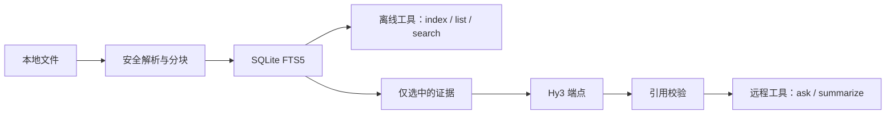

# Hy3 本地知识库 MCP

[English README](README.md)

Hy3 本地知识库 MCP 是一个本地优先、带可核验引用的 Model Context Protocol 服务，支持
Markdown、TXT、RST 和含文本层的 PDF。MCP 客户端可以索引白名单目录、离线检索，并让 Hy3
基于检索证据回答问题；模型返回的证据编号经过校验后才会交给客户端。

## 用途与隐私边界

索引、来源列表、FTS5 检索、分块和 SQLite 索引都留在本机。`hy3_kb_ask` 与
`hy3_kb_summarize_source` 只把选中的证据片段和指令发送给配置的 Hy3 兼容端点。本地
vLLM/SGLang 将流量限制在 loopback；OpenRouter 或其他第三方端点会依照其隐私政策接收所选
片段。来源文件只读，允许根目录必须显式配置，根目录外路径会被拒绝。



远程分支只从 `selected_evidence` 开始；完整本地文件与 SQLite 索引不会发送给 Hy3。

## 五个工具

注解列使用 MCP `ToolAnnotations` 的原字段名。`remote` 表示调用配置的 Hy3 端点，`offline`
表示只访问本地索引/文件。

| 工具 | 主要参数 | 执行方式 | readOnlyHint | destructiveHint | idempotentHint | openWorldHint |
| --- | --- | --- | --- | --- | --- | --- |
| `hy3_kb_index_documents` | `collection`、`path`、`recursive=true`、`replace=false`、`include_globs` | offline | false | false | true | false |
| `hy3_kb_search` | `collection`、`query`、`limit=8`、`offset=0`、`source_paths`、`response_format` | offline | true | false | true | false |
| `hy3_kb_ask` | `collection`、`question`、`top_k=8`、`source_paths`、`reasoning_effort`、`response_format` | remote | true | false | false | true |
| `hy3_kb_summarize_source` | `collection`、`source_path`、`focus`、`reasoning_effort`、`response_format` | remote | true | false | false | true |
| `hy3_kb_list_sources` | `collection`、`query`、`limit=20`、`offset=0`、`response_format` | offline | true | false | true | false |

`response_format` 可选 `markdown` 或 `json`。collection 使用安全标识符；来源过滤路径应使用
list/search 返回的、相对根目录的 POSIX 路径。

### 主要结构化返回字段

- 索引：`collection`、`discovered_sources`、`indexed_sources`、`updated_sources`、
  `unchanged_sources`、`skipped_sources`、`failed_sources`、`chunk_count` 和逐文件 `errors`；
  每项错误包含 `source_path` 与安全的 `reason` 文本。
- 检索：分页字段 `query`、`total`、`count`、`offset`、`has_more`、`next_offset`，以及
  `results` 中的 `evidence_id`、`source_path`、`page_number`、`line_start`、`line_end`、`score`
  和 `snippet`。
- 问答：`answer`、`grounded`、`insufficient_evidence`、`citations` 和 `warnings`。
- 总结：`summary`、`coverage`、`used_evidence_ids`、`citations` 和 `warnings`。
- 来源列表：分页字段 `total`、`count`、`offset`、`has_more`、`next_offset`，以及 `sources`
  中的 `source_path`、`source_format`、`size_bytes`、`page_count`、`chunk_count`、
  `content_sha256_prefix` 和 `indexed_at` 元数据。

## 环境要求与安装

- Python 3.10+（Python 3.10 或更高版本）。
- 使用 `uv` 隔离运行，或使用 `pip` 安装到普通虚拟环境。
- 只有 ask 和 summarize 操作需要 OpenAI 兼容的 Hy3 端点。

在本目录运行：

```powershell
python -m venv .venv
.\.venv\Scripts\Activate.ps1
pip install .
hy3-knowledge-mcp
```

也可以不激活环境，直接让 `uvx` 构建并运行当前 checkout：

```powershell
uvx --from . hy3-knowledge-mcp
```

服务使用 stdio 传输 MCP；应用日志不得写入 stdout。

## 端点配置

启动前先设置允许根目录。下面先给出本地 profile，因为它的隐私边界最强。

### 本地 vLLM 或 SGLang

先在 loopback 启动 OpenAI 兼容的 Hy3 服务，然后运行：

```powershell
$env:HY3_BASE_URL = "http://127.0.0.1:8000/v1"
$env:HY3_MODEL = "hy3"
$env:HY3_ENDPOINT_PROFILE = "local"
$env:HY3_REASONING_EFFORT = "none" # 映射到本地 no_think；low/high 会原样传递
$env:HY3_KB_ROOTS = (Resolve-Path ".\examples\knowledge_base").Path
Remove-Item Env:HY3_API_KEY -ErrorAction SilentlyContinue # 客户端内部提供 EMPTY
uvx --from . hy3-knowledge-mcp
```

本地 profile 下，`none` 映射为 Hy3 的 `no_think` 载荷；`low` 和 `high` 仍受支持并原样传递。
密钥未设置时，客户端内部使用非秘密哨兵值 `EMPTY`。

### OpenRouter

只在启动进程环境中放置新轮换的密钥：

```powershell
$env:HY3_API_KEY = "<YOUR_ROTATED_HY3_KEY>"
$env:HY3_BASE_URL = "https://openrouter.ai/api/v1"
$env:HY3_MODEL = "tencent/hy3:free"
$env:HY3_ENDPOINT_PROFILE = "openrouter"
$env:HY3_REASONING_EFFORT = "none"
$env:HY3_KB_ROOTS = (Resolve-Path ".\examples\knowledge_base").Path
uvx --from . hy3-knowledge-mcp
```

当前已跟踪的 10/10 评测报告使用 `none`；这只记录实测配置，并不声称它普遍优于仍受支持的
`low` 或 `high`。`tencent/hy3:free` 是临时 route，OpenRouter 标示的到期日为 2026-07-21。
若已不可用，请选择其他 Hy3 端点/模型，并在评测报告中记录实际 route。

## 环境变量与限制

安全模板见 [.env.example](.env.example)。可以使用未跟踪的本地 `.env`，但秘密更适合放在进程
环境中。

| 变量 | 默认值/含义 |
| --- | --- |
| `HY3_API_KEY` | remote profile 必需；local profile 可省略 |
| `HY3_BASE_URL`、`HY3_MODEL`、`HY3_ENDPOINT_PROFILE` | URL、route 及 `local`/`openrouter`/`generic` 行为 |
| `HY3_REASONING_EFFORT` | `none`、`low` 或 `high` |
| `HY3_TIMEOUT_SECONDS`、`HY3_MAX_RETRIES`、`HY3_MAX_OUTPUT_TOKENS` | `60`、`2`、`2048` |
| `HY3_KB_ROOTS` | 必填；一个或多个现存目录，以操作系统路径分隔符连接 |
| `HY3_KB_STORAGE_DIR` | SQLite 存储目录；默认使用平台用户数据目录 |
| `HY3_KB_MAX_FILE_BYTES`、`HY3_KB_MAX_FILES_PER_RUN` | `10485760`、`500` |
| `HY3_KB_MAX_TOTAL_BYTES_PER_RUN` | `104857600` |
| `HY3_KB_MAX_DISCOVERY_ENTRIES`、`HY3_KB_MAX_DISCOVERY_DIRECTORIES`、`HY3_KB_MAX_DISCOVERY_DEPTH` | `20000`、`2000`、`64` |
| `HY3_KB_MAX_PDF_PAGES` | `500` |
| `HY3_KB_CHUNK_CHARS`、`HY3_KB_CHUNK_OVERLAP_CHARS` | `3000`、`300` |
| `HY3_KB_MAX_CONTEXT_CHARS`、`HY3_KB_PROMPT_RESERVE_CHARS` | `90000`、`8000` |
| `HY3_KB_MAX_SUMMARY_REQUESTS` | `16` |

## 端到端示例：index → list → search → ask

按上文通过 `HY3_KB_ROOTS` 配置一个允许根目录，再从 MCP 客户端依次调用：

这里 `path="."` 表示唯一配置的允许根目录。配置多个根目录时，应使用只在一个根目录下解析成功的
相对路径，或使用允许范围内的绝对路径；无法唯一解析的相对路径会被拒绝。

```text
hy3_kb_index_documents(collection="demo", path=".", recursive=true)
hy3_kb_list_sources(collection="demo", limit=20)
hy3_kb_search(collection="demo", query="两个客户端验证对应哪一天上线", limit=8)
hy3_kb_ask(collection="demo", question="两个客户端验证对应哪一天上线？", top_k=8)
```

index/list/search 不需要模型密钥；ask 需要已配置端点并返回引用。在固定语料中，预期日期是
`2025-11-18`。

## 客户端配置

- [Cline 配置](docs/clients/cline.md)
- [TRAE 配置](docs/clients/trae.md)
- [CodeBuddy 与 WorkBuddy 配置](docs/clients/codebuddy-workbuddy.md)

配置样例位于 [examples/clients](examples/clients)。禁止把秘密写入已跟踪 JSON。

## 精确客户端验证提示词

Cline 和 TRAE 验证必须使用下面的原文，并让 `.` 解析为白名单语料目录：

```text
必须通过 hy3-knowledge MCP 完成，不要直接读取文件替代工具：
1. 调用 hy3_kb_index_documents，collection="demo"，path="."。
2. 调用 hy3_kb_list_sources 确认来源。
3. 调用 hy3_kb_search 搜索“两个客户端验证对应哪一天上线”。
4. 调用 hy3_kb_ask 回答同一问题。
5. 最终展示调用过的工具名称、答案和文件/行号引用。
```

只有客户端画面明确显示连接 `hy3-knowledge`、四个工具调用、答案 `2025-11-18`，以及语料
文件/行号引用时，才算证据合格。终端替代或直接读取文件不算真实客户端证据。

真实客户端验证于 2026-07-11 完成，使用 Cline CLI `3.0.39` 和 TRAE SOLO CN `0.1.25` /
VS Code `1.107.1`。两次运行都调用了上述四个工具，返回 `2025-11-18`，并引用
`738b65bbd428/roadmap.md, lines 1–8`：

- [Cline 录屏](docs/demos/cline.gif)
- [TRAE 录屏](docs/demos/trae.gif)
- [实测验证记录](docs/demos/README.md)

## 测试、构建、smoke 与评测

在本 package 目录运行，并关闭 dotenv 以保证测试确定性：

```powershell
$env:PYTHON_DOTENV_DISABLED = "1"
uv run python -m pytest -q
uv run ruff check .
uv run ruff format --check .
uv run python -m build
uv run python -m twine check dist\*
uv run python scripts/stdio_smoke.py --knowledge-root tests/fixtures/smoke --storage-dir .smoke-storage
uv run python scripts/run_eval.py --evaluation eval/evaluation.xml --knowledge-root examples/knowledge_base --output eval/report.md
```

smoke 测试完全离线。评测会真实调用模型，并且只有十题全部完成后才原子覆盖报告；请保护密钥并
检查实测 [report](eval/report.md)。

## 安全与限制

- 只允许读取已配置的规范化根目录；路径穿越、根目录外绝对路径、符号链接/junction 逃逸和不安全
  来源标识都会被拒绝。
- 文件发现数量/深度、单文件/总字节、PDF 页数、分块、上下文、输出和总结请求数均有限制，防止
  意外资源耗尽。
- 来源文件不会被修改。本地 SQLite/FTS5 存储包含抽取文本和元数据，请按数据政策保护或删除。
- PDF 只支持内嵌文本层，不支持 OCR；扫描件/纯图片 PDF 可能索引为空，需要先在服务外做 OCR。
- 发送给 OpenRouter 或其他第三方的检索片段会离开本地隐私边界。请检查其留存政策，不要索引或
  披露无权处理的数据。
- 模型输出经过 schema 校验，引用只能指向已提供证据，检索文本作为不可信证据隔离；这些措施能
  降低但不能彻底消除 prompt injection 风险。

## 排错

- **401/403 或 auth 错误：** remote profile 需要有效、已轮换的 `HY3_API_KEY`；检查 URL 与
  profile 组合。不要把密钥贴进 issue 或日志。
- **429：** 服务商触发限流。遵守重试提示、降低并发、等待或切换 Hy3 route；重试次数受
  `HY3_MAX_RETRIES` 限制。
- **FTS5 不可用：** 使用编译时包含 FTS5 的 Python SQLite；若 `sqlite3` 无法创建 FTS5 虚拟表，
  请重装标准 CPython。
- **空 PDF：** 确认 PDF 文本可选择且页数未超过 `HY3_KB_MAX_PDF_PAGES`；本服务不执行 OCR。
- **path denial：** 解析目标真实路径，确认它位于 `HY3_KB_ROOTS` 内，避免符号链接逃逸，并传入
  工具要求的根目录相对路径。
- **无来源/无结果：** 先索引同名 collection，检查 include globs，再 list 后 search。
