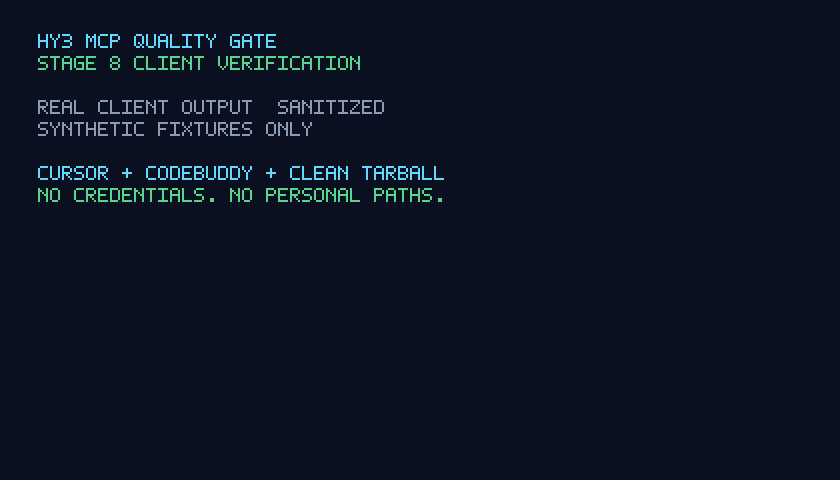

# Hy3 MCP Quality Gate

[English](README.md) | [简体中文](README_CN.md)

> Delivery status: all eight planned stages are complete. The TypeScript stdio
> server, four-tool surface, target registry, bounded protocol inspector,
> deterministic and optional Hy3 audits, compatibility comparison, inert probe
> generation, reproducible evaluation, clean-package verification, bilingual
> documentation, and two-client evidence are available in this repository.

Hy3 MCP Quality Gate is a local stdio MCP server that inspects other
pre-registered MCP servers. It combines deterministic protocol and JSON Schema
checks with Hy3 semantic review to produce evidence-backed findings, compatibility
reports, and safe test cases.

The Stage 1 product contract remains authoritative for the implementation. Current
runtime status is stated explicitly in the delivery roadmap so incomplete tools are
not presented as operational.

## Problem

MCP servers can be syntactically valid while remaining difficult or unsafe for an
agent to use. Common problems include ambiguous tool descriptions, incomplete
parameter documentation, incompatible contract changes, misleading safety hints,
stdout protocol pollution, and unbounded startup behavior. These problems are hard
to catch with a single kind of test:

- deterministic checks are reliable for protocol and schema facts;
- semantic checks are needed for descriptions, intent, overlap, and migration impact.

The quality gate keeps those two sources separate. It never presents a Hy3 opinion
as a protocol fact.

## What “quality gate” means

The name borrows the idea of a physical access gate, but this project is software:
it does not control a real door, badge reader, or building entrance. It is also not
a network firewall, intrusion-detection system, antivirus product, or runtime
sandbox.

Instead, it is a **pre-release and pre-integration checkpoint for MCP contracts**.
An MCP server is the item approaching the gate. The quality gate starts only a
pre-registered local server, performs MCP initialization and tool discovery, then
examines the contracts the server exposes. It asks:

- can the server complete the MCP protocol handshake within fixed limits?
- are tool names and JSON Schemas structurally valid?
- do descriptions clearly explain intent, inputs, outputs, side effects, and
  failure behavior?
- do safety annotations contradict what the tool says it does?
- can every reported problem be tied to a concrete protocol event or JSON Pointer?

Deterministic code decides protocol and schema facts and produces the reproducible
score. Hy3 acts as a bounded semantic reviewer for ambiguity, overlap, missing
operational meaning, and misleading safety language. Its output is treated as
untrusted, schema-validated advice and cannot change the deterministic score.

The gate therefore resembles a CI quality check more than a security perimeter.
Security review is one lane of the check, but the system does not prove that a
server is harmless at runtime. The initial release never invokes the target's
business tools, never executes generated probes, and never accepts an arbitrary
command from an MCP caller.

## MCP tools

| Tool | Purpose | Hy3 role |
| --- | --- | --- |
| `mcpq_inspect_server` | Start a registered target, negotiate MCP, list tools, and validate its declared contracts. | Summarize impact only; pass/fail remains deterministic. |
| `mcpq_audit_contracts` | Produce deterministic and semantic findings with evidence paths and a scorecard. | Review ambiguity, overlap, misleading descriptions, and annotation semantics. |
| `mcpq_compare_contracts` | Compare two registered server versions and identify compatibility changes. | Explain semantic changes and propose a migration plan. |
| `mcpq_generate_probe_suite` | Generate schema-valid normal, boundary, error, and adversarial probe cases without executing them. | Generate scenario-aware cases and expected behavior. |

The complete inputs, outputs, invariants, and error behavior are defined in
[`docs/design.md`](docs/design.md).

## Current implementation status

| Capability | Status |
| --- | --- |
| TypeScript package and local stdio transport | Available |
| Four discoverable tools with documented input/output schemas | Available |
| Strict target registry with allowed roots, environment policy, and hard limits | Available |
| `mcpq_inspect_server` initialize and `tools/list` workflow | Available |
| Timeout, malformed JSON, stdout pollution, output limit, and process cleanup controls | Available |
| Deterministic contract rules and reproducible scorecard | Available |
| Hy3 semantic audit with strict validation and safe degradation | Available |
| Deterministic compatibility comparison with optional Hy3 migration review | Available |
| Hy3 probe generation with local Schema and safety validation | Available |
| Reproducible fixture evaluation and committed metrics baseline | Available |
| Cursor and CodeBuddy project configuration and read-only fixture calls | Verified |
| Clean tarball installation and sanitized delivery evidence | Verified |

`mcpq_audit_contracts` works offline with `include_hy3=false`. With
`include_hy3=true`, it calls a configured OpenAI-compatible Hy3 endpoint. If Hy3 is
not configured, unavailable, times out, or returns invalid output, deterministic
results remain available and a non-failing deterministic audit returns `partial`;
no semantic findings are fabricated.

`mcpq_compare_contracts` can run fully offline with `include_hy3=false`. Removed
tools, new required inputs, narrowed constraints, removed enum values, narrowed
outputs, and riskier annotations are classified deterministically. Hy3 may add
`COMPAT-008` semantic-risk findings and migration steps, but cannot downgrade a
deterministic `breaking` result.

`mcpq_generate_probe_suite` requires Hy3 because generation is its core operation.
Every candidate is validated locally against the discovered input JSON Schema,
profile, case limit, evidence pointer, and safety policy. The quality gate returns
the cases as inert data and never calls the target tool.

## Development quickstart

Requirements: Node.js 22 or newer and npm.

```bash
cd mcp_servers/mcp_quality_gate
npm ci
npm run typecheck
npm run lint
npm test
npm run evaluate
```

Run the complete offline demo. It discovers all four tools, calls inspection,
audits a deliberately defective fixture, and compares a breaking contract change:

```bash
npm run demo
```

Build and start the quality gate over stdio:

```bash
npm run build
MCPQ_TARGETS_FILE=/absolute/path/to/targets.json npm start
```

## Cursor and CodeBuddy

The repository commits project-level configurations for both required clients:

- Cursor: `/.cursor/mcp.json`
- CodeBuddy: `/.mcp.json`

From the repository root, one command installs dependencies, builds the server,
checks the client configurations, performs a real stdio handshake, discovers all
four tools, and calls the conforming fixture:

```bash
cd mcp_servers/mcp_quality_gate && npm ci && npm run verify:delivery
```

Then start Cursor or CodeBuddy from the **repository root**, approve the project
MCP server when prompted, and use the examples in
[`docs/clients.md`](docs/clients.md). The committed configurations use only
repository-relative paths and contain no credential. Node.js must be available on
the client's `PATH`.

### Sanitized client demo



The GIF is rendered reproducibly from normalized terminal evidence. It shows only
synthetic fixture IDs and contains no account name, credential, personal path, or
raw provider conversation. The exact acceptance and evidence rules are documented
in [`docs/delivery.md`](docs/delivery.md).

Start from [`examples/targets.example.json`](examples/targets.example.json), but
keep the real registry private. Commands, cwd values, fixed environment variables,
and process limits can only be supplied through that startup registry. MCP callers
receive only a validated `target_id` parameter.

To enable the semantic path, configure an OpenAI-compatible Hy3 endpoint:

```bash
export HY3_API_KEY=EMPTY
export HY3_BASE_URL=http://127.0.0.1:8000/v1
export HY3_MODEL=hy3
export HY3_REASONING_EFFORT=high
export HY3_TIMEOUT_MS=60000
export MCPQ_TARGETS_FILE=/absolute/path/to/targets.json
npm start
```

`EMPTY` is appropriate only for a local endpoint that does not authenticate.
Use the real provider credential when authentication is required, keep it in the
process environment, and never commit it. `mcpq_audit_contracts` accepts an
optional per-call `reasoning_effort`; when omitted it uses
`HY3_REASONING_EFFORT`.

Example MCP arguments:

```json
{
  "baseline_target_id": "fixture-compat-baseline",
  "current_target_id": "fixture-compat-breaking",
  "include_non_breaking": true,
  "include_hy3": false
}
```

```json
{
  "target_id": "fixture-good",
  "tool_name": "fixture_echo",
  "profile": "balanced",
  "max_cases": 12
}
```

## Design principles

1. **Facts and judgments stay separate.** Every finding declares whether it came
   from deterministic code or Hy3.
2. **Evidence is mandatory.** A finding points to a protocol event, JSON Pointer,
   tool name, or version change.
3. **Commands are configuration, not tool input.** Callers select a trusted
   `target_id`; they cannot supply a shell command through an MCP call.
4. **Inspection is non-invasive by default.** The first release performs
   initialization and discovery but does not invoke target business tools.
5. **Untrusted text remains data.** Target descriptions, schemas, stderr, and model
   output cannot redefine the quality gate's instructions.
6. **Scores remain reproducible.** Only deterministic findings change the numeric
   conformance score; Hy3 findings are reported separately with confidence.

## Architecture

```text
MCP client
    |
    | stdio tools/call
    v
Hy3 MCP Quality Gate
    |-- target registry (trusted local configuration)
    |-- bounded stdio inspector
    |-- deterministic rule engine
    |-- deterministic compatibility engine
    |-- Hy3 semantic and migration reviewers
    |-- locally validated inert probe generator
    `-- structured report composer
             |
             v
       findings + scorecard + evidence
```

Targets are declared before startup. See
[`examples/targets.example.json`](examples/targets.example.json) for the planned
configuration shape.

## Security boundary

The quality gate launches configured local processes, so its security boundary is
part of the product rather than an implementation detail. The first release will:

- resolve only known target IDs from a local registry;
- spawn processes without a shell;
- use an explicit environment allowlist;
- bound startup time, request time, stdout, stderr, and total process lifetime;
- terminate the complete child process group on timeout;
- redact credential-like values before logs, reports, or Hy3 requests;
- reserve stdout for MCP JSON-RPC and write diagnostics to stderr;
- treat MCP annotations as untrusted hints;
- avoid calling target business tools.

See [`docs/security.md`](docs/security.md) for threats, controls, and residual risks.

## Rule catalogue

Stable rule IDs are grouped into protocol, schema, documentation, safety,
compatibility, and robustness families. See
[`docs/rule-catalog.md`](docs/rule-catalog.md).

## Delivery roadmap

- **Stage 1 — design baseline:** product scope, tool contracts, threat model, rule
  catalogue, and target registry example.
- **Stage 2 — runnable server (complete):** TypeScript package, stdio server, four
  registered tools, build, lint, and test commands.
- **Stage 3 — protocol inspector (complete):** safe target process management and
  `mcpq_inspect_server`.
- **Stage 4 — deterministic audit (complete):** evidence model, static contract
  rules, versioned deductions, and reproducible score.
- **Stage 5 — Hy3 audit (complete):** validated structured semantic findings,
  evidence resolution, bounded repair, and safe provider degradation.
- **Stage 6 — compatibility and probes (complete):** deterministic contract diff,
  validated Hy3 migration advice, and safe unexecuted test generation.
- **Stage 7 — evaluation (complete):** intentionally broken fixture servers,
  strict golden expectations, reproducible metrics, and a committed baseline.
- **Stage 8 — delivery (complete):** clean-package verification, real read-only
  CodeBuddy and Cursor fixture calls, bilingual documentation, sanitized evidence,
  and a reproducible demo GIF.

## Non-goals for the first release

- a web dashboard or hosted service;
- automatic source-code modification;
- accepting arbitrary commands from MCP tool arguments;
- executing generated probes or destructive target tools;
- claiming that MCP annotations prove actual target behavior;
- replacing official MCP SDK or Inspector testing;
- grading general code quality unrelated to the exposed MCP contract.

## Configuration policy

Hy3 configuration is provided only through environment variables:

| Variable | Default | Meaning |
| --- | --- | --- |
| `HY3_API_KEY` | unset | Enables semantic review when non-empty. |
| `HY3_BASE_URL` | `http://127.0.0.1:8000/v1` | HTTP(S) OpenAI-compatible API root; credentials, query strings, and fragments are rejected. |
| `HY3_MODEL` | `hy3` | Model identifier sent to the endpoint. |
| `HY3_REASONING_EFFORT` | `high` | Server default: `no_think`, `low`, or `high`. |
| `HY3_TIMEOUT_MS` | `60000` | Complete request and response deadline, capped at 300000 ms. |

No credential value may be stored in a target registry, fixture, transcript,
evaluation result, or committed client configuration.

## Documentation

- [Architecture and tool contracts](docs/design.md)
- [Security model](docs/security.md)
- [Rule catalogue](docs/rule-catalog.md)
- [Evaluation method and baseline interpretation](docs/evaluation.md)
- [Cursor and CodeBuddy setup and runnable calls](docs/clients.md)
- [Delivery verification and evidence policy](docs/delivery.md)
- [Target registry example](examples/targets.example.json)
