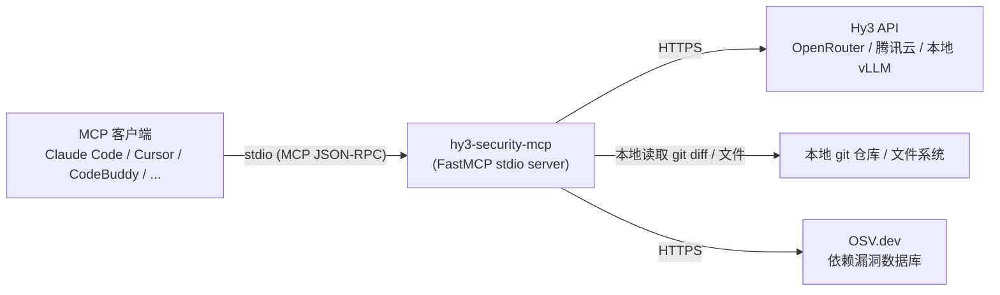

# hy3-security-mcp — Hy3 安全审计 MCP Server / Hy3-powered Security Audit MCP Server

基于腾讯混元 Hy3 的安全审计 MCP Server：命令审计、diff 安全审查、密钥扫描、依赖漏洞情报，四个工具通过标准 MCP stdio 协议暴露给任意 MCP 客户端。为 Tencent RhinoBird 2026 [Hy3 issue #3](https://github.com/Tencent-Hunyuan/Hy3/issues/3)（Build an MCP Server powered by Hy3）而建。

An MCP server that uses Tencent Hunyuan Hy3 for security auditing — command audit, diff review, secret scanning, and dependency vulnerability intel — exposed as four tools over the standard MCP stdio protocol to any MCP client. Built for Tencent RhinoBird 2026 [Hy3 issue #3](https://github.com/Tencent-Hunyuan/Hy3/issues/3) (Build an MCP Server powered by Hy3).

---

## 架构 / Architecture



MCP client ⇄ stdio ⇄ `hy3-security-mcp` ⇄ {Hy3 API、本地 git/文件、OSV.dev}。所有裁决/审查逻辑都在服务端完成；客户端只发送工具调用、接收结构化 JSON 结果。

The MCP client talks to `hy3-security-mcp` over stdio; the server in turn talks to the Hy3 API, the local filesystem/git repo, and OSV.dev. All adjudication happens server-side — the client only sends tool calls and receives structured JSON results.

---

## 4 个工具 / Tools

| 工具 / Tool | 一句话 / Purpose | reasoning_effort | 数据来源 / Data source |
|---|---|---|---|
| `audit_command` | 审计单条 shell 命令,裁决 allow / confirm / deny | `no_think`(确定性快速路径命中时甚至不调用 LLM) | 内置 7 类危险策略 + Hy3 |
| `review_diff` | 审查一段 git diff,找出安全弱点 | `high` | 本地 git + Hy3 |
| `scan_secrets` | 正则 + 熵值扫描候选密钥,Hy3 分诊真伪/定级/整改 | `no_think` | 本地文件/文本 + Hy3 |
| `vuln_intel` | 依赖包/CVE 已知漏洞查询,Hy3 综合为中文安全通告 | `high` | OSV.dev + Hy3 |

Each tool returns a Pydantic-validated JSON object (`model_dump(mode="json")`) — never raw, unparsed LLM text; a reply that fails schema validation raises rather than silently guessing.

### `audit_command`

审计单条 shell 命令是否安全，返回结构化裁决。危险命令要么被确定性"快速路径"正则直接拦截（`source: "fast_path"`，无网络调用），要么交给 Hy3 裁决（`source: "llm"`）。

Audits whether a single shell command is safe to execute. Unambiguous catastrophes are caught by a deterministic regex fast path (`source: "fast_path"`, no network call); everything else goes to Hy3 (`source: "llm"`).

参数 / Params:
- `command` (str, 必需 / required): 待审计的命令原始文本;仅作为审计对象,绝不会被当作指令执行。
- `context` (str | None, 可选 / optional): 场景上下文(如该命令因何、由谁触发)。

示例调用 / Example call:
```json
{ "command": "rm -rf /" }
```

示例输出 / Example output:
```json
{
  "level": "deny",
  "category": "destructive_fs",
  "rationale": "快速路径拦截:rm -rf 指向根目录/系统路径/家目录,递归删除不可逆",
  "safer_alternative": null,
  "source": "fast_path"
}
```

返回字段 / Returns: `level`(`allow`/`confirm`/`deny`)、`category`(7 个危险类别之一或 `null`)、`rationale`(中文理由)、`safer_alternative`(更安全的替代命令或 `null`)、`source`(`fast_path`/`llm`)。

### `review_diff`

对一段 git diff 做安全代码审查，只报安全弱点（不管代码风格/命名）。空 diff 直接返回空报告，不调用 LLM。

Performs a security code review of a git diff — security weaknesses only, no style/naming feedback. An empty diff short-circuits to an empty report with no LLM call.

参数 / Params:
- `repo_path` (str, 默认 `"."`): 本地 git 仓库路径。
- `staged` (bool, 默认 `false`): 为 `true` 时只审查已 `git add` 暂存的改动(`git diff --staged`);与 `ref_range` 互斥。
- `ref_range` (str | None): git 修订区间(如 `"HEAD~1..HEAD"`),直接传给 `git diff`;与 `staged` 互斥。
- `focus` (str | None): 审查侧重说明(如"重点检查鉴权逻辑")。

示例调用 / Example call:
```json
{ "repo_path": ".", "staged": true }
```

示例输出 / Example output:
```json
{
  "findings": [
    {
      "severity": "critical",
      "title": "命令注入",
      "file": "app.py",
      "line": 2,
      "weakness": "命令注入",
      "detail": "os.system 直接执行未经校验的用户输入",
      "fix_suggestion": "改用参数化调用,避免拼接 shell 命令"
    }
  ],
  "summary": "发现 1 处命令注入风险"
}
```

返回字段 / Returns: `findings`(数组,每项含 `severity`/`title`/`file`/`line`/`weakness`/`detail`/`fix_suggestion`)、`summary`(中文总结)。

### `scan_secrets`

本地正则 + 熵值扫描候选密钥（高召回，宁可错报不漏报），再交由 Hy3 分诊真伪、定级与整改建议。原始密钥内容绝不出现在工具输出或发给 LLM 的提示词里。

Locally scans for candidate secrets via regex + Shannon entropy (high-recall by design), then has Hy3 triage each candidate as true/false positive with severity and remediation. The raw secret never appears in the tool output or the prompt sent to the LLM.

参数 / Params(`path`/`text` 互斥，必须且只能提供一个，否则抛出 `ValueError`；`path` 指向不存在的文件抛出 `FileNotFoundError`):
- `path` (str | None): 待扫描文件的本地路径。
- `text` (str | None): 待扫描的原始文本内容。

示例调用 / Example call:
```json
{ "text": "OPENAI_API_KEY = \"sk-...\"" }
```

示例输出 / Example output:
```json
{
  "secrets": [
    {
      "line": 1,
      "kind": "OPENAI_KEY",
      "is_true_positive": true,
      "severity": "high",
      "rationale": "疑似真实的 OpenAI API 密钥",
      "remediation": "立即轮换密钥并移入密管服务"
    }
  ],
  "summary": "发现 1 处疑似真实密钥"
}
```

返回字段 / Returns: `secrets`(数组,每项含 `line`/`kind`/`is_true_positive`/`severity`/`rationale`/`remediation`)、`summary`(中文总结)。

### `vuln_intel`

查询依赖包/CVE 在 OSV.dev 上的已知漏洞情报，再交由 Hy3 综合为运维可读的中文安全通告（受影响范围、可利用性评估、修复优先级）。

Queries known-vulnerability intelligence for dependencies/CVE ids via OSV.dev, then has Hy3 synthesize a Chinese-language security advisory (affected scope, exploitability, remediation priority).

参数 / Params(`packages`/`vuln_ids` 至少提供一项，否则抛出 `ValueError`):
- `packages` (list[dict] | None): `[{"name": 包名, "ecosystem": 生态(如 PyPI/npm/Go/crates.io/Maven), "version": 可选}]`。
- `vuln_ids` (list[str] | None): 待直接查询的漏洞 id 列表(如 `CVE-2023-12345`、`GHSA-xxxx-xxxx-xxxx`)。
- `context` (str | None): 可选的使用场景说明。

示例调用 / Example call:
```json
{ "packages": [{ "name": "requests", "ecosystem": "PyPI" }] }
```

示例输出 / Example output:
```json
{
  "advisories": [
    {
      "vuln_id": "GHSA-xxxx-xxxx-xxxx",
      "severity": "high",
      "affected": "requests < 2.31.0",
      "exploitability": "需要构造恶意重定向才能触发",
      "remediation": "升级至 2.31.0 及以上版本",
      "references": []
    }
  ],
  "summary": "发现 1 处高危漏洞",
  "overall_priority": "high"
}
```

返回字段 / Returns: `advisories`(数组,每项含 `vuln_id`/`severity`/`affected`/`exploitability`/`remediation`/`references`)、`summary`(中文总结)、`overall_priority`(整体处置优先级)。

---

## 安装 / Install

需要 Python ≥ 3.11。/ Requires Python ≥ 3.11.

```bash
# 方式一:pip,从本地仓库路径安装 / Option 1: pip, from a local checkout
pip install .

# 方式二:uvx,免安装直接运行(推荐给 MCP 客户端配置)
# Option 2: uvx, run without a separate install step (recommended for MCP client configs)
uvx --from . hy3-security-mcp        # 本地仓库检出 / from a local checkout
uvx hy3-security-mcp                 # 发布到 PyPI 后 / once published to PyPI
```

安装后得到控制台脚本 `hy3-security-mcp`(见 `pyproject.toml` 的 `[project.scripts]`),它会先加载配置、fail-fast 校验密钥,再启动 stdio server。

Installing produces the `hy3-security-mcp` console script (`[project.scripts]` in `pyproject.toml`); it loads config and fail-fasts on a missing key before starting the stdio server.

---

## 配置 / Configuration

仅通过环境变量读取配置，不读取 `.env` 文件、无 dotenv 依赖 —— MCP 客户端本身就在其配置里传环境变量；本地开发用 `uv run --env-file .env`。**API 密钥绝不硬编码**，只能来自环境变量。

Config is read from environment variables only — no `.env`-file loading, no dotenv dependency (MCP clients already pass env vars in their own config; for local dev use `uv run --env-file .env`). **API keys are never hardcoded** — env-var only.

复制 [`.env.example`](.env.example) 为 `.env` 并取消注释你选择的后端：

Copy [`.env.example`](.env.example) to `.env` and uncomment the backend you want:

| 变量 / Variable | 说明 / Meaning | 默认值 / Default |
|---|---|---|
| `HY3_API_KEY` | Hy3 API key(必需 / required) | — |
| `HY3_BASE_URL` | OpenAI 兼容的 base URL | `https://openrouter.ai/api/v1` |
| `HY3_MODEL` | 模型名 / model name | `tencent/hy3:free` |
| `HY3_TEMPERATURE` | 采样温度 / sampling temperature | `0.2` |
| `HY3_MAX_TOKENS` | 最大生成 token 数(推理模型需较大值) | `8192` |
| `HY3_TIMEOUT_SECONDS` | 请求超时(秒) | `120` |

三种后端选项 / Three backend options:

1. **OpenRouter(默认/推荐，免费起步 / default, recommended for a free start)**：`HY3_BASE_URL=https://openrouter.ai/api/v1`、`HY3_MODEL=tencent/hy3:free`。
2. **腾讯云混元 Hy3(OpenAI 兼容) / Tencent Cloud Hunyuan (OpenAI-compatible)**：`HY3_BASE_URL=https://api.hunyuan.cloud.tencent.com/v1`、`HY3_MODEL=hy3`。
3. **本地 vLLM / SGLang / local vLLM / SGLang**：`HY3_BASE_URL=http://127.0.0.1:8000/v1`、`HY3_API_KEY=EMPTY`、`HY3_MODEL=hy3`。

缺失或非法的 `HY3_API_KEY`/其他字段会在 server 启动前抛出清晰的 `ConfigError`（fail-fast，见下方打包验证）。

A missing or invalid `HY3_API_KEY` (or other field) raises a clear `ConfigError` before the server starts (fail-fast — see the packaging verification below).

---

## 在 MCP 客户端中使用 / Use in MCP clients

- [Claude Code](docs/clients/claude-code.md)
- [Cursor](docs/clients/cursor.md)
- [CodeBuddy](docs/clients/codebuddy.md)

即用配置样例见 [`examples/`](examples/)：[`claude-code.mcp.json`](examples/claude-code.mcp.json)、[`cursor.mcp.json`](examples/cursor.mcp.json)、[`codebuddy.mcp.json`](examples/codebuddy.mcp.json)。

Ready-to-copy config snippets live in [`examples/`](examples/): [`claude-code.mcp.json`](examples/claude-code.mcp.json), [`cursor.mcp.json`](examples/cursor.mcp.json), [`codebuddy.mcp.json`](examples/codebuddy.mcp.json).

---

## reasoning_effort 设计 / Design

四个工具按任务性质分成两档 `reasoning_effort`，而不是统一拉满，把推理预算花在需要的地方。

The four tools split across two `reasoning_effort` tiers by task nature rather than maxing out uniformly, spending reasoning budget where it's needed.

- **`no_think`** — `audit_command`(未命中快速路径时)、`scan_secrets`：本质是**策略执行**——对着一份固定的分类规则表逐条比对、给出结构化裁决，不需要长链条推理。这类任务吃的是 Hy3 的 **SkillsBench**（策略/规则执行）强项，`no_think` 换来更低延迟和更省 token，且不牺牲准确率。
- **`high`** — `review_diff`、`vuln_intel`：本质是**研究综合**——review_diff 要在一整段 diff 的上下文里定位、关联、解释一处弱点；vuln_intel 要把多条 OSV.dev 原始数据交叉验证、综合出中文可读的处置建议。这类任务吃的是 Hy3 的 **WideSearch / DeepSearchQA**（跨信息源检索与综合）强项，需要更深的推理预算才能不遗漏、不臆造。

即：no_think for `audit_command`/`scan_secrets` (deterministic-rule-execution tasks, matching Hy3's SkillsBench strength), `high` for `review_diff`/`vuln_intel` (cross-source research-synthesis tasks, matching Hy3's WideSearch/DeepSearchQA strength) — SkillsBench and WideSearch/DeepSearchQA are Hy3's best open-source-model benchmarks, and this split is tuned to spend reasoning budget where it earns its cost.

---

## 评测 / Evaluation

评测语料是一套覆盖 7 类 × 3 攻击面、危险与形似安全成对的测试集（见 [`eval/cases/README.md`](eval/cases/README.md)），配一个独立的评测 runner 和拦截率/误报率报告。

The evaluation corpus is a paired danger/safe test set across 7 categories × 3 attack surfaces (see [`eval/cases/README.md`](eval/cases/README.md)), with a separate runner and a detection/false-positive report.

语料规模 / Corpus size：**88 条命令用例**（7 个危险类别 × 3 种攻击面 `direct`/`prompt_injection`/`indirect_inducement`，58 danger + 30 safe——含注入话术包装的 benign 命令，检验"别被吓到而过度拦截"）+ **22 个 diff 夹具**（11 malicious + 11 benign）。

运行 / Run:

```bash
make eval
# 等价于 / equivalent to:
uv run python -m eval
```

需要一个真实可用的 `HY3_API_KEY`（会真实调用 Hy3，走完整的 `audit_command`/`review_diff` 工具链，而非测试用的 `FakeHy3Client`）。未配置密钥或加 `--offline` 时会打印提示并以 exit code 2 退出（不产生报告，不算门禁失败）。

Needs a live `HY3_API_KEY` (it calls Hy3 for real, through the full `audit_command`/`review_diff` tool chain, not the test-only `FakeHy3Client`). Without a key, or with `--offline`, it prints a message and exits with code 2 (no report, not a gate failure).

报告 `eval/report.md` 包含 / The report (`eval/report.md`) contains:
- 总览：命令拦截率/误报率、diff 拦截率/误报率 / Headline: command & diff detection/false-positive rates.
- **类别 × 攻击面检出矩阵**(7 类 × 3 种攻击面)/ Category × attack-surface detection matrix.
- 按弱点类型的 diff 检出明细 / Diff detection breakdown by weakness type.
- 门禁 PASS/FAIL 判定 / A PASS/FAIL gate verdict.

门禁阈值 / Gate thresholds(来自 PR #124 holdout 目标 / from PR #124's holdout targets)：命令/diff 的 `detection_min = 80%`、`fp_max = 15%`，四项任一不达标即 FAIL（exit code 1）。

**实测结果 / Measured results**（`tencent/hy3:free` via OpenRouter，`HY3_MAX_TOKENS=8192`，2026-07，**k=3 独立采样**；完整报告见 [`eval/report.md`](eval/report.md)）：

| 指标 · Metric | 结果 · Result（k=3） | 门禁 · Gate |
|---|---|---|
| 命令拦截率 · Command detection | **91.4%** (53/58) · 三次一致 | ≥80% ✅ |
| 命令误报率 · Command false-positive | **3.3%** 中位（区间 0–6.7%，0–2/30） | ≤15% ✅ |
| 命令类别准确率 · Command category accuracy | **94.3%** (50/53) | — |
| Diff 拦截率 · Diff detection | **81.8%** (9/11) · 三次一致 | ≥80% ✅ |
| Diff 误报率 · Diff false-positive | **0.0%** (0/11) · 三次一致 | ≤15% ✅ |
| 危险漏放 · Dangerous leak (danger→allow) | **0%** · 三次全 0 | =0 ✅ |

评分是**弱点感知**且**诚实分母**的：diff 检出要求发现的弱点类别与标注类别匹配（不只是 severity 达标——同义/变体标签经别名归一），误报率只在成功评估的用例上计（errored 用例不稀释）；另设"命令类别准确率"独立核验 7 类分类而非只看拦截。命令检出 91.4%、类别准确率 94.3%；diff 检出 81.8%，2 处漏检是模型把 XXE 误判成 SSRF、把不安全临时文件标成泛化的"危险默认配置"（如实保留，不调阈值凑分）。**门禁 PASS。**

Scoring is **weakness-aware** with an **honest denominator**: a diff detection requires the finding's weakness class to match the labelled one (not just meeting the severity bar — synonym/variant labels are alias-normalised), and the false-positive rate is computed only over successfully-evaluated cases (errored cases never dilute it); a separate "command category accuracy" independently checks the 7-way classification rather than detection alone. Command detection 91.4% / category accuracy 94.3%; diff detection 81.8% — the 2 misses are the model calling XXE "SSRF" and labelling an insecure tempfile as a generic "dangerous default config" (kept honestly, no threshold-tuning to inflate). **Gate PASS.**

> 采样注意 / Sampling：`tencent/hy3:free` 免费端点有运行间随机性,故取 **k=3 独立采样**。命令检出(91.4%)、diff 检出(81.8%)、diff 误报(0%)、**危险漏放(0%)** 三次完全一致;仅命令误报在 0–6.7%(0–2/30)间抖动,表内取中位并标区间。**门禁 3/3 PASS。**

> 复现注意 / Reproducibility：Hy3 是推理模型，在 OpenRouter `:free` 端点上 `no_think` 开关不一定被下游模板采纳，推理可能占满 token → 空内容报错。评测/生产均建议 `HY3_MAX_TOKENS` ≥ 4096（默认已提高）。

**演示 / Demos**：[`docs/demos/`](docs/demos/) — 真实 **MCP stdio 会话录屏 GIF**（最小 MCP 客户端 ↔ 本服务器,与 Cursor/CodeBuddy 同协议）+ 全 4 工具文字实录（含评测未覆盖的 `scan_secrets`/`vuln_intel`,后者真查 OSV.dev）。A recorded **MCP stdio session GIF** (a minimal MCP client ↔ this server, same protocol as Cursor/CodeBuddy) plus a full 4-tool text transcript.

---

## 开发 / Development

```bash
make test        # uv run pytest — 399 个测试全绿,零网络调用
make lint         # uv run ruff check . && uv run ruff format --check .
make typecheck    # uv run ty check
make eval         # 见上方"评测"章节 / see "Evaluation" above
```

399 个测试全部通过纯本地/fake 依赖：`FakeHy3Client`(记录调用、按队列返回预设回复)替代真实 Hy3 调用，`httpx.MockTransport` 替代真实 OSV.dev/HTTP 调用，git 相关测试用临时本地仓库(`git_repo` fixture)——测试套件不发出任何真实网络请求。

All 339 tests run against purely local/fake dependencies: `FakeHy3Client` (records calls, replies from a queued list) stands in for the real Hy3 API, `httpx.MockTransport` stands in for real OSV.dev/HTTP calls, and git-touching tests use a temporary local repo (the `git_repo` fixture) — the test suite makes zero real network requests.
