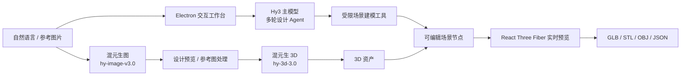

# ArchAgent：由 Hy3 驱动的桌面空间设计智能体

- 项目仓库：[xy200303/ArchAgent](https://github.com/xy200303/ArchAgent)
- 许可证：AGPL-3.0-only
- 形态：Electron 桌面应用（React + React Three Fiber）

ArchAgent 面向建筑、房间与室内场景的快速设计。它不是只把大模型接入聊天框，而是将 **Hy3 主模型、混元生图和混元生 3D** 融合为一个桌面工作台：用户可从一句空间需求或一张参考图出发，获得可继续编辑、预览和导出的 3D 设计结果。

## Hy3 在系统中的角色

ArchAgent 全程通过 API 调用混元产品，不进行训练、微调或本地推理部署。应用在 Electron Main 进程中读取 `HY3_API_KEY`、`HY3_BASE_URL` 和 `HY3_CHAT_MODEL`，以 OpenAI-compatible Chat Completions 协议连接 Hy3；图像与 3D 服务复用同一密钥。API Key 不会暴露给 Renderer。



| 混元能力 | ArchAgent 中的职责 | 对用户的价值 |
| --- | --- | --- |
| **Hy3 主模型** | 多轮理解设计意图、规划工具调用、生成并修订场景命令 | 把“我想要什么空间”变成可操作的设计步骤 |
| **混元生图（`hy-image-v3.0`）** | 生成设计预览、辅助处理参考图 | 在建模前快速探索空间风格与视觉方向 |
| **混元生 3D（`hy-3d-3.0`）** | 将确认的参考图或对象转为 3D 资产 | 将灵感素材直接带入可编辑的空间场景 |

Hy3 主模型作为多轮设计 Agent 的核心模型，负责：

- 理解用户的自然语言空间设计需求和图片附件。
- 基于会话上下文规划下一步操作，并调用受限建模工具。
- 生成和修订场景命令，包括创建或修改墙体、门窗、楼板、房间区域和家具。
- 编排混元生图和混元生 3D 服务，完成从参考图到可编辑资产的工作流。

## 可交互前端

应用提供完整的 Electron 图形界面：右侧对话区用于输入需求和查看 Agent 工具调用，中央 React Three Fiber 编辑器用于实时 3D 预览，工具栏和属性面板支持选择、移动、旋转、缩放、画墙、放置构件与导出 GLB / STL / OBJ / JSON。

## 端到端演示流程

以下两条流程的操作脚本和可复现入口已包含在项目中；录屏或 GIF 将在本 PR 更新为 Ready for review 前补充：

1. **自然语言创建并迭代房间**：输入“创建一个 5m x 4m 的卧室，南墙开一扇门和一扇窗”，Hy3 调用场景工具建立节点；用户在 3D 编辑器中检查布局，再以对话继续调整尺寸或家具位置，最后导出模型。
2. **参考图到可编辑 3D 资产**：导入参考图片，Hy3 结合混元图像与 3D API 生成预览或 3D 资产；用户将资产放入场景、在属性面板调整位置和旋转，并导出结果。

## 运行

```bash
git clone https://github.com/xy200303/ArchAgent.git
cd ArchAgent
npm install
copy .env.example .env.local
npm run dev
```

在 `.env.local` 中填写 Hy3 API 配置后，即可通过桌面界面完成上述流程。更多配置、工具列表、测试命令和设计说明见 [ArchAgent README](https://github.com/xy200303/ArchAgent#readme)。
