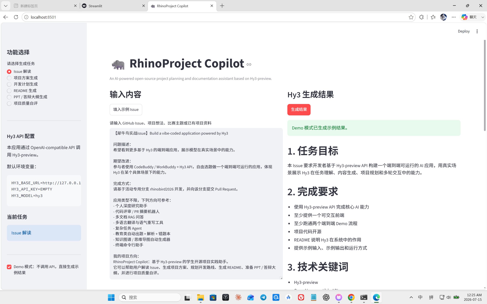

# RhinoProject Copilot

RhinoProject Copilot is an AI-powered open-source project planning and documentation assistant based on **Hy3-preview**.  
It is designed for student developers who participate in open-source training programs, innovation competitions, course projects, and research practice tasks.

The project helps users turn a vague GitHub Issue, project idea, competition topic, or existing project material into a clear and executable project plan.

---

## 1. Project Background

In open-source training programs and student innovation projects, many beginners do not lack ideas. The real difficulty is often that they do not know how to:

- understand the real requirements behind a GitHub Issue;
- convert a broad topic into a runnable project;
- design a reasonable technical route;
- prepare README documentation;
- generate PPT or defense materials;
- evaluate whether the project is complete enough for submission.

RhinoProject Copilot aims to solve this problem by using Hy3-preview as the core AI reasoning and generation engine.

---

## 2. Project Goal

The goal of this project is to provide a lightweight but complete assistant for student developers.

Given an Issue, a project idea, or competition requirements, RhinoProject Copilot can generate:

- GitHub Issue analysis;
- project proposal;
- development plan;
- README document;
- PPT / defense outline;
- project quality self-evaluation.

This allows students to move from **“I do not know what to do”** to **“I know what to build, how to build it, and how to present it.”**

---

## 3. Demo Screenshot



---

## 4. Key Features

| Feature | Description |
|---|---|
| Issue Analysis | Understands a GitHub Issue and extracts task goals, requirements, technical keywords, deliverables, and development risks. |
| Project Proposal Generation | Generates a structured project plan based on an idea, topic, or Issue. |
| Development Plan Generation | Breaks the project into executable steps and provides a practical development schedule. |
| README Generation | Creates a Markdown README structure for open-source submission. |
| PPT / Defense Outline | Generates presentation structure, demo script, project highlights, and possible Q&A. |
| Project Quality Evaluation | Evaluates the project using a rubric including innovation, completeness, reproducibility, documentation, and demo quality. |
| Demo Mode | Allows local preview without a real Hy3 API key. |
| Markdown Download | Supports downloading generated results as Markdown files. |

---

## 5. Why Hy3-preview

Hy3-preview is used as the central AI capability of this project.

In RhinoProject Copilot, Hy3-preview is responsible for:

- long-context understanding of GitHub Issues and project requirements;
- task decomposition and planning;
- structured document generation;
- project quality evaluation;
- defense and presentation material generation.

The project calls Hy3-preview through an **OpenAI-compatible API interface**, making the system easy to adapt to different deployment environments.

---

## 6. Tech Stack

| Part | Technology |
|---|---|
| Frontend / UI | Streamlit |
| Programming Language | Python |
| AI Model Interface | OpenAI-compatible API |
| Model Target | Hy3-preview |
| Configuration | `.env` / environment variables |
| Output Format | Markdown |
| Documentation | README, sample input, sample output, prompt templates |

---

## 7. Project Structure

```text
projects/RhinoProject-Copilot/
├── app.py
├── requirements.txt
├── .env.example
├── README.md
├── assets/
│   └── demo_screenshot.png
├── examples/
│   ├── sample_issue.md
│   ├── sample_output.md
│   └── sample_project_plan.md
└── prompts/
    ├── issue_analyzer.md
    ├── project_planner.md
    ├── readme_generator.md
    ├── ppt_outline_generator.md
    └── evaluator.md
```

---

## 8. Installation

Clone the repository and enter the project directory:

```bash
git clone -b rhinobird2026 https://github.com/Bokai-Xie591/Hy3.git
cd Hy3/projects/RhinoProject-Copilot
```

Install dependencies:

```bash
pip install -r requirements.txt
```

Copy the environment configuration example:

```bash
cp .env.example .env
```

For Windows CMD, use:

```cmd
copy .env.example .env
```

---

## 9. Configuration

The application uses the following environment variables:

```env
HY3_BASE_URL=http://127.0.0.1:8000/v1
HY3_API_KEY=EMPTY
HY3_MODEL=hy3
```

Explanation:

| Variable | Description |
|---|---|
| `HY3_BASE_URL` | Base URL of the OpenAI-compatible Hy3 API service. |
| `HY3_API_KEY` | API key used by the service. |
| `HY3_MODEL` | Model name used for generation. |

> For safety, `.env` should not be committed to GitHub. Only `.env.example` is included.

---

## 10. Usage

Run the Streamlit app:

```bash
streamlit run app.py
```

Then open the local page in the browser:

```text
http://localhost:8501
```

Basic workflow:

1. Choose a task from the sidebar.
2. Paste a GitHub Issue, project idea, competition topic, or project material.
3. Click **Generate Result**.
4. View the structured output.
5. Download the result as a Markdown file.

---

## 11. Demo Mode

RhinoProject Copilot provides a **Demo Mode** for quick local preview.

When Demo Mode is enabled:

- no real Hy3 API key is required;
- no external model service is required;
- the app can directly generate built-in sample results;
- users can test the complete interaction flow locally.

This is useful for reviewers who want to quickly verify the UI and end-to-end workflow.

---

## 12. Real API Mode

To use the real Hy3-preview API mode:

1. Configure `.env` with the correct API endpoint and key.
2. Disable Demo Mode in the sidebar.
3. Run the app with:

```bash
streamlit run app.py
```

The application will then call Hy3-preview through the OpenAI-compatible API.

---

## 13. Example Input

```text
【犀牛鸟实战issue】Build a vibe-coded application powered by Hy3

问题描述：
希望看到更多基于 Hy3 的端到端应用，展示模型在真实场景中的能力。

期望改进：
参与者使用 CodeBuddy / WorkBuddy + Hy3 API，自由选题做一个端到端可运行的应用，体现 Hy3 在某个具体场景下的能力。

我的项目方向：
RhinoProject Copilot：基于 Hy3-preview 的学生开源项目实践助手。
它可以帮助用户解读 Issue、生成项目方案、规划开发路线、生成 README、准备 PPT / 答辩大纲，并进行项目质量自评。
```

---

## 14. Example Output

The system can generate structured content such as:

```text
1. Task Goal
2. Completion Requirements
3. Technical Keywords
4. Deliverables
5. Difficulty Analysis
6. Recommended Development Route
7. MVP Suggestion
```

More examples can be found in:

```text
examples/sample_issue.md
examples/sample_output.md
examples/sample_project_plan.md
```

---

## 15. Project Rubric

RhinoProject Copilot can evaluate a project from multiple dimensions:

| Dimension | Meaning |
|---|---|
| Innovation | Whether the project has a clear scenario and differentiated value. |
| Completeness | Whether the project forms a complete functional loop. |
| Engineering Quality | Whether the code structure, dependencies, and configuration are clear. |
| Hy3 Usage Depth | Whether Hy3-preview plays a core role in the system. |
| Reproducibility | Whether the project can be easily run by others. |
| README Quality | Whether the documentation is clear and complete. |
| Demo Quality | Whether the project provides an interactive demo and sample results. |
| Open-source Value | Whether the project is useful to other student developers. |

---

## 16. Highlights

- Focuses on a real pain point of student developers.
- Covers the whole workflow from Issue understanding to project presentation.
- Uses Hy3-preview for core reasoning and generation tasks.
- Provides a runnable Streamlit frontend.
- Includes Demo Mode for quick review.
- Supports Markdown output and download.
- Includes prompt templates, examples, configuration files, and documentation.

---

## 17. Limitations

Current limitations include:

- GitHub Issue URL auto-fetching is not yet implemented.
- Real API mode depends on an available Hy3-compatible endpoint.
- The current version mainly supports text-based generation.
- Multi-file project analysis can be further improved in future versions.

---

## 18. Future Work

Future improvements may include:

- automatic GitHub Issue URL parsing;
- GitHub repository README auto-review;
- multi-file project structure analysis;
- one-click PPT outline export;
- project score visualization;
- more built-in examples for different project types;
- better integration with open-source contribution workflows.

---

## 19. License

This project follows the license of the upstream repository.

---

## 20. Acknowledgement

This project is developed for the 2026 Rhino-bird Open-source Training Program issue:

```text
Build a vibe-coded application powered by Hy3
```

RhinoProject Copilot uses Hy3-preview as the core AI engine for project planning, documentation generation, and quality evaluation.
