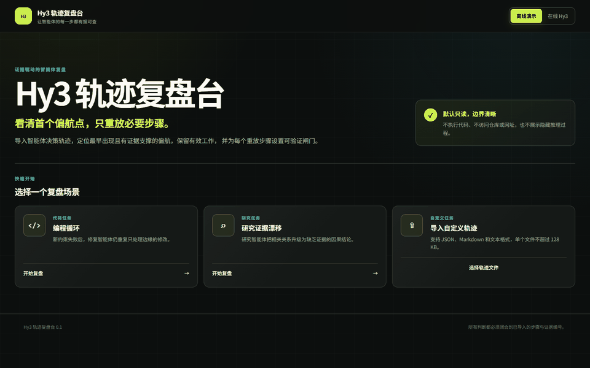

# Hy3 ReplayLab

Hy3 ReplayLab is a local Web workbench that turns an explicitly imported AI-agent trace into an evidence-backed first-divergence finding and a minimal, verifiable replay plan.

## The problem

When an agent run fails, the last visible error is often not the first bad decision. Re-running the whole trajectory is expensive and can repeat unsafe actions. ReplayLab aligns the task, acceptance criteria, trace steps, and supplied evidence; identifies the earliest decision that became unjustifiable at that point in time; and proposes the smallest ordered rerun with validation gates.

ReplayLab is deliberately not a code-review tool, incident-RCA system, project planner, cross-session memory, or live agent controller. Its object is the decision trajectory and its output is a minimal replay plan.

## 30-second preview



This 12-second GIF records the running Web UI for both public fixtures. It is an **offline fixture demo** backed by deterministic provider outputs, not a live-model recording. See the [demo provenance](docs/demo/README.md).

Each report contains:

- a normalized, stable-ID timeline;
- an acceptance-criteria coverage matrix;
- one `DivergenceFinding` with severity, category, first step, impact steps, explanation, and evidence references;
- one `ReplayPlan` with the preserved prefix, rerun boundary, ordered actions, validation gates, stop conditions, and prohibited actions;
- complete evidence-linked JSON and Markdown exports.

## Install and run

Prerequisites: Python 3.13, [uv](https://docs.astral.sh/uv/), Node.js 22, npm, and Chrome for the browser tests.

Terminal 1:

```console
cd backend
uv sync --locked
uv run uvicorn replaylab.main:app --host 127.0.0.1 --port 8000
```

Terminal 2:

```console
cd frontend
npm ci
npm run dev
```

Open `http://127.0.0.1:5173`. The Vite development server proxies only `/api` to the local FastAPI process. The built-in offline workflows require no API key.

## Configure live Hy3

The browser never accepts, stores, or displays a key. The backend reads only these process environment variables:

```text
HY3_API_KEY=
HY3_BASE_URL=https://tokenhub.tencentmaas.com/v1
HY3_MODEL=hy3
```

Use [.env.example](.env.example) as a names-only reference and set the values in the backend process environment. For example, in PowerShell:

```powershell
$env:HY3_API_KEY = "your-key"
$env:HY3_BASE_URL = "https://tokenhub.tencentmaas.com/v1"
$env:HY3_MODEL = "hy3"
uv run uvicorn replaylab.main:app --host 127.0.0.1 --port 8000
```

Select **Live Hy3** in the UI. The health endpoint reports only whether live mode is configured, never the value. Hy3 performs trace interpretation, goal/constraint alignment, first-divergence reasoning, and replay-plan ordering. Deterministic code owns parsing, stable IDs, limits, redaction, strict schema validation, reference closure, temporal ordering, coverage validation, export, and the single controlled repair boundary.

## Built-in cases

- `coding-loop`: a bug-fixing agent repeats a patch after new acceptance evidence and a failed test. The annotated first divergence is `step-006-repeat-patch`.
- `research-grounding`: a research agent jumps from retrieved snippets to an unsupported causal claim and bad citation. The annotated first divergence is `step-006-unsupported-causal-leap`.

Every fixture contains public synthetic [input](fixtures/coding-loop/input.json), a separate human [annotation](fixtures/coding-loop/annotation.json), and an offline provider output. The fixture picker can run either the deterministic offline boundary or the configured live Hy3 provider.

## Custom imports

Choose a JSON, Markdown, or TXT file in the UI. Custom imports intentionally require **Live Hy3**; the deterministic provider is defined only for the two verified fixtures.

- The filename must be 1–120 safe ASCII characters and end in `.json`, `.md`, or `.txt`.
- The MIME type must match the extension; archives, binary data, path components, reserved device names, and ambiguous Markdown are rejected.
- The file limit is 128,000 bytes. The validated task bundle limit is 256,000 bytes, 50 criteria, 200 trace steps, and 200 evidence items.
- JSON and TXT contain one raw `TaskSpec` object. Markdown contains exactly one `replaylab-json` or `json` fenced block holding that object.
- The easiest schema reference is either built-in fixture input, for example [coding-loop/input.json](fixtures/coding-loop/input.json).

The importer sends the selected text to the local backend for schema validation. It does not execute embedded code, follow embedded instructions, fetch URLs, read a repository, or write imported data to disk.

## Architecture

| Layer | Responsibility |
| --- | --- |
| React/Vite UI | Select/import a case, show timeline/coverage/evidence/replay plan, stop waiting/retry, and download exports |
| FastAPI boundary | Health, allowlisted fixtures, safe import normalization, provider selection, bounded errors |
| Hy3 provider | OpenAI-compatible structured call, timeout/retry policy, one controlled schema repair, usage metadata |
| Deterministic core | Pydantic contracts, stable IDs, redaction, reference and ordering invariants, report/export assembly |
| Evaluation | Human-authored truth, 12 independent synthetic cases, deterministic metric computation |

The complete data flow and trust boundaries are in [architecture.md](docs/architecture.md).

## Evaluation

Run the contract and metric plumbing without a key:

```console
cd backend
uv run replaylab-eval --mode offline-golden-contract
```

With live environment variables configured:

```console
uv run replaylab-live-fixtures
uv run replaylab-eval --mode live-hy3
```

The 12 public cases cover two no-divergence controls, repeated loops, omitted constraints, wrong tool parameters, evidence drift, malicious trace instructions, resource limits, wrong citations, destructive actions, skipped validation, and stale results. Human annotations are the truth source; model self-grades are not.

| 2026-07-22 run | Result | Interpretation |
| --- | --- | --- |
| Offline golden contract | 12/12 structured, all metric checks 100% | Validates schemas and scoring plumbing; **not** a model-quality claim |
| Historical live Hy3 fixture v1 | 2/2 structurally accepted with exact first-divergence matches | `coding-loop`: 12,062 ms / 2,348 tokens; `research-grounding`: 72,893 ms / 2,460 tokens; the saved artifact predates the full-annotation gate |
| Optional broad live Hy3 batch | 2/12 structured, aggregate quality metrics 16.7% | Ten requests ended as bounded provider failures under the available hosted quota/transport; retained as failures, not replaced or hidden |
| Current live UI smoke | Two `coding-loop` attempts produced bounded provider failures | The model catalog probe returned HTTP 200, but analysis completion did not reproduce; the current two-fixture full gate is still pending |

See [evaluation methodology](docs/evaluation.md), the [offline report](evals/results/offline-golden-contract-2026-07-22.md), the [historical fixture report](evals/results/live-fixtures-2026-07-22.md), the [bounded broad report](evals/results/live-hy3-2026-07-22.md), and the [current UI smoke check](evals/results/live-ui-smoke-2026-07-22.md).

## Security and limitations

- Only explicitly selected local text is analyzed. ReplayLab never executes trace code or shell commands, visits trace URLs, modifies files, or takes control of an agent.
- Trace text, tool output, filenames, URLs, and prior provider output are untrusted data. The provider prompt and deterministic validator prevent them from overriding system rules or creating unknown references.
- Credential-like input and output are redacted before provider use and before report assembly. Bounded errors omit request IDs, raw prompts, complete inputs, authorization material, and upstream response bodies.
- Provider output is capped at 256,000 bytes. Calls use a 10-second connect timeout, 60-second request timeout, at most three attempts, and `Retry-After`-aware retry only for network failures and 429/502/503/504. HTTP 400/401/403 fail immediately.
- This local MVP has no login, cloud storage, repository access, background agent, or collaboration service. It does not prove that a model explanation is causally true; it proves that every accepted output satisfies the explicit schema, supplied references, and replay invariants.
- The actual-UI GIF remains offline-labeled. Historical and current live evidence are separated in the [verification ledger](docs/verification.md); no offline response is relabeled as live.

See the full [security model](docs/security.md), [verification ledger](docs/verification.md), [requirements mapping](docs/requirements-mapping.md), and [CodeBuddy collaboration record](docs/codebuddy-collaboration.md).

## Development checks

```console
cd backend
uv run ruff check .
uv run pytest -q
uv build

cd ../frontend
npm run lint
npm run typecheck
npm test -- --run
npm run build
npm run e2e -- --project=chromium

cd ..
python scripts/check_markdown_links.py
```

The current verified counts and clean-install procedure are recorded in [verification.md](docs/verification.md). This project is covered by the repository's [Apache License 2.0](../../LICENSE).
