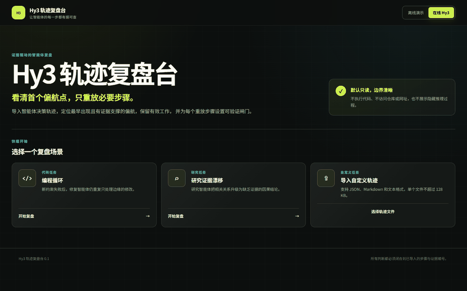

# Hy3 轨迹复盘台

Hy3 轨迹复盘台是一个中文本地 Web 工作台：把用户明确导入的 AI Agent 执行轨迹转化为有证据的首个偏航点和最小、可验证的重放计划。

## 问题

Agent 运行失败时，最后一个报错通常不是第一个错误决策。整段重跑成本高，还可能重复危险操作。ReplayLab 对齐任务、验收条件、轨迹步骤和用户提供的证据，按照每一步当时可见的信息找到最早失去依据的决策，再生成带验证门的最小顺序重跑集合。

ReplayLab 不是代码评审、事故 RCA、项目规划、跨会话记忆或 Agent 托管平台。它分析的是 Agent 决策轨迹，交付的是最小重放计划。

## 30 秒预览



这段 12 秒 GIF 录制了运行中的中文 Web UI。两条公开案例均通过 TokenHub `hy3-preview` 实时分析，界面明确显示**在线 Hy3**；两次分析合计 64,719 毫秒。无需 Key 的[离线演示](docs/demo/replaylab-offline-demo.gif)也单独保留。参见[演示来源说明](docs/demo/README.md)。

想直接动手验证，可按[中文手动测试用例](docs/manual-test-cases-cn.md)依次测试两条离线场景、证据与导出、在线 Hy3、自定义导入、非法输入和移动端布局。

每份报告包含：

- 规范化时间线和稳定 `step_id`；
- 验收条件覆盖矩阵；
- `DivergenceFinding`：严重度、类别、首个偏航步骤、影响步骤、解释和 evidence 引用；
- `ReplayPlan`：保留前缀、重跑起点、顺序动作、验证门、停止条件和禁止事项；
- 完整且可追溯到证据的 JSON/Markdown 导出。

## 安装与运行

前置环境：Python 3.13、[uv](https://docs.astral.sh/uv/)、Node.js 22、npm；浏览器测试还需要 Chrome。

终端 1：

```console
cd backend
uv sync --locked
uv run uvicorn replaylab.main:app --host 127.0.0.1 --port 8000
```

终端 2：

```console
cd frontend
npm ci
npm run dev
```

打开 `http://127.0.0.1:5173`。Vite 只把 `/api` 代理到本地 FastAPI。内置离线流程不需要 API Key。

## 配置 Hy3

浏览器永远不接收、不保存、不显示 Key。后端只读取以下进程环境变量：

```text
HY3_API_KEY=
HY3_BASE_URL=https://tokenhub.tencentmaas.com/v1
HY3_MODEL=hy3
```

[.env.example](.env.example) 只用于说明变量名。请把值注入后端进程，例如 PowerShell：

```powershell
$env:HY3_API_KEY = "your-key"
$env:HY3_BASE_URL = "https://tokenhub.tencentmaas.com/v1"
$env:HY3_MODEL = "hy3"
uv run uvicorn replaylab.main:app --host 127.0.0.1 --port 8000
```

在 UI 中选择 **在线 Hy3**。健康接口只返回“是否已配置”，不会返回变量值。Hy3 负责理解轨迹、对齐目标与约束、推理首个偏航点和排列重放计划，并以简体中文返回所有面向用户的说明；确定性代码负责解析、稳定 ID、资源上限、脱敏、严格 Schema、引用闭包、时序与覆盖校验、导出，以及最多一次受控修复。

## 内置案例

- `coding-loop`：修 bug 的 Agent 在出现新增验收证据和失败测试后仍重复补丁；人工标注的首个偏航点是 `step-006-repeat-patch`。
- `research-grounding`：研究 Agent 从检索片段跳到无依据的因果结论并错误引用；人工标注的首个偏航点是 `step-006-unsupported-causal-leap`。

每个案例都有公开合成的 [输入](fixtures/coding-loop/input.json)、独立的人工 [标注](fixtures/coding-loop/annotation.json) 和离线 provider 输出。案例选择器可运行确定性离线边界，也可调用已配置的真实 Hy3。

## 自定义导入

UI 支持 JSON、Markdown、TXT。自定义导入有意限定为 **在线 Hy3**；确定性 provider 只对两条已验证的内置案例定义。

- 文件名为 1–120 个安全 ASCII 字符，扩展名只能是 `.json`、`.md`、`.txt`。
- MIME 必须与扩展名一致；拒绝压缩包、二进制、路径成分、系统保留名和含糊 Markdown。
- 单文件最多 128,000 字节；校验后的任务包最多 256,000 字节、50 条标准、200 个轨迹步骤、200 条证据。
- JSON/TXT 是单个原始 `TaskSpec` 对象；Markdown 必须且只能有一个 `replaylab-json` 或 `json` 围栏，其中放置该对象。
- 可直接参考内置输入，例如 [coding-loop/input.json](fixtures/coding-loop/input.json)。

导入器只把选中的文本交给本地后端校验。它不会执行嵌入代码、遵循轨迹中的指令、访问 URL、读取仓库或把导入数据写入磁盘。

## 架构

| 层 | 职责 |
| --- | --- |
| React/Vite UI | 选择/导入案例，展示时间线、覆盖、证据与重放计划，停止等待/重试并下载导出 |
| FastAPI 边界 | 健康检查、白名单 fixture、安全导入、provider 选择、受限错误 |
| Hy3 provider | OpenAI-compatible 结构化调用、超时/重试、一次受控 Schema 修复、usage 元数据 |
| 确定性核心 | Pydantic 契约、稳定 ID、脱敏、引用与排序不变量、报告及导出装配 |
| 评测层 | 人工真值、12 条独立公开合成 case、确定性指标计算 |

完整数据流和信任边界见 [architecture.md](docs/architecture.md)。

## 评测

无 Key 可运行契约与指标管道：

```console
cd backend
uv run replaylab-eval --mode offline-golden-contract
```

配置 live 环境变量后：

```console
uv run replaylab-live-fixtures
uv run replaylab-eval --mode live-hy3
```

12 条公开 case 覆盖两条无偏航对照、重复循环、遗漏约束、错误工具参数、证据漂移、恶意轨迹、资源超限、错误引用、破坏性动作、跳过验证和陈旧结果。最终真值来自人工标注，不让模型自问自评。

| 2026-07-22 运行 | 结果 | 含义 |
| --- | --- | --- |
| 离线 golden contract | 12/12 结构化成功，指标检查均为 100% | 只验证 Schema 和评分管道，**不是**模型质量结论 |
| 当前完整 Hy3 Preview fixture 门禁 | 2/2 通过完整人工标注 | 两条案例的首个偏航、约束、必需证据、重放 precision/recall、验证门均为 100%，危险建议率为 0 |
| 当前在线 UI 门禁 | 两条流程通过，在线分析合计 64,719 ms | 界面确认 `mode=live`，完成证据查看以及 JSON/Markdown 下载，生成 12 秒在线 GIF |
| 历史 Hy3 fixture v1 | 2/2 通过结构校验并精确命中首个偏航点 | `coding-loop`：12,062 ms / 2,348 tokens；`research-grounding`：72,893 ms / 2,460 tokens；保存结果早于完整标注门禁 |
| 可选的 12 条真实 Hy3 扩展批次 | 2/12 结构化成功，聚合质量指标 16.7% | 其余十条在当时可用 Hosted 配额/传输条件下以受限 provider 失败结束；全部保留为失败，不替换、不隐藏 |
| 先前 `hy3` 配额检查 | HTTP 402 / `401008` | 如实保留为该服务免费额度耗尽；当前门禁使用同属 Hy3 的可配置 `hy3-preview`，没有把失败改写为成功 |

详见[评测方法](docs/evaluation.md)、[当前完整 fixture 报告](evals/results/live-fixtures-hy3-preview-2026-07-22.md)、[在线界面门禁](evals/results/live-ui-demo-2026-07-22.md)、[离线报告](evals/results/offline-golden-contract-2026-07-22.md)、[历史 fixture 报告](evals/results/live-fixtures-2026-07-22.md)和[受限扩展报告](evals/results/live-hy3-2026-07-22.md)。

## 安全与限制

- 只分析用户明确选择的本地文本；不执行轨迹中的代码或 shell、不访问其中的 URL、不修改文件、不接管 Agent。
- 轨迹、工具输出、文件名、URL 和旧模型输出全部是不可信数据；provider 提示和确定性校验共同阻止其覆盖系统规则或制造未知引用。
- 凭据形态的输入/输出在 provider 调用和报告装配前脱敏；受限错误不包含请求 ID、原始 prompt、完整输入、鉴权材料或上游响应体。
- provider 输出最多 256,000 字节；连接超时 10 秒、请求超时 60 秒、最多三次尝试；只对网络错误及 429/502/503/504 有限重试并尊重 `Retry-After`，400/401/403 立即失败。
- 本地 MVP 没有登录、云存储、仓库访问、后台 Agent 或协作服务。它不能证明模型解释在现实中必然具有因果性；它能保证被接受的结果满足显式 Schema、用户提供的引用和重放不变量。
- 在线与离线 GIF 分开保存并显示各自模式；[验证台账](docs/verification.md)保留先前配额失败，也记录当前 2/2 与真实在线界面通过，没有把离线响应改标为 live。

更多信息见 [安全模型](docs/security.md)、[验证台账](docs/verification.md)、[需求映射](docs/requirements-mapping.md) 和 [CodeBuddy 协作记录](docs/codebuddy-collaboration.md)。

## 开发检查

```console
cd backend
uv run ruff check .
uv run pytest -q
uv build

cd ../frontend
npm run lint
npm run typecheck
npm test -- --run
npm run build
npm run e2e -- --project=chromium

cd ..
python scripts/check_markdown_links.py
```

当前测试数量和 clean-install 步骤记录在 [verification.md](docs/verification.md)。本项目适用仓库根目录的 [Apache License 2.0](../../LICENSE)。
