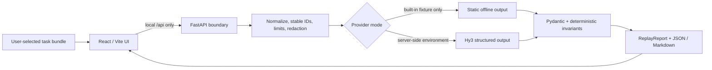

# Architecture

Hy3 ReplayLab is a local two-process application with a deliberately narrow provider boundary. The browser talks only to the local FastAPI service; only that service can call the configured Hy3 endpoint.

## Contract model

`TaskSpec` is the only analysis input. It contains a task definition, 1–50 acceptance criteria, 1–200 ordered trace steps, and 1–200 evidence objects. Missing criterion, step, and evidence IDs are generated from the ordinal plus a canonical-content hash, so identical imports yield identical IDs. Extra fields are forbidden.

The provider returns an `AnalysisDraft`:

- one coverage item per criterion, in criterion order;
- one divergence finding, with existing step/evidence references or an explicit no-divergence form;
- a replay plan whose preserved steps are the exact valid prefix, whose rerun steps are ordered, and whose actions, gates, stop conditions, and prohibitions cite known evidence.

The service converts the validated draft into a stable-ID `ReplayReport` and complete exports. A provider cannot choose the report ID or bypass validation.

## Analysis pipeline

1. The importer validates extension/MIME, byte limits, filename safety, JSON shape, resource counts, ordering, uniqueness, and input references.
2. Credential-shaped text is redacted. The trace remains data; no trace command, URL, or code is executed.
3. Offline mode reads an allowlisted provider output only for `coding-loop` or `research-grounding`. Live mode creates `Hy3Settings` only from `HY3_API_KEY`, `HY3_BASE_URL`, and `HY3_MODEL`.
4. Hy3 receives a strict JSON Schema and an instruction to judge a step only from information available at that step. It performs semantic alignment and proposes the first divergence and smallest replay.
5. Pydantic and deterministic validators enforce schema, reference closure, coverage order, first-step chronology, exact preserved prefix, ordered rerun, and evidence-backed gates/actions.
6. Invalid structured output gets at most one redacted, 20,000-character controlled repair. If it remains invalid, the report is rejected.
7. The UI receives the validated report plus complete JSON and Markdown exports. It shows concise explanations and citations, never hidden chain-of-thought.

## Runtime boundaries

| Boundary | Invariant |
| --- | --- |
| Browser → backend | Same-origin `/api`; no API key field or persistence |
| File import | Text only; no path traversal, archives, binary data, or implicit filesystem reads |
| Backend → Hy3 | One OpenAI-compatible endpoint derived from validated server configuration |
| Hy3 → backend | 256,000-byte maximum; strict response envelope and `AnalysisDraft` schema |
| Report → UI | Existing IDs only; bounded concise explanations; secrets redacted |

Network errors and 429/502/503/504 are retried at most three total attempts with bounded backoff and supported `Retry-After` seconds. Other HTTP errors fail immediately. The UI exposes loading, browser-side stop-wait, explicit retry, and rate-limit state. Stop-wait aborts the browser response but does not claim to cancel work already accepted by the server; that work remains bounded by the provider timeout and attempt limits.

## Source map

- API and provider selection: [`backend/src/replaylab/main.py`](../backend/src/replaylab/main.py)
- contracts and stable IDs: [`backend/src/replaylab/schemas.py`](../backend/src/replaylab/schemas.py)
- deterministic invariants: [`backend/src/replaylab/validation.py`](../backend/src/replaylab/validation.py)
- Hy3 boundary: [`backend/src/replaylab/hy3.py`](../backend/src/replaylab/hy3.py)
- import boundary: [`backend/src/replaylab/imports.py`](../backend/src/replaylab/imports.py)
- UI state machine: [`frontend/src/App.tsx`](../frontend/src/App.tsx)
- evaluation metrics: [`backend/src/replaylab/evaluation.py`](../backend/src/replaylab/evaluation.py)

The application does not import code from other unmerged Hy3 submissions and does not depend on TaskRelay MCP.
