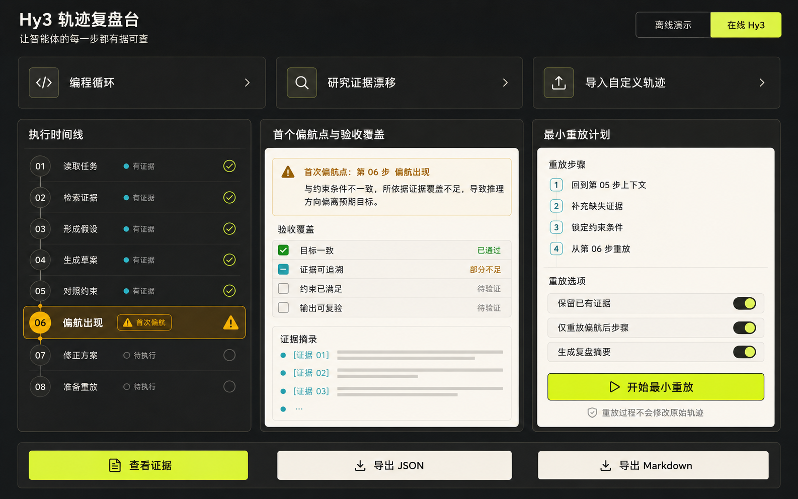

# 中文界面视觉参考

本图于 2026-07-22 通过用户已登录的 ChatGPT 网页版图片功能生成，不使用 Codex 内置生图。提示词要求一张中文开发者工具界面：深石墨背景、暖白报告面板、酸性黄绿主操作、青色证据与琥珀色偏航警告，并包含场景卡片、执行时间线、首个偏航点、验收覆盖、最小重放计划和导出操作。

参考图只用于设计方向，不作为运行时图片或页面替代品。最终 React/CSS 实现重新构建了所有布局、文本、交互、响应式行为和无障碍语义，并由 Playwright 截取真实产品演示。
